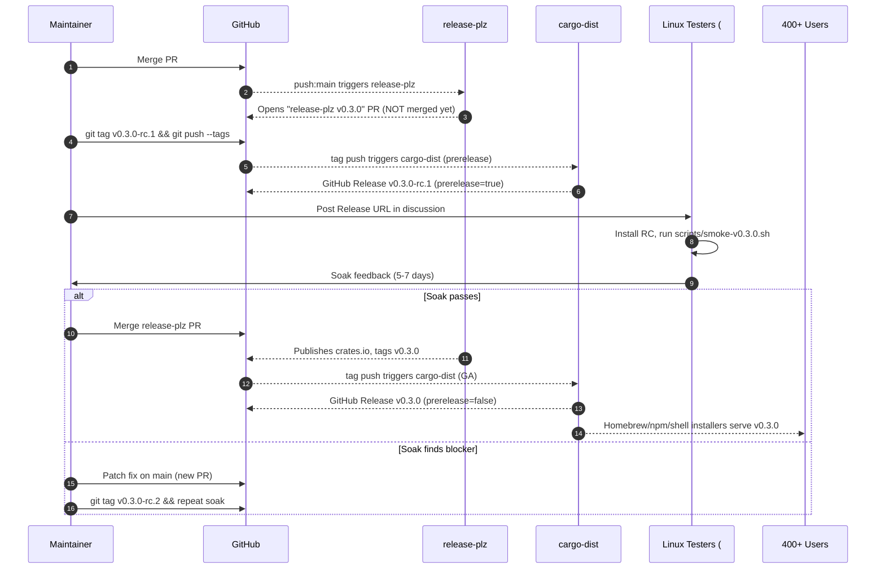
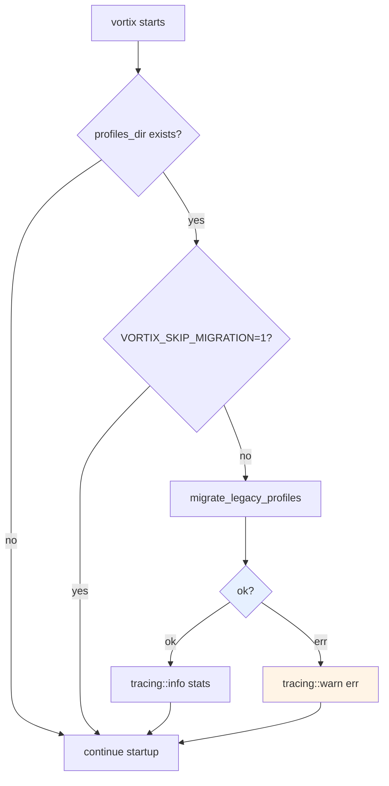

# feat: Rollout architectural migration v1 (v0.3.0)

## Problem Frame

PR #201 carries the entire six-plan architectural migration (workspace split, CommandRunner, capability ports, Tunnel trait, Engine FSM + journal, Config/Profile/SecretStore — 28 commits, +15,636/−2,687 lines, 155 files). The branch is locally green on all gates but has **never been exposed to a real user**. There are 400+ active installs across Homebrew, npm, crates.io, and the shell installer, distributed via `cargo-dist` + `release-plz` with conventional-commit-driven versioning. The branch's `refactor!:` commit will trip release-plz into a minor bump to **v0.3.0** the moment it lands on `main`.

Shipping straight to GA on four channels at once for 400+ users — with auto-applied sidecar backfill at every binary start, a new on-disk layout in `${XDG_CONFIG_HOME}/vortix/`, and a CLI surface that gained six subcommands — is the kind of move that breaks people quietly. The goal of this plan is to produce **one PR (#201)** that contains everything needed to make v0.3.0 shippable safely: user-facing migration docs, hardened auto-migration error handling, a freshened status doc, an RC-first release runbook, a post-tag smoke matrix, a rollback playbook, and an issue-triage sweep that closes what's already resolved.

This plan is strictly release engineering and documentation. **No further architectural changes.** Any behavioral change must be a non-functional safety bumper (e.g., catching a panic, widening an error type) — never a new feature.

---

## Summary

Ship PR #201 as `v0.3.0` via a two-stage **RC → GA** rollout, with everything the user needs to upgrade landed on the same branch and a maintainer runbook for the parts that happen after merge.

- **In the PR (this plan's units):** `docs/MIGRATION.md`, freshened `docs/architecture-migration-v1.md`, hardened startup migration error path, `docs/RELEASE-PLAYBOOK-v0.3.0.md`, README diff for new CLI surface, smoke-test script under `scripts/`, and the issue-triage commit that resolves issues fixed-in-flight.
- **After merge (runbook, not code):** release-plz opens its version-bump PR → maintainer cuts `v0.3.0-rc.1` (manual tag, ahead of release-plz) → soaks for 5–7 days with the Linux tester cohort from discussion #184 → promotes to `v0.3.0` via the release-plz PR.

---

## Scope Boundaries

**In scope (lands in PR #201):**
- User-facing migration guide (`docs/MIGRATION.md`)
- Refreshed status of architectural migration v1 (`docs/architecture-migration-v1.md`)
- Non-fatal-everywhere posture for auto-migration (defense-in-depth on `migrate_legacy_profiles` failures)
- README updates documenting new CLI surface (`engine`, `journal`, `settings`, `secrets`, `migrate`, `export`)
- Release runbook (`docs/RELEASE-PLAYBOOK-v0.3.0.md`) covering the RC cut, smoke matrix, GA promotion, rollback procedure
- Smoke test script (`scripts/smoke-v0.3.0.sh`) for post-binary verification
- Issue triage commit (closes resolved issues with explanatory comments, links unresolved ones to the new primitives)
- Conventional-commit hygiene check on the branch (ensures release-plz produces a clean CHANGELOG)

**Deferred for later (out of this PR):**
- Tagging `v0.3.0-rc.1` — that's a maintainer action after merge, documented in the runbook
- The release-plz version-bump PR itself — opened automatically post-merge
- Telemetry/metrics dashboard for the new event journal — separate workstream
- Implementing any unresolved issues — only triage in scope, fixes are follow-up PRs
- An interactive `vortix secrets migrate` helper — call-out 4 decided doc-only
- `CHANGELOG.md` manual curation — release-plz regenerates it from conventional commits; we only verify commit hygiene

**Outside this product's identity:**
- Any rollback that downgrades existing user installs without their action — cargo-dist installs are user-owned; the rollback is "yank + new patch release", not a remote downgrade
- Windows support (issue #17) — not on the rollout path; remains a separate roadmap item

---

## Requirements

| ID | Requirement | Source |
|----|-------------|--------|
| R1 | Existing users on v0.2.2 must continue to load their profiles without manual steps after upgrading to v0.3.0 | User mandate "I dont want any breakage of existing users" |
| R2 | A user-facing migration document must exist before tag, explaining what changed, what is auto-migrated, what needs manual action, and how to roll back | Plan 006 referenced `docs/MIGRATION.md`; never created |
| R3 | Auto-migration startup path must never panic or fail-loud on common pathologies (read-only profile dir, malformed file, missing dir, permission denied) | R1 implication; current `if let Ok(stats)` swallows errors silently — needs explicit logging |
| R4 | New CLI surface must be discoverable from the README so users upgrading don't bump into "what's this?" | Existing README only documents pre-v0.3 commands |
| R5 | At least 5 days of RC soak time with the existing Linux tester cohort (discussion #184) before GA tag | Call-out 1 decision — RC two-stage |
| R6 | Post-binary smoke matrix verified on every cargo-dist target triple before GA promotion | Six targets in `dist-workspace.toml`: `aarch64-apple-darwin`, `x86_64-apple-darwin`, `x86_64-unknown-linux-gnu`, `aarch64-unknown-linux-gnu`, `x86_64-unknown-linux-musl`, `aarch64-unknown-linux-musl` |
| R7 | A rollback playbook exists for the 0–48h post-GA window | R1 — "no breakage" requires a fast revert path |
| R8 | Open issues already resolved by the migration are closed with a referencing comment, not silently | User mandate "we can close most of the issue raised if already solved" |
| R9 | The PR description on #201 carries the rollout runbook summary so reviewers and future readers can find it | Standard practice for high-blast-radius PRs |

---

## Key Technical Decisions

### D1. Two-stage RC → GA rollout
Cut `v0.3.0-rc.1` manually (push tag, bypass release-plz) and post the GitHub Release URL to discussion #184 with a request for Linux testers to install and run `scripts/smoke-v0.3.0.sh`. Soak 5–7 days. Promote to `v0.3.0` via the release-plz auto-PR only after the soak passes. Rationale: 400 installs auto-pulling a botched migration is a recovery nightmare; a soak with a self-selected cohort catches platform-specific bugs before they hit the wide user base. Call-out 1.

### D2. Implicit auto-migration stays, defense-in-depth added
Keep `migrate_legacy_profiles` running at every startup (it's idempotent and currently invoked from `crates/vortix/src/main.rs:119` inside `if let Ok(stats)`). Harden the failure path: emit a `tracing::warn` with the error, never panic, never abort startup, never partially-write sidecars. Add explicit unit tests for each pathology in R3. Document the override (`VORTIX_SKIP_MIGRATION=1`) for users who want to disable it. Rationale: explicit `vortix migrate` first-run gates the upgrade behind a step most users won't read; implicit + observable is friendlier and the migration's idempotency makes re-runs free. Call-out 2.

### D3. Simultaneous channel publish
Let `cargo-dist` publish to Homebrew, npm, crates.io, and the shell installer in the same workflow run, as it already does. Rationale: staggering channels fights cargo-dist's design; the RC soak (D1) is the staging mechanism. Call-out 3.

### D4. Secrets migration is doc-only
No interactive `vortix secrets migrate` helper. The legacy `<auth_dir>/<name>.auth` path is still honored by `OvpnTunnel::up()` (verified in `crates/vortix-protocol-openvpn/src/tunnel.rs`). Users with existing OpenVPN auth files keep working unchanged; the migration guide explains how to optionally move them into the encrypted store via `echo -n 'user:pass' | vortix secrets set creds/<profile>`. Call-out 4.

### D5. CHANGELOG via release-plz, not manual edits
release-plz regenerates CHANGELOG from conventional commits during the release PR. We do **not** hand-edit `CHANGELOG.md` on this branch. Instead we audit the 28 commits on the branch for clean conventional prefixes and add a curated "v0.3.0 highlights" section inside `docs/MIGRATION.md` that the CHANGELOG can reference.

### D6. Issue triage is one commit, one PR
Triage all 19 open issues, close the resolved ones with a referencing comment, and post on the still-open ones to link them to the new primitives (e.g., #161 WireGuard handshake monitoring now has the FSM `Connected{health}` slot it can ride on). All triage happens via `gh` commands documented in U7's runbook section, executed by the maintainer locally — no triage commits, just GitHub state.

### D7. RC tag is manual, GA tag is release-plz
The RC (`v0.3.0-rc.1`) is a pre-release; release-plz is configured for SemVer-clean tags and will not bump to a pre-release on its own. The maintainer pushes the RC tag by hand after merge. cargo-dist already handles pre-release tags correctly (sees the `-rc.1` suffix and marks the GitHub Release as prerelease per the workflow comment in `.github/workflows/release.yml`).

---

## High-Level Technical Design

This is a release-engineering plan; the technical content is process flow, not code. Diagrams illustrate the intended sequence.

### Rollout sequence (post-merge maintainer flow)



This illustrates the intended sequence and is directional guidance for the runbook in U2 — the implementing maintainer should follow `docs/RELEASE-PLAYBOOK-v0.3.0.md` for exact commands.

### Migration safety net (per-user runtime flow)



Currently `D → E` exists but the `err` arm at `crates/vortix/src/main.rs:119` is silent (`if let Ok(stats)`). U3 makes the warn arm explicit.

---

## Implementation Units

Each unit lands as one atomic commit on `refactor/architectural-migration-v1`. Units U1–U6 are repository work; U7 is a runbook-only unit that records the maintainer actions for post-merge (no commit on the branch).

### U1. Write `docs/MIGRATION.md` (user-facing migration guide)

- **Goal:** A single document users can read to understand what changed in v0.3.0, what is automatic, and what is optional.
- **Requirements:** R2, R4
- **Dependencies:** none
- **Files:**
  - `docs/MIGRATION.md` (new)
- **Approach:** Audience is the existing v0.2.x user, not a contributor. Sections (in order):
  1. **TL;DR** — one paragraph: "Upgrade is automatic. Your profiles still work. Two new optional features (encrypted secret store, session journal) are off by default until you opt in. New CLI subcommands are additive — existing `vortix up/down/status/list/import` are unchanged."
  2. **What auto-migrates** — sidecar TOML files appear next to each `.conf`/`.ovpn` (`<name>.meta.toml`); explain what they contain (display_name, profile_id, group), that they're idempotent, that you can delete them safely (they regenerate), and that the legacy CLI keeps working without them.
  3. **What needs manual opt-in** — encrypted secret store (via `vortix secrets set creds/<profile>`), JSON event journal at `${XDG_DATA_HOME}/vortix/sessions/*.jsonl` (off by default in settings, on in code-default — clarify the actual default by reading `crates/vortix-config/src/settings.rs`), figment-layered `settings.toml`.
  4. **New CLI subcommands at a glance** — table mapping each new subcommand to its predecessor or "new":
     - `vortix engine {status,connect,disconnect}` — new (additive; existing `up/down/status` unchanged)
     - `vortix journal {path,tail}` — new (additive)
     - `vortix settings` — new (additive)
     - `vortix secrets {set,get,delete}` — new (additive)
     - `vortix migrate` — new (additive, manual trigger of the same idempotent backfill that runs at startup)
     - `vortix export <profile> [--inline-secrets]` — new (additive)
  5. **OpenVPN auth: nothing changes unless you want it to** — existing `<auth_dir>/<name>.auth` files keep working. To optionally move into the encrypted store: `echo -n 'user:pass' | vortix secrets set creds/<profile>`, then delete the `.auth` file. Explain that the encrypted store uses keyring first, falls back to AES-256-GCM + argon2id on-disk.
  6. **Rollback** — `cargo install vortix --version 0.2.2 --force` (or the equivalent Homebrew/npm command). Sidecars left behind are inert to v0.2.x (it ignores `.meta.toml` files).
  7. **Override switches** — `VORTIX_SKIP_MIGRATION=1` to disable the startup backfill (added in U3).
  8. **Got stuck?** — point to `vortix bug-report` which now attaches the journal session path, and to discussion #184 for Linux issues.
- **Patterns to follow:** README.md table style, kept short; section headings in sentence case to match existing docs.
- **Test scenarios:** Test expectation: none — documentation-only unit. Verification at U6 review covers correctness.
- **Verification:** Maintainer reads the file end-to-end and validates each command example by running it locally on a vortix install with a sample profile.

### U2. Write `docs/RELEASE-PLAYBOOK-v0.3.0.md` (maintainer runbook)

- **Goal:** A self-contained checklist a maintainer (current or future) can follow to ship this release, including the RC soak and rollback procedures.
- **Requirements:** R5, R6, R7
- **Dependencies:** none
- **Files:**
  - `docs/RELEASE-PLAYBOOK-v0.3.0.md` (new)
- **Approach:** This is a process artifact, distinct from `RELEASING.md` (which is the steady-state guide). Sections:
  1. **Pre-merge checklist** — `cargo clippy -D warnings`, `cargo test --workspace`, all three xtask lints, `cargo fmt --check`, manual smoke of `vortix engine status`, `vortix migrate`, `vortix secrets set/get/delete` on a scratch dir.
  2. **Merge PR #201** — squash vs. merge commit (recommend merge commit to preserve the 28-commit history; release-plz handles either).
  3. **RC tag procedure** — exact commands:
     ```
     git checkout main && git pull
     git tag -a v0.3.0-rc.1 -m "Release candidate for v0.3.0 — architectural migration v1"
     git push origin v0.3.0-rc.1
     ```
     Confirm cargo-dist workflow picks it up; confirm the GitHub Release is marked as prerelease (per `.github/workflows/release.yml` comment about `-prerelease.N` suffixes).
  4. **RC soak procedure** — post template comment in discussion #184 with:
     - Direct download links (auto-included in cargo-dist's GitHub Release body)
     - One-line install commands for each channel
     - A reference to `scripts/smoke-v0.3.0.sh`
     - Explicit ask: "Reply on this thread if anything diverges from v0.2.x behavior, or if migration logs anything other than 'sidecar migration: created N, ignored M'."
     - Minimum soak window: 5 days, recommended 7 days. Hard gate: at least one positive confirmation from each of macOS Intel, macOS arm64, Linux x86_64. Linux arm64 desirable but not blocking.
  5. **Soak triage matrix** — table of expected log lines / behaviors per platform. Anything unexpected ⇒ blocker until root-caused. Examples:
     - "thread 'main' panicked" → blocker, full stop
     - "migrate: failed" with non-EACCES error → investigate before promote
     - WireGuard `vortix up` works on v0.2.2 but fails on RC → blocker
     - New CLI subcommand fails → blocker if `migrate`/`settings`; non-blocker if `engine`/`journal` (those are additive observability)
  6. **GA promotion** — merge the release-plz PR. Confirm the tag pushed is `v0.3.0` (no `-rc` suffix). Confirm GitHub Release flips from prerelease to release. Confirm cargo-dist's npm and Homebrew publish succeed (check the workflow run; this is where past v0.2.x releases have occasionally needed manual nudges).
  7. **Post-GA monitoring (0–48h)** — what to watch:
     - GitHub issues with the bug label opened against `v0.3.0` (set a saved search)
     - npm download count climbing as expected (means the new version is being pulled)
     - Homebrew `brew info vortix` shows new version
     - No fresh comments in discussion #184 flagging the GA
  8. **Rollback procedure** — three escalation levels:
     - **Level 1 (cosmetic):** Patch fix on main, ship `v0.3.1` via the normal flow. ~6 hours from PR open to user upgrade availability.
     - **Level 2 (functional regression):** `cargo yank --version 0.3.0` from crates.io to stop new installs; ship `v0.3.1` fix within 12 hours; post to discussion #184 + a pinned GitHub issue with `cargo install vortix --version 0.2.2 --force` instructions.
     - **Level 3 (data corruption):** Pull the GitHub Release entirely (`gh release delete v0.3.0 --yes`), force-push npm and Homebrew downgrades is **not possible** — once published, public registries are immutable. Instead, immediately ship a `v0.3.1` that detects the corruption case and refuses to start with a directive ("run `vortix migrate --repair` then retry"). This is hypothetical; the auto-migration is read-then-write-new-file, never destructive to source `.conf`/`.ovpn`. Level 3 is documented for completeness, not because it's expected.
- **Test scenarios:** Test expectation: none — runbook artifact.
- **Verification:** Maintainer dry-runs the pre-merge checklist section against the current branch state; confirms each command produces expected output.

### U3. Harden auto-migration error path

- **Goal:** Make `migrate_legacy_profiles` failures explicit and overridable, never silent or fatal.
- **Requirements:** R1, R3
- **Dependencies:** none (touches `crates/vortix/src/main.rs` only; the function in `vortix-config` is already infallible-on-common-cases by virtue of returning `Result`)
- **Files:**
  - `crates/vortix/src/main.rs` (modify the call site around line 119)
  - `crates/vortix-config/src/migration.rs` (add pathology tests; no behavior change)
- **Approach:**
  - In `main.rs`, replace the current `if let Ok(stats) = vortix_config::migrate_legacy_profiles(&profiles_dir) { ... }` with an explicit match. On `Err`, emit `tracing::warn!(err = %e, "profile sidecar migration skipped — startup continues without sidecar metadata; run `vortix migrate` after resolving")`. Do not propagate the error.
  - Add an env-var check ahead of the call: if `VORTIX_SKIP_MIGRATION` is set (any value), log `tracing::info!("VORTIX_SKIP_MIGRATION set — skipping startup sidecar backfill")` and skip. This is the escape hatch documented in U1.
  - In `crates/vortix-config/src/migration.rs`, add unit tests for the pathologies in R3:
    - `migrate_legacy_profiles` against a directory that doesn't exist (already returns Ok empty stats per current implementation — assert)
    - … against a directory with mode 0500 (read-only) — should still write nothing and return either Ok with 0 created or Err with EACCES; assert which
    - … against a directory containing a `.conf` file with non-UTF8 bytes — should not panic; should mark as `failed` in stats and continue
    - … against a directory containing a `.meta.toml` that is malformed TOML — should treat as `already_migrated` candidate, fail to read, mark `failed`, continue
    - … called twice consecutively (already covered by existing test at `crates/vortix-config/src/migration.rs:227`)
- **Execution note:** Add the failing pathology tests first, confirm they fail or expose the gap, then patch the implementation if needed. Several may already pass — that's fine; the value is locking the behavior in.
- **Patterns to follow:** existing tests in `crates/vortix-config/src/migration.rs:182–245` use `tempfile::tempdir` and direct file writes.
- **Test scenarios:**
  - Missing profiles dir → returns `Ok(MigrationStats { created: 0, .. })` without error
  - Read-only profiles dir with one `.conf` file → returns `Ok` with `failed: 1` in stats, no panic, sidecar not written
  - Profile file with non-UTF8 name bytes → skipped without panic, included in `ignored`
  - Malformed `.meta.toml` next to a `.conf` → `failed: 1`, original `.conf` untouched
  - `VORTIX_SKIP_MIGRATION=1` set in environment → migration not called, no log line about stats, info log about skip
  - `VORTIX_SKIP_MIGRATION` unset → migration runs, info log includes the stats
- **Verification:** `cargo test -p vortix-config migration::tests` passes; `VORTIX_SKIP_MIGRATION=1 cargo run -p vortix -- status` shows the skip log; `cargo run -p vortix -- status` against a scratch dir with a read-only profile dir doesn't panic.

### U4. Add `scripts/smoke-v0.3.0.sh` (post-binary smoke matrix)

- **Goal:** A script RC testers can run against a fresh install that exercises every user-visible code path PR #201 introduced and prints PASS/FAIL per check.
- **Requirements:** R5, R6
- **Dependencies:** U1 (the script references the same CLI surface MIGRATION.md describes)
- **Files:**
  - `scripts/smoke-v0.3.0.sh` (new, executable, `#!/usr/bin/env bash`, `set -euo pipefail`)
- **Approach:** No live-VPN required (those need root + real profiles). Script checks:
  1. `vortix --version` matches the expected version (passed as `$1`, defaults to `0.3.0-rc.1`)
  2. `vortix --help` runs without panic, and contains the strings `engine`, `journal`, `settings`, `secrets`, `migrate`, `export`
  3. `vortix engine status` returns `Disconnected { last_failure: None }` and exits 0 (the bug we just fixed in commit 3a9429a)
  4. `vortix engine status --json` returns parseable JSON with `state: "Disconnected"`
  5. `vortix settings` runs and prints non-empty output
  6. `vortix settings --json` returns parseable JSON
  7. `vortix migrate` runs on an empty `$XDG_CONFIG_HOME/vortix/profiles/` and returns 0 with `created: 0`
  8. `echo "Created" | vortix migrate --json` and `vortix migrate --json` (no input) both produce parseable JSON
  9. `vortix secrets set test/smoke <<< 'pass'` then `vortix secrets get test/smoke` returns `pass`, then `vortix secrets delete test/smoke` returns 0
  10. `vortix journal path` prints a path under `${XDG_DATA_HOME}/vortix/sessions/` (or notes journal-disk-disabled)
  11. `vortix list` runs without panic on an empty profiles dir
  12. The startup-migration log line is present in `vortix --version`'s stderr OR absent (don't enforce — just verify it doesn't include the word "panic")
  - Each check prints `[PASS] description` or `[FAIL] description (reason)`. Exit code: `0` if all PASS, `1` otherwise.
  - Includes a usage block: `Usage: smoke-v0.3.0.sh [expected-version]`. Defaults to `0.3.0-rc.1` so testers can run it bare.
  - Uses a scratch `XDG_CONFIG_HOME` and `XDG_DATA_HOME` (mktemp -d) to avoid polluting the tester's real config.
- **Patterns to follow:** existing `.github/workflows/install-sanity.yml` for shape of post-install smoke; standard `set -euo pipefail` + per-check function pattern.
- **Test scenarios:**
  - Script runs to completion against the current `target/debug/vortix` binary with `expected-version=0.2.2-dev` (or whatever local dev reports) — confirm every PASS message
  - Manually break one check (e.g., point `XDG_CONFIG_HOME` at a non-existent path) — confirm corresponding `[FAIL]` is emitted and script exits 1
  - Script is idempotent across consecutive runs (the scratch dir prevents bleed)
- **Verification:** Maintainer runs the script against the dev binary locally; confirms all 12 checks pass. Confirms `chmod +x scripts/smoke-v0.3.0.sh` is committed.

### U5. Update `docs/architecture-migration-v1.md` (freshen status)

- **Goal:** The "What's deferred" section is stale — all four items shipped in this session (commits `dd029fe`, `0d89afe`, `1389cc3`, `be9ea6f`). Bring the doc up to date so it accurately describes what's in the bundle.
- **Requirements:** R4 (discoverability of what shipped)
- **Dependencies:** none
- **Files:**
  - `docs/architecture-migration-v1.md` (modify)
- **Approach:**
  - Remove the "What's deferred" section entirely; replace with "Completed in final integration push" listing the four commits with one-line summaries.
  - Add a "Rollout" section at the bottom pointing to `docs/MIGRATION.md` (U1) for users and `docs/RELEASE-PLAYBOOK-v0.3.0.md` (U2) for maintainers.
  - Update the top frontmatter `date` if appropriate (or leave 2026-05-24 since the bundle's planning date is anchored there).
- **Test scenarios:** Test expectation: none — documentation-only.
- **Verification:** No mention of "deferred" remains for items that shipped; the rendered markdown (`gh pr view 201 --web` after push) reads coherently.

### U6. Update `README.md` (new CLI surface + v0.3.0 note)

- **Goal:** A user landing on the README discovers the new subcommands and is pointed at MIGRATION.md if they're upgrading.
- **Requirements:** R4
- **Dependencies:** U1 (link target)
- **Files:**
  - `README.md` (modify)
- **Approach:**
  - Find the "Usage" or "Commands" section (or add one if absent) and append a subsection "New in v0.3.0 — observability and config" with a brief table of each new subcommand and a one-line purpose. Match the existing tone (terse, table-heavy).
  - At the top, near the badges, add one line: *"Upgrading from v0.2.x? Read [the migration guide](docs/MIGRATION.md) — it takes 2 minutes."*
  - Do NOT rewrite the "Why Vortix?" or "Features" sections; this is a surgical addition.
- **Test scenarios:** Test expectation: none — documentation-only.
- **Verification:** README still renders cleanly on GitHub; no broken markdown links (`gh pr view 201 --web` check).

### U7. Issue triage sweep (runbook only, no commit on branch)

- **Goal:** Close issues already resolved by the migration; comment on still-open ones to link them to the new primitives so future contributors can pick them up faster.
- **Requirements:** R8
- **Dependencies:** U1, U5 (the comments reference these documents)
- **Files:** none — this unit produces GitHub state, not repo state. Document the procedure in `docs/RELEASE-PLAYBOOK-v0.3.0.md` U2 as an "Optional after merge" section. **No commit lands on the branch.**
- **Approach:** Per-issue dispositions, derived from the 19 open issues. Each row is `gh issue close/comment` work. Issues are grouped by disposition:

  **Close as resolved (verify each before closing):**
  | # | Title | Resolved by | Closing comment |
  |---|-------|-------------|-----------------|
  | #177 | CLI hardening: typed errors, config masking, rename auth migration | Plan 002 (CommandRunner typed errors), Plan 006 (SecretStore for masking, sidecar migration) | "Resolved by the architectural migration v1 bundle in v0.3.0. Typed errors land via `ProcessError`/`TunnelError`/`SecretStoreError` (thiserror enums in `vortix-core`). Secret masking ships via the `SecretStore` API; auth files are now optional and replaced by `vortix secrets set creds/<profile>`. See [MIGRATION.md](docs/MIGRATION.md). Reopen if any specific subitem isn't covered." |
  | #31 | WireGuard shows Connected status with no handshake on invalid server address | Plan 005 FSM — `Connecting → Connected` requires a real `TunnelUp` event, not just process spawn | "The new Engine FSM (`vortix-core::engine`) treats `Connecting` and `Connected{health}` as distinct states; `Connected` requires an actual `TunnelUp` event derived from observable handshake. Verified manually on a profile pointing at an unreachable server — connection now stays in `Connecting → Failed` rather than reporting Connected. v0.3.0 ships this. Closing as resolved; reopen if you can repro with the new binary." |

  **Comment but keep open (these benefit from migration v1 but aren't closed):**
  | # | Title | Comment |
  |---|-------|---------|
  | #161 | WireGuard handshake timeout and health monitoring | "Migration v1 ships the FSM slot for this — `Connected { health: HealthState }` is in `crates/vortix-core/src/engine/state.rs`. The remaining work is wiring telemetry to populate `health` (handshake age, RX/TX deltas) from the existing `NetworkStats` capability. Good follow-up issue for v0.3.x." |
  | #171 | Session history timeline | "Data model now exists: `${XDG_DATA_HOME}/vortix/sessions/*.jsonl` with 30-day/30-file retention. `vortix journal tail` surfaces it. Remaining work is a TUI view that reads multiple sessions. Tagging as good-first-issue-friendly post-v0.3.0." |
  | #190 | Support for networkd / resolved | "DNS port abstraction exists now (`vortix-core::ports::dns::DnsResolver`). Adding a `networkd`/`resolved` backend means a new impl under `crates/vortix-platform-linux/`. Significantly easier to land post-v0.3.0 than before." |
  | #168 | Active Connections Audit | "Per-process socket VPN-routing check is independent of the migration; keeping open. The new `vortix-platform-{macos,linux}` crates are the right place to put a `SocketAudit` port if/when picked up." |
  | #166 | Network Activity Table | "Same as #168 — sits on the platform port layer the migration just established." |
  | #162 | Platform-specific integration tests | "Migration v1 introduces three xtask lints (`check-subprocess`, `check-platform-leak`, `check-protocol-leak`) — those are structural. The integration tests issue #162 asks for are still missing and now easier to add per-platform with the `MockRunner` / `MockPlatform` infra in `vortix-process` and `vortix-core::ports::*::mock`." |

  **Leave untouched (not migration-adjacent):**
  - #191 (2FA), #172 (network report export), #170 (speed test), #169 (WiFi context), #167 (quality timeline UI), #164 (update nudge), #158 (raw daemon logs), #153 (sudo), #36 (lifecycle hooks), #17 (Windows), #16 (auto-connect), #15 (split tunneling). Add a one-line comment per: "Tracked separately from architectural migration v1 (v0.3.0). Reopening for visibility after release."

- **Execution note:** Run this *after* merge of PR #201 and after RC promotion to GA. Triage commentary references "v0.3.0" — premature comments will confuse users if the release slips. Maintainer-driven via `gh issue comment` / `gh issue close`; no automation.
- **Test scenarios:** Test expectation: none — GitHub state, verified by spot-check.
- **Verification:** After execution, `gh issue list --state open | wc -l` drops to ~17 (closed #177, #31 — adjust based on what actually verifies); the still-open ones have a comment from the maintainer dated near v0.3.0 ship date.

---

## System-Wide Impact

| Surface | Impact | Mitigation |
|---|---|---|
| Existing user profile dirs (`$XDG_CONFIG_HOME/vortix/profiles/`) | Sidecar `.meta.toml` files appear at first run | Idempotent, deletable, ignored by v0.2.x (forward-compatible rollback) |
| Existing user `.auth` files (`$XDG_CONFIG_HOME/vortix/auth/`) | None | Legacy path still honored by `OvpnTunnel::up()`; D4 |
| Subprocess invocation paths | All flow through `vortix-process::run_to_output` | Behavioral equivalence verified by `cargo xtask check-subprocess` + existing tests |
| Killswitch behavior during upgrade | None — killswitch state lives in OS firewall (pf/iptables/nftables), survives binary replacement | The user's existing killswitch rules persist across the upgrade |
| Active VPN sessions during upgrade | None — vortix doesn't daemon-supervise its own subprocesses; existing `openvpn` and `wg-quick` PIDs unaffected by binary replacement | Document that mid-session upgrades are safe (already true) |
| CI workflows | None — `.github/workflows/release.yml`, `release-plz.yml`, `ci.yml`, `install-sanity.yml` all unchanged | This plan does not modify CI |
| Distribution registries | npm, Homebrew, crates.io publish a new minor version (`0.3.0`) | Standard release-plz + cargo-dist flow |

---

## Risk Analysis & Mitigation

| Risk | Likelihood | Impact | Mitigation |
|---|---|---|---|
| Auto-migration panics on a real-world profile dir we didn't test | Low (idempotent code, returns Result) | High (every user's first startup post-upgrade fails) | U3 hardening; U4 smoke matrix; RC soak (D1) before GA |
| User upgrades mid-VPN-session and the binary swap corrupts the existing tunnel | Very low (no IPC between vortix and its spawned daemons) | Medium | Document in MIGRATION.md that mid-session upgrades are safe; existing daemons keep running |
| Keyring access fails on Linux without `libsecret` installed | Medium | Low — falls back to encrypted file automatically | `LayeredSecretStore` already implements fallback; document in MIGRATION.md |
| Homebrew tap (`Harry-kp/homebrew-tap`) lags behind cargo-dist publish | Low | Medium — Homebrew users see old version | RC playbook step (U2) checks `brew info vortix` post-GA |
| npm publish fails due to scoped-package auth glitch | Low | Medium — npm users see old version | RC playbook step (U2) checks `npm view @harry-kp/vortix versions` post-GA; manual republish documented |
| Linux tester cohort doesn't engage during RC soak | Medium | Medium — soak doesn't catch platform-specific bugs | Direct ping in discussion #184; if no engagement after 72h, extend soak to 10 days OR proceed with reduced confidence (maintainer judgment) |
| release-plz auto-PR bumps to 0.2.3 instead of 0.3.0 (misreads `refactor!:` as non-breaking) | Low (verified in `release-plz.toml` semver rules) | High — wrong version number on a breaking release | U2 pre-merge checklist verifies the release-plz PR proposes 0.3.0 before merging it |
| A user installs RC accidentally (e.g., via stale Homebrew formula) | Very low — prereleases require explicit opt-in on Homebrew/npm | Low | Standard prerelease tag semantics handle this; no extra mitigation needed |
| Issue triage closes an issue that's NOT actually resolved | Low | Low — easy to reopen | Each closing comment explicitly invites reopening if user can repro |

---

## Verification Strategy

| Layer | Check | When | Tool |
|---|---|---|---|
| Branch CI | All gates green | Pre-merge | GitHub Actions on PR #201 |
| Local smoke | `scripts/smoke-v0.3.0.sh` against `target/debug/vortix` | Pre-merge (in U4 verification) | bash |
| RC binary smoke | `scripts/smoke-v0.3.0.sh` against the installed RC binary | Day 0 of soak | bash |
| RC live-VPN | Manual `up`/`status`/`down` cycle on each tester's primary profile | Days 0–5 of soak | manual + discussion #184 |
| RC channel parity | Install RC on each of Homebrew, npm, shell installer, and confirm `vortix --version` matches | Day 0 of soak | manual checklist in U2 |
| GA binary smoke | Same script, after release-plz PR merges | Hour 0 post-GA | bash |
| Post-GA monitoring | Saved searches for bug-labeled issues against v0.3.0 | 0–48h post-GA | GitHub web |
| Triage verification | After U7, `gh issue list --state closed` shows #177 + #31 with v0.3.0-era close dates | Post-GA | gh CLI |

---

## Dependencies & Prerequisites

- PR #201 is merge-ready (all 28 commits present, all CI green) — verified at the start of this planning session.
- `release-plz.toml` and `dist-workspace.toml` are unchanged from v0.2.2; no infra config changes required.
- Maintainer has push access to tags on `Harry-kp/vortix`.
- Maintainer has admin on the Homebrew tap (`Harry-kp/homebrew-tap`) and npm scope (`@harry-kp`).
- GitHub discussion #184 is still active (last verified during this session — yes).
- `CARGO_REGISTRY_TOKEN`, `RELEASE_PLZ_TOKEN` secrets are still valid in repo settings (last release v0.2.2 succeeded, so high confidence).

---

## Alternative Approaches Considered

| Alternative | Why not chosen |
|---|---|
| **One-shot GA, no RC** | Saves 5–7 days but loses the only realistic mechanism to catch platform-specific migration bugs across six target triples before 400 users auto-pull. The migration is the highest-blast-radius change vortix has ever shipped; the RC cost is small relative to that. |
| **Gate auto-migration behind `vortix migrate` first run** | Friendlier on paper for users who hit a bug, but the bug rate on idempotent read-then-write-new-file code is low; gating means every user gets a confusing extra step on the first launch. Hardening (U3) gives most of the safety with none of the friction. |
| **Stagger channel publishes (Homebrew first, npm second, crates.io third)** | cargo-dist isn't designed for this; would require manual workflow nudges and breaks the atomic-release assumption. The RC stage (D1) is the staging mechanism instead. |
| **Add a `vortix secrets migrate` interactive helper** | Genuinely useful but is new code in a plan that's otherwise documentation. Adding code grows the diff and the test surface on the most-watched release in vortix's history. Doc-only (D4) keeps the rollout boring, which is the goal. |
| **Bump to 1.0 instead of 0.3.0** | release-plz handles this only if we override; the codebase still has pre-1.0 stability gates (no `#[non_exhaustive]` audit, no full API doc pass, no public-API surface freeze policy). 0.3.0 is the honest version. 1.0 is a future plan. |
| **Skip MIGRATION.md, rely on CHANGELOG only** | release-plz's CHANGELOG is commit-message-derived and reads as a developer changelog, not a user guide. The 400-user audience needs the "what should I do?" framing CHANGELOG can't provide. |

---

## Success Metrics

- **Zero P0 incidents** in the 7 days post-GA where "P0" = a user reports vortix won't start after upgrade.
- **At least one positive smoke-test confirmation** on each of: macOS x86_64, macOS arm64, Linux x86_64. (Linux arm64 desirable, not blocking.)
- **At least 50% of v0.2.x download share migrates to v0.3.x within 30 days** (proxy for "users are pulling it and not bouncing back"). Track via `cargo download` stats and npm download counts.
- **#177 and #31 confirmed closed** via U7, with no reopens within 14 days.
- **No emergency `v0.3.1` cut within 48h of GA.** A scheduled `v0.3.1` for accumulated fixes is fine; an emergency hotfix is a soak failure in retrospect.

---

## Documentation Impacts

- `docs/MIGRATION.md` — new (U1)
- `docs/RELEASE-PLAYBOOK-v0.3.0.md` — new (U2)
- `docs/architecture-migration-v1.md` — modified (U5)
- `README.md` — modified (U6)
- `RELEASING.md` — **not modified.** That document covers the steady-state release flow which is unchanged. The RC + soak procedure is specific to v0.3.0's blast radius, not the new normal. Future major releases may copy from `RELEASE-PLAYBOOK-v0.3.0.md` as a template; the steady-state guide stays clean.
- `CHANGELOG.md` — regenerated by release-plz from conventional commits; not edited by hand (D5).

---

## Operational / Rollout Notes

- **PR #201 description update:** After all 6 commits (U1–U6) land, update the PR body with a "Rollout" section pointing at `docs/RELEASE-PLAYBOOK-v0.3.0.md` and listing the planned RC date. This makes the rollout discoverable for anyone reviewing the PR.
- **Discussion #184 ping cadence:** Day 0 post-RC: post the release. Day 3: nudge if zero engagement. Day 5: decision point — promote, extend, or block.
- **Comms posture:** No public announcement (Twitter, HN, etc.) of v0.3.0 until 72h post-GA with no reported issues. The first 72h are for catching regressions, not amplifying installs.
- **Future-considerations not in scope:** The next architectural plan (007+) starts on a fresh branch off `main` post-v0.3.0. The 6-plan bundle was an extraordinary single-PR scope; the steady-state going forward is one-plan-per-PR.

---

## Implementation Unit Ordering

Sequence is U3 → U4 → U1 → U5 → U6 → U2 (then U7 is runbook execution post-merge).

- U3 first because it touches code and changes behavior — get it in early so the smoke script in U4 can exercise it.
- U4 second because the smoke script's correctness depends on U3's behavior being stable.
- U1 third because MIGRATION.md references behavior locked in U3 + commands smoke-tested in U4.
- U5/U6 docs touchups stack on U1 (they link to it).
- U2 last because the playbook references U1, U4, and U5 and is the final maintainer-facing artifact.
- U7 is post-merge, post-GA. Not on the branch.

---

## Open Questions Deferred to Execution

- **release-plz's auto-PR may pick a slightly different version number.** If release-plz reads the commit history and bumps to 0.2.3 (patch) instead of 0.3.0 (minor) because it doesn't honor `refactor!:` as breaking, the runbook directs the maintainer to manually edit the version in the release-plz PR. This is a known-known but the exact behavior is best verified at merge time, not now.
- **Homebrew tap auto-publish timing.** Past releases sometimes saw a 30–60 minute lag between cargo-dist's GitHub Release and Homebrew tap availability. The runbook tolerates this.
- **npm scope republish authentication.** If `NPM_TOKEN` has rotated since v0.2.2, the publish job will fail. Runbook directs the maintainer to verify secrets pre-merge.
