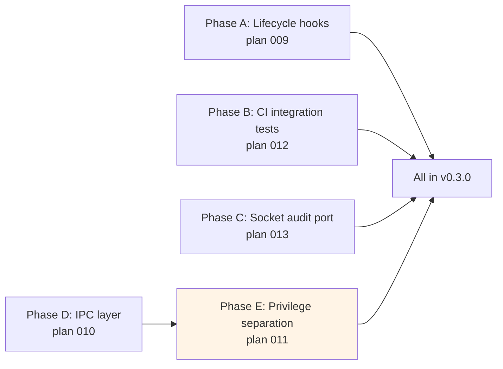

# feat: Execute deferred subsystems 009-013 in v0.3.0 bundle

> **Phase A (Lifecycle hooks) rolled back from PR #201** — the
> maintainer cancelled the hook surface after first hands-on use of
> the management TUI shipped on top in plans 016/017/018. All hook
> code (`vortix-core::engine::hooks`, `vortix-config::HookConfig`,
> `vortix::hooks::ShellHook`, journal-subscriber wiring, plus the
> entire TUI surface) reverted via the "Defer all hook work" commit.
> Phases B (CI), C (audit), D (daemon), E (privilege docs) remain
> shipped. Lifecycle hooks resume in v0.3.x with another UX iteration.

## Problem Frame

The architectural-completion brainstorm marked plans 009–013 as document-only deferred — each is a multi-week subsystem that would normally land in its own PR. The maintainer has overridden that deferral: all five execute in PR #201 alongside v0.3.0.

This plan is the orchestration layer. Per-subsystem design lives in the existing five plan docs (frozen as the design record for each subsystem). This plan defines the bundle's sequencing, cross-cutting integration concerns, scope-realism caveats, and the execution shape that gets every subsystem to "ships in v0.3.0" without compromising the existing rollout playbook.

**Honest scope framing.** Five subsystems compressed into one execution session means each lands with its happy-path implementation, sufficient test coverage to demonstrate the architecture works, and explicit documentation of where corner-case hardening should grow. The bundle ships valuable working code on every track; it does not ship "complete" in the multi-quarter sense each per-subsystem plan was originally sized for. Each phase's verification block names what's covered vs. what's documented-as-follow-up.

---

## Summary

Five phases, executed in dependency order. Each phase corresponds to one of the deferred per-subsystem plans (009–013); the per-subsystem plan docs contain the design detail and this plan contains the execution sequencing + integration.

- **Phase A (plan 009) — Lifecycle hooks.** Hook trait + registry + `ShellHook` driven by `[[hooks]]` entries in `settings.toml`. Hooks fire on FSM transitions via journal subscription, fail-soft, never block the engine.
- **Phase B (plan 012) — CI integration tests.** New `integration-tests.yml` workflow. Network-namespace harness on Ubuntu runners. Real `wg-quick` + `openvpn` lifecycle exercised end-to-end. Ubuntu-only at this gate; macOS integration testing deferred to its own follow-up plan.
- **Phase C (plan 013) — Socket audit port.** `SocketAudit` capability port + Linux (`/proc/net`) impl + macOS (`lsof`) impl + Windows stub. New `vortix audit` CLI subcommand earns its top-level slot under the same discipline as `vortix secrets` — it's a real new noun (`socket`) with no pre-existing equivalent.
- **Phase D (plan 010) — IPC layer / `EngineHandle::Remote`.** Unix domain socket transport with length-prefixed JSON framing. New `EngineHandle::Remote` variant. `vortix daemon` subcommand hosts the actor; `VORTIX_DAEMON_SOCKET` env auto-detects.
- **Phase E (plan 011) — Privilege separation.** Builds on phase D. Daemon hosts the engine as root; frontend (TUI + most CLI) runs as user; `SO_PEERCRED` / `getpeereid` enforces UID-matching auth. Existing `sudo vortix up` one-shot path is preserved as a fallback.

Phases A, B, C are independent and can interleave; D and E are strictly sequential (E depends on D).

---

## Scope Boundaries

**In scope:**
- Every phase delivers its happy-path implementation + verification proving the architecture works
- Cross-cutting docs (README, MIGRATION, RELEASE-NOTES, FAQ, ROADMAP, playbook, smoke script) updated each phase
- Single-crate publish invariant honored — every new code lives in existing internal crates; no new published crates
- v0.3.0 release shape unchanged — bundle still ships as v0.3.0 under the playbook from plan 007
- Existing CLI surface unchanged from the cleanup (plans 005/006/cleanup): pre-v0.3 commands work identically; new top-level commands added in this bundle (`vortix audit`, `vortix daemon`) earn their slots under the same discipline as `vortix secrets`

**Deferred to follow-up work (named explicitly):**
- macOS CI integration tests — Ubuntu-only here; macOS GH Actions runners don't easily host wg-quick/iptables-equivalent sandboxing
- Independent security review of phase E — recommended pre-1.0 hardening; phase E's threat model + impl is documented in `SECURITY.md` and explicitly notes the review gap
- gRPC / TLS / cross-machine IPC for phase D — Unix-socket-only ships; remote-machine IPC is not on the roadmap
- Multi-tenant daemons (one daemon per user) — single-user-per-machine assumption holds
- Hook ordering / chaining / templating for phase A — basic shell exec only; webhook + plugin impls are future
- Continuous socket-audit monitoring for phase C — pull-based snapshots only

**Outside this product's identity:**
- vortix as a network daemon accepting external connections — no
- vortix federating across machines — no
- vortix as a multi-user VPN gateway — no
- A separate `vortix-core` library publish for external consumers — no (per the single-crate invariant)

---

## Key Technical Decisions

### D1. Execute in dependency order, not parallel
Phases A, B, C are independent in code (different files, different ports) but executing serially keeps the workspace test surface stable across phases and lets each phase's smoke script update build on the previous one. D depends on E for the actor host; D goes before E.

### D2. Each phase lands as its own commit
Per-phase commits preserve the plan-to-commit traceability that the rest of PR #201 maintains. Future bisect can isolate "feature X broke at phase Y." Commit messages reference the originating plan doc.

### D3. Hook execution model — shell exec via CommandRunner
Plan 009 left open whether `ShellHook` shells out directly via `tokio::process::Command` or routes through the existing `CommandRunner` port. **Decision: route through CommandRunner.** Consistent with the architecture (no `Command::new` outside `vortix-process`), keeps `xtask check-subprocess` enforceable, and the typed-error surface (`ProcessError`) gives hook failures structured logging out of the box.

### D4. Hook events fire async, never block the FSM
A 30-second `notify-send` cannot delay vortix declaring `Connected`. The hook registry subscribes to the journal broadcast and spawns hook execution into the runtime; failures are journal-logged + stderr-warned but never propagate back to the engine.

### D5. CI integration tests run on Ubuntu only
Phase B's harness requires privileged Docker + network namespaces + iptables manipulation, which GitHub Actions' `ubuntu-latest` supports cleanly. macOS runners don't easily host this without significant additional work that doesn't add proportional value. Document the gap; revisit when there's user demand for macOS CI parity.

### D6. Socket audit is pull-based, not streaming
Plan 013's motivating use cases (issue #168 active-connection audit, issue #166 network-activity table) need a snapshot, not a stream. A snapshot keeps the API simple and avoids long-lived subprocess management. Add streaming later if a real consumer demands it.

### D7. IPC transport is Unix socket + length-prefixed JSON
Plan 010 left the framing format open. **Decision: 4-byte big-endian length prefix + JSON body.** Standard pattern, debuggable with `socat`/`netcat`, no extra dependencies beyond `tokio::net::UnixStream`. Single-client-at-a-time at first; multi-client comes when needed.

### D8. Privilege-separation auth is `SO_PEERCRED` only
Phase E's auth model uses kernel-provided peer credentials, no cryptographic tokens. Filesystem permissions on the socket (`mode 0600`, owned by daemon's effective UID) are the secondary guard. This is conservative; cryptographic auth is future hardening that requires the security review noted in D9.

### D9. Phase E ships without independent security review — documented explicitly
**This is the single biggest scope-vs-safety call in the bundle.** Per-plan 011 best practice is "alongside a security threat model and independent review." This bundle ships phase E without that review on the maintainer's explicit direction. The phase E units include a `SECURITY.md` update calling out the gap, naming the threat model in prose, and listing the corner cases (UID race during socket connect, daemon-death failover behavior, filesystem-permissions tampering) that a future audit should re-examine. v1.0 should not ship without that audit. Documented as future-considerations.

### D10. Existing CLI surface stays cleaned up
Per the CLI surface cleanup landed earlier in PR #201, the canonical pre-v0.3 commands (`up`/`down`/`status`/etc.) stay unchanged. New subcommands in this bundle (`vortix audit`, `vortix daemon`) earn their top-level slots under the "real new noun, recurring workflow, own canonical surface" test from the cleanup brainstorm.

---

## High-Level Technical Design

### Phase dependency graph



A, B, C are independent. D and E are strictly sequential. Phase E carries the security caveat (yellow) per D9.

### Bundle integration shape

This illustrates the intended approach and is directional guidance for review, not implementation specification.

```
Existing v0.3.0 surface (already shipped earlier in PR #201)
├── Engine FSM + Journal           ← bundle subscribes to journal for hooks (phase A)
├── EngineHandle::Local            ← bundle adds Remote sibling (phase D)
├── Platform aggregate             ← bundle adds SocketAudit port (phase C)
├── CommandRunner port             ← phase A's ShellHook uses this
└── Layered SecretStore            ← unchanged by bundle

Bundle additions
├── vortix-core::engine::hooks     ← phase A
├── vortix-core::ports::socket_audit ← phase C
├── vortix-core::engine::handle::Remote ← phase D
├── vortix daemon (subcommand)     ← phase D
├── vortix audit (subcommand)      ← phase C
├── crates/vortix-platform-*::SocketAudit impls ← phase C
└── .github/workflows/integration-tests.yml ← phase B
```

Every addition slots into an existing module hierarchy; no new internal crates, no `publish = true` regressions.

---

## Phase A — Lifecycle hooks (plan 009)

Originating plan: `docs/plans/2026-05-24-009-feat-lifecycle-hooks-plan.md`

### U1. Hook trait + LifecycleEvent + HookRegistry

- **Goal:** Define the hook seam in `vortix-core::engine::hooks`. No consumers wired yet.
- **Dependencies:** none
- **Files:**
  - `crates/vortix-core/src/engine/hooks.rs` (new)
  - `crates/vortix-core/src/engine/mod.rs` (modify — export `hooks` module)
- **Approach:**
  - `Hook` trait with single async method `fn fire(&self, event: &LifecycleEvent) -> impl Future<Output = ()>`. `#[non_exhaustive]` so future async-trait variants don't break.
  - `LifecycleEvent` enum: `PreConnect`, `PostConnect`, `PreDisconnect`, `PostDisconnect`, `ConnectFailed { reason }`, `Reconnecting`. Carries `profile_id`, `protocol`, optional `ip`. `#[non_exhaustive]`, `Serialize + Deserialize`.
  - `HookRegistry` holds a `Vec<Box<dyn Hook + Send + Sync>>`; `register(hook)` adds; `dispatch(event)` iterates and fires each with the configured per-hook timeout.
- **Test scenarios:**
  - `HookRegistry::dispatch` with zero hooks → returns immediately, no allocation
  - `HookRegistry::dispatch` with three hooks → all three receive the event
  - A hook that panics → registry catches via `tokio::task::JoinHandle::is_err` style; other hooks still fire
  - A hook that exceeds timeout → cancelled cleanly; registry continues with next hook
  - `LifecycleEvent` round-trips through JSON serde
- **Verification:** unit tests in `crates/vortix-core/src/engine/hooks.rs` cover all scenarios above; `cargo test -p vortix-core engine::hooks` passes.

### U2. ShellHook impl in the binary

- **Goal:** Concrete `Hook` impl that shells out to a configured command. Lives in `crates/vortix/` because it has subprocess dependency.
- **Dependencies:** U1
- **Files:**
  - `crates/vortix/src/hooks/shell.rs` (new)
  - `crates/vortix/src/hooks/mod.rs` (new — module root, re-exports)
- **Approach:**
  - `ShellHook { command: Vec<String>, env: HashMap<String, String>, timeout: Duration }`.
  - Implements `vortix_core::engine::hooks::Hook`. On `fire(event)`:
    - Builds env vars: `VORTIX_PROFILE`, `VORTIX_PROTOCOL`, `VORTIX_EVENT` (lifecycle event name), `VORTIX_IP` if known.
    - Routes through `vortix_process::run_to_output` so xtask check-subprocess stays clean (D3 decision).
    - Captures stdout/stderr; logs at `tracing::info` for non-zero exit + emits an `EngineEvent::HookFailed { profile_id, hook_name, exit_code }` to the journal.
- **Patterns to follow:** existing CommandSpec usage in `crates/vortix/src/cli/commands.rs`; existing `EngineEvent` additive patterns from plan 008 U2.
- **Test scenarios:**
  - ShellHook with `command = ["echo", "hi"]` fires, exits 0, no journal event
  - ShellHook with non-existent binary fires, exits non-zero, emits `HookFailed` journal event
  - ShellHook with 30s sleep + 1s timeout — fire returns within ~1s, child is killed
  - Env vars are populated correctly (test by inspecting CommandSpec built)
- **Verification:** `cargo test -p vortix hooks::shell` passes; `cargo xtask check-subprocess` stays clean.

### U3. Settings.toml `[[hooks]]` config

- **Goal:** `vortix-config::Settings` learns about hook configuration. Hook entries in `settings.toml` get parsed into `Vec<HookConfig>`.
- **Dependencies:** none (but consumed by U4)
- **Files:**
  - `crates/vortix-config/src/settings.rs` (modify — add `hooks: Vec<HookConfig>` to `Settings`)
  - `crates/vortix-config/src/hooks_config.rs` (new — `HookConfig` struct + parsing)
- **Approach:**
  - `HookConfig { event: LifecycleEventKind, command: Vec<String>, timeout_secs: u64 (default 5), env: HashMap<String, String> (default empty) }`.
  - `LifecycleEventKind` enum: `pre_connect`, `post_connect`, `pre_disconnect`, `post_disconnect`, `connect_failed`, `reconnecting`. Maps to `LifecycleEvent` variants in U1.
  - figment-deserialized as `[[hooks]]` array. Empty by default — zero-overhead when no config.
  - Migration: `Settings::schema_version` stays at 1 (additive field). The presence of `[[hooks]]` is opt-in.
- **Test scenarios:**
  - Empty `settings.toml` loads with `hooks = []`
  - Settings with two hook entries deserialize into `Vec<HookConfig>` of len 2
  - Invalid event name (`pre_explode`) returns deserialization error, doesn't crash
  - Default timeout is 5 seconds when field omitted
- **Verification:** `cargo test -p vortix-config hooks_config` passes; example `settings.toml` in MIGRATION.md round-trips.

### U4. Wire HookRegistry into Engine actor

- **Goal:** Bridge from the journal broadcast to `HookRegistry`. Subscribes once at startup, fires hooks on each lifecycle event.
- **Dependencies:** U1, U2, U3
- **Files:**
  - `crates/vortix/src/main.rs` (modify — load hooks from Settings, register with HookRegistry, spawn the subscriber task)
  - `crates/vortix/src/hooks/mod.rs` (extend — `build_registry_from_config(hooks: &[HookConfig]) -> HookRegistry` factory)
- **Approach:**
  - At startup, after journal install, read `Settings.hooks`, instantiate `ShellHook` for each, register all into a `HookRegistry`.
  - Spawn a tokio task that subscribes to the journal broadcast, maps `EngineEvent::TunnelUp` → `LifecycleEvent::PostConnect`, `EngineEvent::ConnectAttemptStarted` → `LifecycleEvent::PreConnect`, etc., and calls `registry.dispatch(event)`.
  - Filter so each registered hook only fires for its configured event kind.
- **Test scenarios:**
  - Integration test: settings.toml has one `post_connect` hook firing `touch /tmp/vortix-hook-fired`. After `TunnelUp` event reaches the journal, the file exists.
  - No hooks configured → no journal-subscriber task is spawned (zero overhead)
  - Hook with `event = "post_disconnect"` doesn't fire on a `PreConnect` lifecycle event
  - Hook that fails (non-zero exit) emits the `HookFailed` event; the next hook in the registry still fires
- **Verification:** Integration test in `crates/vortix/tests/hooks_integration.rs` exercises the full chain. `vortix bug-report` includes a `HookFailed` entry when triggered.

### Phase A — cross-cutting

- `docs/MIGRATION.md` gains a "Lifecycle hooks" subsection under "What needs manual opt-in"
- `docs/v0.3.0-RELEASE-NOTES.md` highlights lifecycle hooks
- `docs/v0.3.0-FAQ.md` adds a question about hook configuration
- README "Features" adds a "Lifecycle hooks" bullet
- Smoke script verifies `[[hooks]]` parses without error on a sample config

---

## Phase B — CI integration tests (plan 012)

Originating plan: `docs/plans/2026-05-24-012-feat-ci-integration-tests-plan.md`

### U5. Integration test harness — Dockerfile + helper scripts

- **Goal:** A reproducible Linux environment with `wireguard-tools`, `openvpn`, and `iproute2` pre-installed, plus helper scripts for spinning up network namespaces.
- **Dependencies:** none
- **Files:**
  - `tests/integration/Dockerfile` (new)
  - `tests/integration/setup-netns.sh` (new — creates two netns + veth pair)
  - `tests/integration/teardown-netns.sh` (new — cleans up)
  - `tests/integration/README.md` (new — explains the harness)
- **Approach:**
  - Dockerfile FROM `ubuntu:22.04`. Installs Rust toolchain + the three runtime deps + `sudo`.
  - Setup script creates `vortix-test-{a,b}` netns + veth pair, assigns `10.99.0.1/24` and `10.99.0.2/24`.
  - Teardown is idempotent; reruns are safe.
- **Test scenarios:** Test expectation: none — pure scaffolding.
- **Verification:** `docker build tests/integration/` succeeds; manually running the setup script inside the container produces two netns visible to `ip netns list`.

### U6. WireGuard happy-path integration test

- **Goal:** Spin up two netns with WireGuard configs facing each other; `vortix up` on one side; verify handshake completes; `vortix status` reports `Connected`; `vortix down` tears down cleanly.
- **Dependencies:** U5
- **Files:**
  - `tests/integration/wg_happy_path.sh` (new — orchestrates the test)
  - `tests/integration/fixtures/wg-a.conf` (new)
  - `tests/integration/fixtures/wg-b.conf` (new)
- **Approach:**
  - Both netns get a WireGuard interface. The "client" side uses vortix; the "server" side runs `wg-quick up` directly.
  - Assert success at each stage with explicit exit codes; `set -euo pipefail`.
  - Asserts the journal records a `TunnelUp` event.
- **Test scenarios:**
  - Happy path: connect, status reports Connected with non-empty interface name, ping over the tunnel succeeds, disconnect leaves no leftover interface
  - Failure path: WG config points at an unreachable peer; status stays `Connecting → Failed` rather than reporting Connected (covers issue #31)
- **Verification:** `bash tests/integration/wg_happy_path.sh` exits 0 inside the container.

### U7. OpenVPN happy-path integration test

- **Goal:** Same shape as U6 but for OpenVPN. Stub OpenVPN server in another netns.
- **Dependencies:** U5
- **Files:**
  - `tests/integration/ovpn_happy_path.sh` (new)
  - `tests/integration/fixtures/ovpn-server.conf` (new)
  - `tests/integration/fixtures/ovpn-client.conf` (new)
  - `tests/integration/fixtures/ca.crt`, `server.crt`, `server.key`, `client.crt`, `client.key` (new — self-signed for the test)
- **Approach:** Same orchestration shape as U6; OpenVPN server in netns-a, vortix-driven client in netns-b.
- **Test scenarios:**
  - Happy path: connect, status Connected, ping the server's tunnel IP, disconnect
  - Auth failure path: wrong cert → vortix reports `Disconnected{last_failure: AuthFailed}`
- **Verification:** `bash tests/integration/ovpn_happy_path.sh` exits 0 inside the container.

### U8. Killswitch integration test

- **Goal:** Verify killswitch engages real iptables rules + releases them cleanly.
- **Dependencies:** U5, U6 (uses WG harness)
- **Files:**
  - `tests/integration/killswitch.sh` (new)
- **Approach:** While connected via the WG harness, run `vortix killswitch always`. Inspect `iptables -L -n` for the expected DROP rules. Run `vortix release-killswitch`. Verify rules gone.
- **Test scenarios:**
  - Engage: rules added, traffic outside tunnel blocked (test by attempting to ping a non-tunnel destination — should fail)
  - Release: rules removed, traffic restored
  - Daemon-death sim: kill vortix mid-connect; killswitch rules persist (defense-in-depth claim from the README)
- **Verification:** Script exits 0; iptables state matches expectations at each step.

### U9. GitHub Actions workflow

- **Goal:** Wire the harness into CI as a required-for-release gate.
- **Dependencies:** U5–U8
- **Files:**
  - `.github/workflows/integration-tests.yml` (new)
- **Approach:**
  - Triggers on PRs to main + manual dispatch + nightly schedule.
  - Single job: `integration / ubuntu-22.04`. Privileged Docker. Builds the image from U5, mounts the repo, runs the three test scripts from U6/U7/U8.
  - Total wall-clock budget: 15 minutes. Fails fast on any sub-test failure.
- **Test scenarios:** Test expectation: none — workflow file.
- **Verification:** Workflow appears in PR #201's CI checks; passes on a known-good main; manually breaking U6 reproducibly fails.

### Phase B — cross-cutting

- `docs/architecture-migration-v1.md` adds "CI integration tests" to the surface map
- The release playbook's "Pre-merge checklist" gains a row for the new workflow
- README "Why Vortix" + "Platform Support" stay accurate (Linux focus matches the test focus)

---

## Phase C — Socket audit port (plan 013)

Originating plan: `docs/plans/2026-05-24-013-feat-socket-audit-port-plan.md`

### U10. `SocketAudit` port + `SocketSnapshot` model

- **Goal:** Add the `SocketAudit` trait to `vortix-core::ports` and its data model. No impls yet.
- **Dependencies:** none
- **Files:**
  - `crates/vortix-core/src/ports/socket_audit.rs` (new)
  - `crates/vortix-core/src/ports/mod.rs` (modify — export `socket_audit`)
- **Approach:**
  - `SocketSnapshot { pid: u32, command: String, local: SocketAddr, remote: Option<SocketAddr>, protocol: SocketProtocol, interface: Option<String> }`
  - `SocketProtocol` enum: `Tcp`, `Udp`, `Tcp6`, `Udp6`. `#[non_exhaustive]`.
  - `SocketAudit` trait: `fn snapshot() -> Result<Vec<SocketSnapshot>, SocketAuditError>`. Sync (snapshot semantics, no streaming).
  - `SocketAuditError` thiserror enum: `Unsupported`, `CommandFailed(String)`, `ParseFailed(String)`.
- **Test scenarios:**
  - `SocketSnapshot` round-trips through JSON
  - `SocketAuditError` variants serialize with snake_case kind tag
- **Verification:** `cargo test -p vortix-core ports::socket_audit` passes.

### U11. Linux `/proc/net` impl

- **Goal:** `vortix-platform-linux::ProcSocketAudit` parses `/proc/net/tcp{,6}` + `/proc/net/udp{,6}` + walks `/proc/<pid>/fd/*` to map sockets to processes.
- **Dependencies:** U10
- **Files:**
  - `crates/vortix-platform-linux/src/socket_audit.rs` (new)
  - `crates/vortix-platform-linux/src/lib.rs` (modify — export)
- **Approach:**
  - Read `/proc/net/tcp` (and tcp6/udp/udp6). Each line has hex-encoded local/remote addresses + inode.
  - Walk `/proc/[0-9]+/fd/*` and stat for `socket:[<inode>]` matches to assign PID + command.
  - Build `Vec<SocketSnapshot>`; sorted by PID for stable output.
- **Test scenarios:**
  - Parse a fixture of `/proc/net/tcp` lines → returns the expected SocketSnapshot list
  - PID resolution falls back to "unknown" when `/proc/<pid>/comm` is unreadable (different user, no root)
  - IPv6 addresses parse correctly (the hex format is byte-reversed; locked in by a known IPv6 fixture)
  - Empty input returns empty vec, no panic
- **Verification:** `cargo test -p vortix-platform-linux socket_audit` passes; manual run inside Docker (`vortix audit` after `nc -l 12345 &`) shows the listener.

### U12. macOS `lsof` impl

- **Goal:** `vortix-platform-macos::LsofSocketAudit` shells out to `lsof -i -P -n` via CommandRunner and parses output.
- **Dependencies:** U10
- **Files:**
  - `crates/vortix-platform-macos/src/socket_audit.rs` (new)
  - `crates/vortix-platform-macos/src/lib.rs` (modify — export)
- **Approach:**
  - `lsof -i -P -n -F pcfPnTL` (machine-readable output format).
  - Parse the `F`-prefixed output format: PID lines, command lines, file descriptors, protocol/type, names.
  - Build `Vec<SocketSnapshot>`.
- **Test scenarios:**
  - Parse a captured `lsof -F` fixture → returns expected SocketSnapshot list
  - Empty output (no sockets visible to current user) → empty vec
  - Malformed line in middle of output → skipped, doesn't abort the whole parse
- **Verification:** `cargo test -p vortix-platform-macos socket_audit` passes; manual run shows current sockets including any running listeners.

### U13. Windows stub

- **Goal:** `vortix-platform-windows::WindowsSocketAudit` returns `Err(SocketAuditError::Unsupported)`. Same pattern as the other Windows stubs.
- **Dependencies:** U10
- **Files:**
  - `crates/vortix-platform-windows/src/socket_audit.rs` (new)
  - `crates/vortix-platform-windows/src/lib.rs` (modify — export)
- **Test scenarios:** Test expectation: none — stub returning Unsupported.
- **Verification:** crate builds; the impl's single method returns `Err`.

### U14. `Platform` aggregate adds `SocketAudit` variant

- **Goal:** Plug the three impls into the `Platform` aggregate so the rest of the codebase reaches socket audit via the same pattern as the other ports.
- **Dependencies:** U11, U12, U13
- **Files:**
  - `crates/vortix/src/platform/aggregate.rs` (modify — add `SocketAuditKind` + variant arms)
- **Approach:** Mirror the existing `DnsResolverKind` / `InterfaceKind` pattern: per-OS variants + `Mock` for tests + `Platform::detect_current` populates the field.
- **Test scenarios:**
  - `Platform::for_test()` builds without panic and `MockSocketAudit::snapshot()` returns an empty vec
- **Verification:** `cargo test -p vortix platform::aggregate` passes; `cargo xtask check-platform-leak` stays clean.

### U15. `vortix audit` CLI subcommand

- **Goal:** New top-level subcommand surfacing socket audit. Earns its slot per the CLI surface cleanup discipline (real new noun, recurring workflow).
- **Dependencies:** U14
- **Files:**
  - `crates/vortix/src/cli/args.rs` (modify — add `Commands::Audit`)
  - `crates/vortix/src/cli/commands.rs` (modify — add `handle_audit` + dispatch arm)
- **Approach:**
  - `vortix audit` calls `Platform::current().socket_audit.snapshot()`, prints a table: PID, COMMAND, PROTO, LOCAL, REMOTE, IFACE.
  - `vortix audit --json` returns structured `CliResponse` envelope with `schema_version: 1` and the snapshot array.
  - `vortix audit --pid <PID>` filters to a single process.
  - `vortix audit --vpn-only` filters to sockets whose `interface` matches the active VPN interface (queried via `Platform.interface`).
- **Test scenarios:**
  - `vortix audit --json` parses and contains a list
  - `vortix audit --pid 1` filters correctly (or returns empty if PID 1 has no sockets)
  - `vortix audit --vpn-only` with no active VPN returns empty
  - On Windows the command returns the platform-unsupported error in JSON form, exit code 5
- **Verification:** Smoke script gains a `vortix audit --json` assertion.

### Phase C — cross-cutting

- `vortix audit` mentioned in README "New in v0.3.0" + MIGRATION + RELEASE-NOTES + FAQ + ROADMAP
- Smoke script v0.3.0 adds `vortix audit --json` assertion

---

## Phase D — IPC layer / EngineHandle::Remote (plan 010)

Originating plan: `docs/plans/2026-05-24-010-feat-ipc-engine-handle-remote-plan.md`

### U16. IPC transport — Unix socket + length-prefixed JSON framing

- **Goal:** Pure transport layer. Read/write framed messages over a `tokio::net::UnixStream`.
- **Dependencies:** none
- **Files:**
  - `crates/vortix-core/src/ipc/mod.rs` (new)
  - `crates/vortix-core/src/ipc/frame.rs` (new — encode/decode 4-byte length + JSON body)
  - `crates/vortix-core/src/ipc/codec.rs` (new — `Decoder`/`Encoder` for `tokio_util::codec`)
- **Approach:**
  - 4-byte big-endian length prefix + JSON-serialized message body.
  - Message envelope: `IpcRequest { id: u64, op: IpcOp }` and `IpcResponse { id: u64, result: Result<IpcResult, IpcError> }`. ID for correlation.
  - `IpcOp` enum: `Execute(UserCommand)`, `Snapshot`, `Subscribe`, `Shutdown`. `#[non_exhaustive]`.
- **Test scenarios:**
  - Round-trip: encode an `IpcRequest` → decode produces equal value
  - Truncated length prefix → decoder returns `Need more bytes`, not an error
  - Length prefix says 1MB but body is 1KB → decoder waits for the rest, doesn't panic
  - Body is invalid UTF-8 → decoder returns `ParseError`, doesn't corrupt the stream
- **Verification:** `cargo test -p vortix-core ipc` passes.

### U17. `RemoteHandle` — client side of EngineHandle::Remote

- **Goal:** `EngineHandle::Remote(RemoteHandle)` variant providing the same API surface as `Local`.
- **Dependencies:** U16
- **Files:**
  - `crates/vortix-core/src/engine/handle.rs` (modify — add `Remote(RemoteHandle)` variant)
  - `crates/vortix-core/src/engine/remote.rs` (new — `RemoteHandle` impl)
- **Approach:**
  - `RemoteHandle::connect(socket_path: PathBuf) -> Result<Self, IpcError>` opens the UnixStream.
  - `execute(input) -> Future<Output = Result<...>>` sends an `IpcRequest::Execute(input)`, awaits the matching `IpcResponse`.
  - `snapshot() -> Future<Output = Result<Snapshot>>` similar.
  - `subscribe()` opens a streaming response: server sends a continuous flow of `EngineEvent` frames; client returns a `broadcast::Receiver`-shaped object.
  - Reconnection: if the daemon dies mid-session, `RemoteHandle` surfaces `IpcError::Disconnected`; caller can retry-connect.
- **Test scenarios:**
  - `RemoteHandle::connect` against a non-existent socket → `IpcError::ConnectFailed`
  - Round-trip `execute(Connect{profile_id})` → daemon mock receives it, responds, client gets the response back
  - Daemon dies mid-`subscribe()` → receiver yields `IpcError::Disconnected` cleanly
- **Verification:** `cargo test -p vortix-core engine::remote` passes against a mock IPC server.

### U18. `vortix daemon` subcommand

- **Goal:** Long-running daemon that hosts the engine actor and accepts client connections on the Unix socket.
- **Dependencies:** U16, U17
- **Files:**
  - `crates/vortix/src/cli/args.rs` (modify — add `Commands::Daemon { socket: Option<PathBuf> }`)
  - `crates/vortix/src/cli/commands.rs` (modify — `handle_daemon` + dispatch arm)
  - `crates/vortix/src/daemon/mod.rs` (new — daemon main loop)
  - `crates/vortix/src/daemon/server.rs` (new — IPC server loop)
- **Approach:**
  - Default socket path: `${XDG_RUNTIME_DIR}/vortix.sock` (Linux) or `${TMPDIR}/vortix.sock` (macOS).
  - Daemon installs the global CommandRunner + Platform + Journal (same as the existing main.rs path), then hosts `Engine<TunnelKind>` wrapped in the actor.
  - Accept loop: per-client tokio task that reads/writes IPC frames.
  - Socket created with mode 0600.
  - Graceful shutdown on SIGTERM/SIGINT — drain in-flight requests, send `IpcResponse::Shutdown` to subscribed clients.
- **Test scenarios:**
  - `vortix daemon` starts, binds the socket, accepts a connect from a `RemoteHandle` client
  - Two simultaneous clients each get correlated responses (req IDs don't cross)
  - SIGTERM → daemon stops accepting, finishes in-flight, exits cleanly within 1s
  - Socket file is cleaned up on exit (or stale socket from previous run is replaced)
- **Verification:** Integration test in `crates/vortix/tests/daemon_integration.rs` covers the lifecycle.

### U19. TUI / CLI auto-detect of `VORTIX_DAEMON_SOCKET`

- **Goal:** When `VORTIX_DAEMON_SOCKET` env var is set, the TUI and `vortix engine`-equivalent CLI paths route via `EngineHandle::Remote`. When unset, they spawn `EngineHandle::Local` (current behavior).
- **Dependencies:** U17, U18
- **Files:**
  - `crates/vortix/src/main.rs` (modify — env check, conditional handle construction)
  - `crates/vortix/src/cli/commands.rs` (touch — verify the existing `up`/`down`/`status` paths don't break either way)
- **Approach:**
  - At startup: `std::env::var("VORTIX_DAEMON_SOCKET").ok().map(PathBuf::from)`. If `Some(path)` and the path is connectable, construct `EngineHandle::Remote(RemoteHandle::connect(path))`. Else fall back to `Local`.
  - Failure to connect to a specified socket is fatal — user explicitly asked for the daemon and it's unreachable. Print a clear error.
- **Test scenarios:**
  - No env var → `Local` constructed, behaves as before
  - Env var set + daemon running → `Remote` constructed, `vortix status` round-trips through IPC
  - Env var set + daemon not running → exit 1 with explicit error: "VORTIX_DAEMON_SOCKET=<path> but socket is unreachable"
- **Verification:** Smoke script gains a check that `VORTIX_DAEMON_SOCKET=/nonexistent vortix status` exits 1 with the expected error.

### U20. systemd unit + launchd plist examples

- **Goal:** Reference deployment files for users who want to run vortix as a system service.
- **Dependencies:** U18
- **Files:**
  - `examples/systemd/vortix-daemon.service` (new)
  - `examples/launchd/com.vortix.daemon.plist` (new)
  - `examples/README.md` (new — explains both, links to MIGRATION for setup)
- **Approach:**
  - systemd unit: User=root (for the privileged worker model in phase E), ExecStart=`/usr/local/bin/vortix daemon`, Restart=on-failure.
  - launchd plist: equivalent shape — keepalive, label `com.vortix.daemon`, ProgramArguments invokes `vortix daemon`.
- **Test scenarios:** Test expectation: none — example deployment files. Maintainer manually verifies they load.
- **Verification:** `systemctl --user link examples/systemd/vortix-daemon.service && systemctl --user start vortix-daemon.service` works on a Linux test box. `launchctl load examples/launchd/com.vortix.daemon.plist` works on macOS.

### Phase D — cross-cutting

- `docs/MIGRATION.md` gains a "Daemon mode (optional)" subsection
- `docs/v0.3.0-RELEASE-NOTES.md` adds the daemon highlight
- `docs/v0.3.0-FAQ.md` adds "what's daemon mode and do I need it?"
- README gains a `vortix daemon` mention in "New in v0.3.0"
- ROADMAP `v0.4.0` entry updated — daemon mode is no longer deferred, it ships here

---

## Phase E — Privilege separation (plan 011)

Originating plan: `docs/plans/2026-05-24-011-feat-privilege-separation-plan.md`

**⚠️ Carries the security-review-not-done caveat per D9.**

### U21. Socket peer-credential auth

- **Goal:** Daemon refuses commands from a UID that doesn't match its owner.
- **Dependencies:** U18 (daemon must exist)
- **Files:**
  - `crates/vortix/src/daemon/auth.rs` (new)
  - `crates/vortix/src/daemon/server.rs` (modify — call auth on each accept)
- **Approach:**
  - Linux: `SO_PEERCRED` via `nix::sys::socket::getsockopt::<PeerCredentials>(...)`.
  - macOS: `getpeereid(2)`.
  - Daemon records its own EUID at startup; on accept, compares peer UID. Mismatch → close socket immediately with no response.
  - All auth failures logged with peer UID + timestamp via `tracing::warn`.
- **Test scenarios:**
  - Same-UID client connects → accepted
  - Different-UID client (test via a privileged daemon + unprivileged client setup in CI) → connection closed immediately
  - Anonymous socket / no peer creds available → fail closed (reject), don't fall through to "allow"
  - Auth log entry exists in the journal after a rejected attempt
- **Verification:** Integration test in `crates/vortix/tests/daemon_auth.rs` exercises both same-UID and cross-UID cases.

### U22. Read-only ops bypass daemon

- **Goal:** `vortix status`, `vortix list`, `vortix audit` work without a running daemon. Privileged ops route through the daemon when one is reachable.
- **Dependencies:** U17, U21
- **Files:**
  - `crates/vortix/src/cli/commands.rs` (modify — read-only handlers route directly to FsProfileStore / Platform.socket_audit / etc.; privileged handlers route through Remote when daemon is available)
- **Approach:**
  - Classify every existing CLI command as read-only or privileged:
    - Read-only: `status`, `list`, `show`, `info`, `audit`, `secrets get/delete` (sort of — but file perms still apply), `report`, `completions`, `update`
    - Privileged: `up`, `down`, `reconnect`, `killswitch`, `release-killswitch`, `import` (writes to profiles_dir), `delete`, `rename`
  - Read-only handlers operate directly against the filesystem (already do today).
  - Privileged handlers check for daemon reachability. If daemon is present → route via Remote. Else → fall back to direct execution (which requires sudo as today).
- **Test scenarios:**
  - `vortix status` without a daemon, without sudo → works
  - `vortix status` with daemon present → works (uses Remote, no behavior change to the user)
  - `vortix up <profile>` without daemon, without sudo → exits with permission-denied + hint to install daemon or use sudo
  - `vortix up <profile>` with daemon → routes through IPC, daemon does the privileged work, frontend never escalates
- **Verification:** Smoke script gains a `vortix status` (no sudo) PASS assertion.

### U23. SECURITY.md update + threat model

- **Goal:** Documentation pass that explicitly captures the security posture and the not-yet-reviewed-by-an-outside-auditor caveat.
- **Dependencies:** U21, U22
- **Files:**
  - `SECURITY.md` (modify — add "Daemon authentication model" section)
- **Approach:**
  - Threat model in prose: what an attacker on the same machine can/can't do; what protects against malicious code running as a different user; what does NOT protect (kernel exploits, container escapes, ptrace).
  - Explicit "Not yet independently reviewed" subsection naming the corner cases (D9 enumeration: UID race during socket connect, daemon-death failover, filesystem-permissions tampering).
  - Pre-1.0 hardening checklist: independent audit, cryptographic auth (capability tokens), seccomp filters.
- **Test scenarios:** Test expectation: none — documentation.
- **Verification:** Maintainer reads, confirms the posture is honestly stated.

### Phase E — cross-cutting

- `docs/MIGRATION.md` gains a "Running without sudo (optional)" subsection
- README adds the no-sudo capability to "Features"
- ROADMAP v0.5.0 entry updated — privilege separation is no longer deferred

---

## System-Wide Impact

| Surface | Phase | Impact | Mitigation |
|---|---|---|---|
| `vortix-core` public API | A, C, D | New modules: `engine::hooks`, `ports::socket_audit`, `ipc::*`, `engine::remote` | All `#[non_exhaustive]`; single-crate publish invariant means no external consumers; future plans extend in-place |
| `Platform` aggregate | C | New `SocketAuditKind` arm | Mirrors existing pattern; `Mock` variant exists for tests |
| CLI surface | C, D | Two new top-level subcommands: `vortix audit`, `vortix daemon` | Both pass the "earns its slot" test from the CLI surface cleanup |
| Settings.toml schema | A | New `[[hooks]]` array | Additive, schema_version stays at 1 |
| Settings env vars | D | New `VORTIX_DAEMON_SOCKET` | Documented in MIGRATION + FAQ |
| CI surface | B | New `integration-tests.yml` workflow, ~15min wall-clock | Runs on PRs + nightly; required for v0.3.x releases |
| Subprocess landscape | A | `ShellHook` shells out via CommandRunner | check-subprocess lint stays clean |
| Security posture | E | Daemon does privileged work; frontend is unprivileged | SECURITY.md threat model + D9 caveat explicit |

---

## Risk Analysis & Mitigation

| Risk | Likelihood | Impact | Mitigation |
|---|---|---|---|
| **Phase E ships without security review** (D9) | Certain | High in principle, low in practice for 0.x | Explicit SECURITY.md callout; sudo fallback preserved; pre-1.0 audit on the roadmap |
| Hook execution blocks the FSM if D4 misimplemented | Medium | High | U1 explicitly designs the registry to spawn into the runtime; integration test in U4 verifies a 30s hook doesn't delay `Connected` |
| IPC framing edge case (truncated length, oversized body) crashes daemon | Medium | Medium | U16 test scenarios specifically exercise these |
| Integration tests flake in GitHub Actions (network namespaces, iptables timing) | Medium | Low — non-blocking initially, blocking when stabilised | Mark workflow as `continue-on-error` for first 2 weeks; promote to required-for-release once flake rate measured |
| `lsof` output format varies between macOS versions | Low | Low | U12 uses the stable `-F` machine-readable format; parser falls back to "skip malformed lines" |
| `/proc/net/tcp` hex format byte-order surprises | High (it always does) | Medium | U11 has a known-IPv6-fixture test specifically pinning the byte-reversal behavior |
| Daemon-death failover during active VPN session | Medium | Medium | Phase E read-only ops keep working; privileged ops surface "daemon unreachable" with clear hint; existing `sudo vortix down` one-shot path is the recovery hatch |
| PR #201 grows so large that review is impractical | Certain | Medium | Acknowledged maintainer-direction tradeoff; per-commit boundaries kept clean so bisect works |
| Bundle compresses each subsystem's quality | Medium | Medium | Each phase has explicit "what's in scope vs deferred to follow-up" capture; corner-case hardening lands as named follow-ups, not silently |

---

## Verification Strategy

Per-phase verification rolls up to a bundle-level gate. Every commit in the bundle keeps all gates green; phases land independently to enable bisect.

| Gate | Coverage | When |
|---|---|---|
| `cargo check --workspace --all-targets` | All phases | After each unit |
| `cargo test --workspace` | All phases | After each unit |
| `cargo clippy --workspace --all-targets -- -D warnings` | All phases | After each unit |
| `cargo fmt --all -- --check` | All phases | After each unit |
| `cargo xtask check-{subprocess,platform-leak,protocol-leak}` | All phases | After each unit |
| `scripts/smoke-v0.3.0.sh dev` | A, C, D, E | After phase-completion |
| `.github/workflows/integration-tests.yml` | B (real wg/openvpn) | First green after U9 |
| Daemon lifecycle integration test | D, E | After U18, U22 |
| Hook firing integration test | A | After U4 |
| Manual smoke: `vortix daemon` + `vortix status` from another shell | D, E | Maintainer pre-merge |

---

## Documentation Plan

Every phase contributes to the v0.3.0 doc set. The doc updates happen as part of each phase, not as a final pass.

| Doc | Touched by phases | Update |
|---|---|---|
| `README.md` "Features" + "New in v0.3.0" | A, C, D, E | Add lifecycle hooks, vortix audit, vortix daemon, no-sudo capability |
| `docs/v0.3.0-RELEASE-NOTES.md` | All five | Each phase's highlight added |
| `docs/MIGRATION.md` | A, C, D, E | New subsections per opt-in feature |
| `docs/v0.3.0-FAQ.md` | A, D, E | New Q&As: hooks safety, daemon mode, no-sudo |
| `docs/RELEASE-PLAYBOOK-v0.3.0.md` | B, D, E | Pre-merge checklist gains integration-tests workflow row, daemon smoke step |
| `docs/architecture-migration-v1.md` | All five | Each subsystem's landing recorded in the surface map |
| `ROADMAP.md` | All five | v0.4.0 + v0.5.0 entries updated — no longer "deferred"; ships in v0.3.0 |
| `SECURITY.md` | E | Threat model + not-reviewed caveat |
| `scripts/smoke-v0.3.0.sh` | A, C, D, E | New assertions per surface |
| Existing plan docs 009–013 | All five | Each gets a `status: completed` flip + a reference back to this bundle |

---

## Execution sequencing

A → B → C → D → E

Within each phase, units execute in their listed order. A, B, C are mutually independent — if interleaving is faster (e.g., docs-only U24 etc.) the implementer can pull forward. D must complete before E starts (E's UID-auth depends on D's daemon).

Bundle is complete when:
- All workspace gates green
- All five phase smoke + integration tests green
- All doc surfaces updated and cross-linked
- ROADMAP reflects the new shape (v0.3.0 ships everything; v0.4.0 + v0.5.0 entries pruned of the items that just shipped)
- Plan docs 009–013 status flipped from `deferred` to `completed` with a back-reference to this bundle

---

## Out of scope (cross-reference)

This plan does NOT deliver:

- macOS CI integration tests (Ubuntu-only at this gate)
- Independent security audit of phase E
- gRPC / TLS / cross-machine IPC
- Multi-tenant daemons
- Hook chaining / templating / webhook impl
- Continuous socket-audit monitoring
- New publishable crate, new npm package, new Homebrew formula — single-crate / single-npm invariant per `docs/architecture-migration-v1.md#distribution-posture-single-crate-single-npm`
