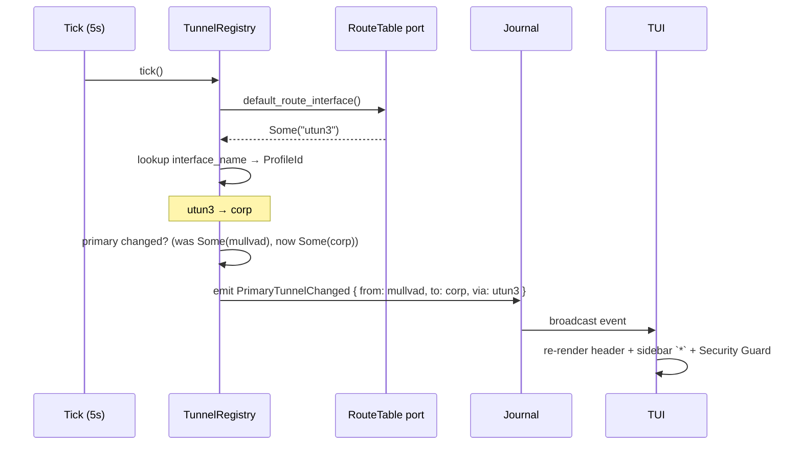

# feat!: Simultaneous active VPN profiles (multi-connection)

## Summary

Replace Vortix's single-active-tunnel state model with a registry of N concurrent `Engine<T>` actors keyed by `ProfileId`, surface a derived "primary" tunnel concept anchored on whichever interface owns the kernel default route, refactor the killswitch to enforce against a union of active interfaces with per-tunnel RFC1918 subtraction, extend WG and OpenVPN parsers for the AllowedIPs / `remote` / `redirect-gateway` data multi-tunnel routing requires, and adapt the TUI via expanded sidebar badges + a focus-driven detail panel — all without adding panels or expanding vertical footprint. WG + OVPN heterogeneous active in v1. Single-cut ship gated on the deferred v0.3.x daemon-completion bundle (plans 010, 011, 015) landing first.

---

## Problem Frame

Vortix today binds state, FSM, killswitch, UI panels, CLI, and persistence to one active tunnel. A user managing more than one VPN profile cannot run two simultaneously even when AllowedIPs are non-overlapping. The origin document captures the full problem narrative, the five actor segments (A1 corp+commercial dev, A2 multi-region QA, A3 MSP sysadmin, A4 self-hoster + Tailscale, A5 site-to-site + road-warrior), and the protocol-level SOP that exists at the WG/OVPN config layer but has never been surfaced cleanly by any GUI VPN client. See origin §2 (Problem frame) and §3 (Actors).

---

## Requirements

The plan inherits the origin's 9 goals (G1-G9) and 12 success criteria (SC1-SC12). Requirements R1-R11 trace to origin success criteria for behavioral verification; R12 and R13 are plan-local implementation requirements (credential-file safety and OVPN minimum-version assertion) that surface from the implementation specifics, not from origin SCs.

- **R1 — Concurrent active tunnels.** N>1 active WG/OVPN/heterogeneous tunnels in parallel without one teardown blocking another (origin G1, G2; SC1, SC4)
- **R2 — Primary derivation from kernel.** Single "primary" derived per-Tick from the kernel default-route interface; no stored Vortix-owned primary state (origin G3; SC1, SC2; Q-DEF-5 resolution: kernel-truth-only)
- **R3 — Honest no-primary UX.** When no active tunnel holds `0/0`, header + Security Guard explicitly say so (origin G4; SC2)
- **R4 — Default-route conflict pre-detection.** Conflict between in-flight `Connecting` and `Connected` primary claimants caught *before* `Tunnel::up` runs; CIDR-union check covers split-CIDR encodings (origin G8; SC3, SC10, SC11, SC12)
- **R5 — Killswitch union with RFC1918 subtraction.** Rules whitelist union of active-tunnel interfaces; per-tunnel declared CIDRs subtract from the flat RFC1918 allow (origin G5; SC6; Q-DEF-9 resolution: per-tunnel subtraction)
- **R6 — CLI backwards-compatibility + additive grammar.** `vortix up` additive, `vortix down` disconnects all, `vortix down <profile>` for one; JSON v1 readers still see primary-only `data.connection` (origin G6; SC4, SC8)
- **R7 — Bounded TUI footprint.** Multi-tunnel adds zero new panels and ≤3 lines of additional vertical content (origin G7)
- **R8 — Single-cut ship.** No phased rollout within multi-tunnel itself (origin G9)
- **R9 — Heterogeneous WG + OVPN concurrent.** WG and OVPN tunnels coexist in the active set with per-protocol DNS suppression for secondaries (origin G2; SC5; H1-H9)
- **R10 — Auto-promote on primary disconnect.** When primary disconnects and a secondary with `0/0` exists, promote it with a visible banner (Q-DEF-4 resolution)
- **R11 — Persistent fwmark warning.** Secondary tunnels at risk of fwmark hijack surface the warning as a persistent line in Connection Details — not a dismissable toast (Q-DEF-1 resolution)
- **R12 — Credential-safe DNS suppression.** Temp configs containing `[Interface] PrivateKey` use `O_CREAT|O_EXCL|O_NOFOLLOW` at mode 0600 with parent-directory symlink rejection; write_openvpn_auth_file migrated to the same helper
- **R13 — OVPN 2.4+ minimum-version assertion.** `--pull-filter ignore "dhcp-option DNS"` requires OVPN 2.4; dependency check fails fast for older versions

**Origin actors:** A1 (corp+commercial dev), A2 (multi-region QA), A3 (MSP sysadmin), A4 (self-hoster + Tailscale), A5 (site-to-site + road-warrior). R10 explicitly serves A5 (persistent-secondary-survives-primary-loss).

**Origin acceptance examples:** Covered via SC1-SC12. The 24 implementation units (U1-U24, including the documentation unit U24) map to one or more R-IDs; the Verification Strategy section traces SC IDs to units.

---

## Scope Boundaries

The origin doc is Deep-feature (not Deep-product), so a single non-goals list is correct here. Items deferred per the origin's NG list are restated; plan-local follow-up work is split out:

- **NG1.** Split-tunnel-by-app routing rules (issue [#15](https://github.com/Harry-kp/vortix/issues/15)). Composes with multi-tunnel but ships separately.
- **NG2.** Multi-hop chaining inside Vortix (traffic-through-A-then-B).
- **NG3.** Teoder's "disable Security Guard" sibling ask from discussion [#199](https://github.com/Harry-kp/vortix/discussions/199). Multi-tunnel's SG-scoping-to-primary addresses the "kind of breaks" symptom; the visibility toggle is a separate small feature.
- **NG4.** Auto-injection of `FwMark` directives into user WG configs. v1 warns; user fixes their `.conf`.
- **NG5.** OpenVPN management-socket integration for precise per-remote killswitch allow-list (origin Q-DEF-2 resolution: keep allow-all + document in SECURITY.md).
- **NG6.** Profile-import-time AllowedIPs overlap analysis across all profiles.
- **NG7.** Per-namespace tunnel model (Linux netns, macOS utun pinning).
- **NG8.** Mac App Store distribution. Vortix uses `utun` directly, not `NEPacketTunnelProvider`.
- **NG9.** IPv6 killswitch enforcement plane. Pre-existing v4-only gap acknowledged honestly in SG; parallel `ip6tables-restore` + `inet6` pf rules tracked as follow-up release.
- **NG10.** Killswitch coalescer for sub-Tick transition bursts (Q-DEF-7 resolution: defer to v2).

### Deferred to Follow-Up Work

- **D4 (OVPN integration test fixtures) — separate plan/PR.** Plan 012 in `docs/plans/` is the home; multi-tunnel SC9 (OVPN retry storm) ships with manual maintainer verification until D4 lands. SC tests at unit layer carry the bulk of behavioral coverage in v1.
- **V1 read-tolerance backport into v0.3.x for `active_tunnels` / `schema_version` fields** — ships as part of plan 015 (deferred-subsystems bundle) so V2→V1 downgrade is seamless. Plan-local fallback: document `rm ~/.config/vortix/killswitch-state.json` in MIGRATION.md (Rollback procedure section).

---

## Dependencies / Prerequisites

Multi-tunnel **cannot start** until the v0.3.x daemon-completion items land in a separate prior release:

- **D1 — Daemon engine wiring** (plan 010 in `docs/plans/`). Today the daemon dispatch (`crates/vortix/src/daemon/server.rs:122-138`) returns `IpcError::Internal("engine wiring not yet connected")` for `Execute`/`Snapshot`/`Subscribe`. `App.engine_handle: Option<EngineHandle>` is wired in `main.rs:295-355` but the TUI bypasses it and mutates `self.engine` directly (`app/mod.rs:60-63` comment confirms). **Hard prerequisite** — the registry is a set of `EngineHandle::Local` actors; building it on a stubbed handle is speculative. D1 done = `vortix up <profile>` and `vortix down` route through `EngineHandle::Local` end-to-end with single-tunnel happy path covered in tests.

- **D2 — SO_PEERCRED / getpeereid enforcement** (plan 011 in `docs/plans/`). Today the daemon socket is mode 0600 with no peer-credential check — any local process running as the daemon owner can issue commands. Multi-tunnel multiplies the blast radius from 1 to N tunnels. **Hard prerequisite.** D2 done = SO_PEERCRED on Linux, `getpeereid(2)` on macOS, rejecting non-matching UIDs.

- **D3 — Read-only ops bypass-daemon.** `vortix status`, `vortix list`, `vortix audit` continue to work without a daemon. Multi-tunnel's `vortix status` returns `{ connections: [...], primary: ... }`; without the bypass, every status call requires daemon presence — a regression for scripts. **Hard prerequisite.** Bundled with D1+D2 in plan 015.

- **D4 — OvpnTunnel happy-path integration test** (plan 012 in `docs/plans/`). **Soft prerequisite.** If D4 slips, SC9 (OVPN retry storm) is manually verified; unit-layer tests via `MockTunnel` cover the bulk of behavioral surface.

- **D5 — V1 read-tolerance backport into a v0.3.x point-release** (new plan, not yet authored). **Hard prerequisite for clean V2→V1 rollback.** The plan's `PersistedState` migration writes V2 schema (`schema_version`, `active_tunnels: Vec<ActiveTunnelInfo>`) immediately on first multi-tunnel boot. A user who hits a regression and reverts to v0.3.x will be running a binary that does not recognise the new fields. Today's v0.3.x `load_state()` swallows parse failures as `None` (`crates/vortix/src/core/killswitch.rs:69-90`), silently disarming the killswitch on revert. **D5 backports `#[serde(default)]` tolerance into v0.3.x** so V2 files load as one-tunnel state under V1 binaries. If D5 does not ship before this plan's release, the V2→V1 rollback procedure documented in §13 falls back to `rm ~/.config/vortix/killswitch-state.json` followed by manual `vortix killswitch <mode>` to re-arm. Prefer D5 lands first; document the fallback as the unconditional safety net.

**Verification before this plan begins implementation:** The daemon stub at `crates/vortix/src/daemon/server.rs:133` (`IpcError::Internal("engine wiring not yet connected in daemon — coming in v0.3.x")`) must be removed by D1's deliverables. Plan 010's `status: completed` claim must be verified at the codebase level — if the stub is still live, D1 is not done in fact regardless of plan-status metadata. A pre-flight check (compile-check `grep "engine wiring not yet connected" crates/vortix/src/daemon/`) gates the start of this plan.

---

## Context & Research

### Relevant Code and Patterns

**FSM and engine baseline (load-bearing; already shipped):**
- `crates/vortix/src/vortix_core/engine/fsm.rs:59` — `Engine<T: Tunnel>` with `tunnel_factory` callback already production-wired (`main.rs:322-329` builds the WG/OVPN dispatch). FSM is sync; wrapped in `tokio::task::spawn_blocking` by `EngineHandle::Local` actor loop (`vortix_core/engine/handle.rs:229-260`).
- `crates/vortix/src/vortix_core/engine/state.rs:107-149` — `Connection` enum (six `#[non_exhaustive]` variants). `DEFAULT_RETRY_BUDGET_SECS = 300` at line 16.
- `crates/vortix/src/vortix_core/engine/event.rs` — `EngineEvent` enum; `#[non_exhaustive]` so additive variants (`PrimaryTunnelChanged`, `ConnectAttemptBlockedByConflict` — both shipping in U23; `KillswitchRefreshed` deferred to v2) need no schema bump.
- `crates/vortix/src/vortix_core/engine/handle.rs:80-83` — `EngineHandle::Local(LocalHandle)` actor with `execute()`, `snapshot()`, `subscribe()`. **Becomes load-bearing via D1.**

**Ports and platform aggregator pattern:**
- `crates/vortix/src/vortix_core/ports/tunnel.rs:133-172` — `Tunnel` trait with `up`, `down`, `status`, `parse_profile`, `capabilities`. `ParsedProfile` (line 83-92) supports `as_any()` downcast — extensible without breaking consumers.
- `crates/vortix/src/vortix_core/ports/route_table.rs:8-11` — `RouteTable::default_gateway() -> Option<String>`. Needs sibling `default_route_interface() -> Option<String>` (U4).
- `crates/vortix/src/vortix_core/ports/killswitch.rs` — `Killswitch` trait with `enable_blocking(vpn_interface, vpn_server_ip)`. Signature change to `enable_blocking_multi(active: &[ActiveTunnelInfo])` is breaking (U7).
- `crates/vortix/src/platform/aggregate.rs:359-365` — dispatch boundary; callers go through `crate::platform::current_platform().route_table.default_gateway()` etc.

**Per-protocol parsers (load-bearing extensions, not currently capturing peer/remote data):**
- `crates/vortix/src/vortix_protocol_wireguard/parser.rs:11-17, 41-74` — `WgParsedProfile` captures only `[Interface]` (dns_servers, address, mtu, raw). The peer-section skip at line 49 (`in_interface = section.eq_ignore_ascii_case("Interface")`) is intentional and the test at line 103 cements it. Extension adds `peers: Vec<WgPeer>` with `public_key`, `allowed_ips: Vec<Cidr>`, `endpoint: Option<SocketAddr>`, `fwmark: Option<u32>`.
- `crates/vortix/src/vortix_protocol_openvpn/parser.rs:7-14` — `OvpnParsedProfile` captures only `interactive_auth` and `raw`. Extension adds `remotes: Vec<RemoteSpec>`, `redirect_gateway: bool`, `routes: Vec<OvpnRoute>`.

**Killswitch state (single-tunnel-shaped today):**
- `crates/vortix/src/core/killswitch.rs:60-65` — `PersistedState` carries `vpn_interface: Option<String>` and `vpn_server_ip: Option<String>` singular. `load_state` (line 69-90) returns `None` on parse failure (swallow). Multi-tunnel introduces `PersistedStateV2` with serde-default V1-tolerance (U10).
- `crates/vortix/src/vortix_platform_linux/firewall.rs:64-115` — `IptablesFirewall::setup_iptables` issues per-rule sequential `iptables -N/-F/-A/-I` calls; RFC1918 + DHCP allows hardcoded at lines 83-89. **Not atomic.** Migrate to `iptables-restore` (U8) — the nftables backend at line 144-195 already uses atomic `nft -f -` and is the pattern to mirror.
- `crates/vortix/src/vortix_platform_macos/firewall.rs:38-75, 113-127, 141-150` — `PfFirewall::generate_pf_rules` builds ruleset string; `enable_blocking` uses `pfctl -f` (already atomic); `disable_blocking` does `pfctl -F all` + `pfctl -d` (the non-atomic seam — fix in U9 by skipping flush during refresh).

**Legacy single-tunnel surfaces being retired:**
- `crates/vortix/src/state/connection.rs:38-69` — legacy `ConnectionState` enum. Tests at lines 71-175 retire with it.
- `crates/vortix/src/engine/mod.rs:35-92` — `VpnEngine` struct holds all single-tunnel state (connection_state, pending_connect, killswitch_mode/state, telemetry channels). Replaced by `TunnelRegistry<T>` (U5).
- `crates/vortix/src/app/mod.rs:58, 60-63` — `App.engine: VpnEngine` + the dormant `engine_handle: Option<EngineHandle>` field. Replaced by `App.registry: TunnelRegistry<T>` (U6).
- `crates/vortix/src/app/connection.rs:15-62` — `toggle_connection` with `InputMode::ConfirmSwitch` at line 48 (renamed in U18).

**UI panel read sites:**
- `crates/vortix/src/ui/dashboard/sidebar.rs:58-63, 65-66, 144-150` — status_char chars `✓`/`…`/`⏻` (today's vocabulary); `fixed_cols: u16 = 2 + 4 + 10 + 3 = 19`; `name_budget` saturates from `inner.width - fixed_cols`.
- `crates/vortix/src/ui/dashboard/header.rs:20-165, 213-237` — 3-branch status logic; KS indicator returns `KS:Off / KS:Auto / KS:Strict / KS:BLOCK`.
- `crates/vortix/src/ui/dashboard/connection_details.rs:34, 336` — body gated on `Connected{..}`; flip-back renderer at line 336.
- `crates/vortix/src/ui/dashboard/security.rs:34-228, 63-83` — single-exit assumption literally hardcoded at lines 63-83.

**Utility helpers:**
- `crates/vortix/src/utils.rs:51-55` — `write_user_file` (fs::write + fix_ownership; no mode bits — TOCTOU window).
- `crates/vortix/src/utils.rs:232-247` — `write_openvpn_auth_file` (write_user_file + separate chmod 0600 — same TOCTOU). Migrated to `write_secret_file` in U11.
- `crates/vortix/src/utils.rs:126-128` — `get_app_config_dir`. Base path for `${config_dir}/tmp/${session_id}/${basename}.conf` per-session temp subdir.

**CLI surface:**
- `crates/vortix/src/cli/args.rs:76-368` — clap subcommand enum. `Up` already has `profile: Option<String>` (additive-compatible). `Down` and `Reconnect` need profile-name extensions (U19).
- `crates/vortix/src/cli/output.rs:14-83` — JSON envelope `CliResponse { schema_version, ok, command, data, error, next_actions }`. `SCHEMA_VERSION = 1` at line 29; bump-on-non-additive policy in module docs. Multi-tunnel's `data.connections[]` + `data.primary` is non-additive → v2 (U20).

**Daemon and IPC:**
- `crates/vortix/src/daemon/server.rs:16-83, 122-138` — `DaemonServer`; dispatch stub.
- `crates/vortix/src/vortix_core/ipc/mod.rs:31-43` — `IpcOp::{Execute(UserCommand), Snapshot, Subscribe, Shutdown}`. `UserCommand` (`vortix_core/engine/input.rs`) has `Connect{profile_id}`, `Disconnect | ForceDisconnect`, `Reconnect`, `UserAnswered`. Multi-tunnel modifies `UserCommand` directly with `Disconnect{profile_id: Option<ProfileId>}` and `Reconnect{profile_id: Option<ProfileId>}` (U21).

**Journal (session ID source):**
- `crates/vortix/src/vortix_core/journal/mod.rs:177-180` — session path is `{ISO-timestamp}-{pid}.jsonl`. **Session ID is `{ISO-timestamp}-{pid}`, not a UUID.** Temp-config subdir naming uses this same ID for the per-session isolation pattern.

### Institutional Learnings

`docs/solutions/` does not exist in this repository — greenfield knowledge area for these topics. Closest adjacent context lives in `docs/plans/`:

- **`docs/plans/2026-05-24-005-feat-engine-fsm-event-journal-plan.md`** — the FSM/handle baseline this work extends.
- **`docs/plans/2026-05-24-004-refactor-tunnel-trait-enum-dispatch-plan.md`** — the `Tunnel` port shape and `tunnel_factory` pattern.
- **`docs/plans/2026-05-24-010-feat-ipc-engine-handle-remote-plan.md`** — D1 (daemon engine wiring); prerequisite.
- **`docs/plans/2026-05-24-011-feat-privilege-separation-plan.md`** — D2 (SO_PEERCRED enforcement); prerequisite.
- **`docs/plans/2026-05-24-015-feat-deferred-subsystems-bundle-plan.md`** — the D1+D2+D3 bundle plan; landing this enables multi-tunnel to start.

After this plan lands, capture non-obvious findings via `/ce-compound` — atomic firewall transactions, CIDR union aggregation algorithms, V1→V2 serde migration shape, heterogeneous-protocol-concurrent edge cases, kernel routing-table parsing on macOS+Linux.

### External References

The origin doc carries the full external-research citation set (`casavant.org` fwmark hijack, SparkLabs Viscosity multi-VPN UX, Tunnelblick DNS suppression, NetworkManager `ipv4.never-default`, Mullvad multi-hop, IVPN kill switch, `wg-quick(8)` man page, Apple Developer Forums NEPacketTunnelProvider). No additional external research dispatched at planning time — the codebase is the dominant source for implementation patterns.

---

## Key Technical Decisions

Each Q-DEF resolution from the origin's pre-planning review is restated here as a named decision with rationale, so plan-time choices are auditable from the plan body alone:

- **D-1. Fwmark UX = persistent panel line in Connection Details (Q-DEF-1 resolution).** Rationale: fails-readable for the user (warning is visible whenever the failing tunnel is focused), not dismissable like a toast (avoids the silent-credential-exposure failure mode), not blocking like an overlay (lower friction). Origin §7.5's credential-exposure framing (cross-operator handshake material leak) motivates picking something stronger than a toast; scope-guardian's middle path is the right calibration.

- **D-2. OVPN `remote` allow-list = keep allow-all + document trust assumption in SECURITY.md (Q-DEF-2 resolution).** Rationale: v1 conservative posture; threat fires only on imported-from-untrusted-source profiles, which is already Vortix's trust assumption for `.ovpn` imports. Management-socket integration (NG5) is the v2 sharper fix.

- **D-3. Primary-disconnect = auto-promote with visible banner (Q-DEF-4 resolution).** Rationale: A5 actor explicitly requires the persistent-secondary-survives-primary-loss pattern; matches user expectation from browsers, cellular handoff, redundancy systems. The banner makes the change visible (`Promoted 'corp' to primary because 'mullvad' disconnected — [u] to revert`), not silent.

- **D-4. Primary derivation = kernel-truth-only (Q-DEF-5 resolution).** Rationale: simpler model, no stored Vortix-owned primary state, aligns with auto-promote (kernel reflects the new primary the moment its `0/0` route lands). Vortix-owned-with-divergence-detection has too much downstream complexity (stored field, drift detection, alert path) for v1; R7 stays a documented property. Kernel-truth + auto-promote together imply the kernel's routing table is the user-facing source of truth — exactly the SOP this plan inherits from the brainstorm.

- **D-5. Killswitch coalescer = deferred to v2 (Q-DEF-7 resolution).** Rationale: scope-guardian's challenge stands — realistic v1 flows are sequential connects separated by seconds, not sub-Tick bursts. The H6 teardown-once-at-end one-shot pattern covers the only real burst case. v1 ships "one transition = one ruleset rewrite."

- **D-6. RFC1918 overlap = per-tunnel CIDR subtraction at rule-synthesis time (Q-DEF-9 resolution).** Rationale: honors G5 ("killswitch posture remains correct") without breaking LAN/DHCP. When the active set includes a tunnel claiming `10.0.0.0/8`, the killswitch removes `10.0.0.0/8` from the flat RFC1918 allow so destinations in that range must go through that tunnel's interface. ~30 lines of CIDR subtraction logic; explicit; easy to test.

Additional plan-time decisions:

- **D-7. Registry shape = `HashMap<ProfileId, Engine<T>>` wrapper (Q-DEF-6 deferred).** The plan adopts a `TunnelRegistry<T>` struct holding the HashMap + derived `primary: Option<ProfileId>` + global killswitch fields, with snapshot accessors (`tunnel_count`, `primary`, `snapshot`, `snapshot_all`). Q-DEF-6 asked whether a plain `Vec<(ProfileId, EngineHandle)>` + free functions would be simpler — the plan defers that prototype to U5 implementation time. If the spike during U5 reveals the Vec form is materially clearer, the struct can be retired before U6 lands. Either shape satisfies the snapshot-accessor contract; the panel migration in U6 reads through accessors and is shape-agnostic.

- **D-8. UserCommand enum extension over new Command enum.** Origin §7.8 framed the multi-tunnel IPC as introducing a "new `Command` enum"; the codebase actually uses `IpcOp::Execute(UserCommand)` (`vortix_core/ipc/mod.rs:31-43`). Multi-tunnel modifies `UserCommand` directly with `Disconnect{profile_id: Option<ProfileId>}` and `Reconnect{profile_id: Option<ProfileId>}` variants — additive within the existing dispatch shape. The JSON envelope v1→v2 bump is the consumer-visible break, not the in-process enum change.

- **D-9. Session ID for temp-config subdir = `{ISO-timestamp}-{pid}` (matches journal session ID).** The origin called for a "per-session UUID subdir" to isolate temp configs from O_EXCL deadlock; the journal already produces a unique session identifier via `journal/mod.rs:177-180`. Reusing it keeps the cleanup-by-session-prefix glob trivial and avoids introducing a second UUID source.

---

## Open Questions

### Resolved During Planning

- **Q-DEF-1 fwmark UX:** resolved as persistent panel line with inline remediation + sidebar `●!` annotation (see D-1, U17, U15)
- **Q-DEF-2 OVPN allow-list:** resolved as keep allow-all + document concrete killswitch-bypass threat in SECURITY.md (see D-2, U24)
- **Q-DEF-4 primary disconnect:** resolved as auto-promote with 10-second banner + manual revert path via `vortix up <old>` (see D-3, U19)
- **Q-DEF-5 primary derivation:** resolved as kernel-truth-only with event-driven `refresh_primary()` on FSM transitions (see D-4, U5)
- **Q-DEF-6 registry struct vs Vec:** resolved as `TunnelRegistry<T>` struct form (D-7 committed; spike retired). Vec + parallel globals was the only alternative and was rejected because derived state — primary, killswitch_mode, killswitch_state — needs a coherent home that a Vec+free-functions shape can't provide without parallel globals. 12 downstream units (U6, U15-U18, etc.) already address `app.registry.X`; that contract is the API the snapshot accessors satisfy regardless of internal shape, but the struct form is committed.
- **Q-DEF-7 killswitch coalescer:** resolved as defer to v2 (see D-5)
- **Q-DEF-9 RFC1918 overlap:** resolved as per-tunnel CIDR subtraction (see D-6)
- **Command enum vs UserCommand extension:** resolved as `UserCommand` extension; acknowledged as wire-protocol breaking, not "additive" (see D-8, U22)
- **`KillswitchRefreshed` journal event:** resolved as deferred to v2 — no v1 consumer, EngineEvent is `#[non_exhaustive]` so the addition is cheap later (see U23)

### Deferred to Implementation

- **Q-DEF-3 v0.3.x prerequisite schedule.** Out of this plan's scope. Plan 015 owns the scheduling of D1+D2+D3.

- **Q-DEF-8 release-comms sequencing.** Out of this plan's scope. Downstream of Q-DEF-3.

- **D5 V1-backport home (added from round-2 review).** Plan 015 was named as the home for V1 read-tolerance backport but its status is `completed-with-phase-a-rollback` and its body never committed to that work. **Decision needed before this plan starts:** (a) create a new plan that ships V1 read-tolerance as a v0.3.x point release (preferred — clean rollback), or (b) commit to the `rm ~/.config/vortix/killswitch-state.json` fallback as the unconditional downgrade procedure documented in MIGRATION.md. Resolution determines whether D5 is a hard prerequisite or a graceful-degradation fallback.

- **Phased Delivery week estimate framing.** The plan presents 7-10 weeks as the total. That estimate assumes parallel execution across Phases D/E and parts of Phase F — viable with multiple implementers, less so for a solo maintainer. **Maintainer resolution needed:** is 7-10w the multi-implementer optimistic estimate (and a solo-maintainer floor is ~12-16w), or is 7-10w the committed sequential floor? Release-comms and prerequisite-scheduling depend on which.

- **D1 hard-prereq vs U22-deferrable framing.** §9 D1 calls D1 a hard prerequisite. The Risks table later says U22 can be deferred if D1 lands late (registry runs through `EngineHandle::Local` without daemon-mode IPC). Resolution: pick one framing — (a) D1 gates U22 only; multi-tunnel ships TUI-only as fallback shape; or (b) D1 hard-required for whole plan + remove U22-deferrable mitigation from Risks row 1. The current ambiguity has downstream effects on release planning.

- **Exact `pending_after_disconnect` cancellation semantics.** What happens if the user has B queued behind A's disconnect, then disconnects A again (already in `Disconnecting`)? Default: the queue is cancelled silently (A's FSM reaches `Disconnected` without firing the queued connect). Verified at implementation time via state transition testing in U5.

- **`pending_after_disconnect` invocation mechanism.** When A's FSM reaches `Disconnected` with B queued, does B's connect fire from: (a) A's FSM transition callback (cross-FSM coupling — requires FSM-to-registry reference), or (b) the registry's tick loop polling all FSMs for queued connects (decoupled, latency up to one Tick)? Default at implementation time: (b) — preserves FSM isolation; up to 5s latency on the queued connect is acceptable. Verified in U5.

- **`lstat`/`openat` error handling on directory creation.** If the config dir doesn't exist yet (first run), the `open(parent, O_DIRECTORY|O_NOFOLLOW)` returns ENOENT. Default: create with `DirBuilder::new().mode(0o700).recursive(true).create(parent)` and retry the `open`; fail loud only on the second ENOENT or on `O_NOFOLLOW` returning ELOOP. Verified at implementation in U12.

---

## High-Level Technical Design

> *This illustrates the intended approach and is directional guidance for review, not implementation specification. The implementing agent should treat it as context, not code to reproduce.*

The plan replaces today's "App holds VpnEngine; one ConnectionState; one killswitch interface" model with a registry-of-FSMs that derives its user-facing primary identity from the kernel routing table.

### State model — registry of FSMs

```text
App
└── registry: TunnelRegistry<T>
    ├── fsms: HashMap<ProfileId, Engine<T>>          // N independent FSMs
    │   ├── corp     → Engine<WgTunnel>     [Connected, addressable 10.0.0.0/8]
    │   ├── personal → Engine<WgTunnel>     [Connected, primary 0.0.0.0/0]
    │   └── lab      → Engine<OvpnTunnel>   [Reconnecting, addressable 198.18.0.0/15]
    │
    ├── primary: Option<ProfileId>                    // derived from RouteTable per-Tick
    ├── killswitch_mode: KillSwitchMode
    └── killswitch_state: KillSwitchState

(per-Engine slot for queue-after-disconnect)
Engine<T>
└── pending_after_disconnect: Option<ProfileId>
```

Each `Engine<T>` retains its existing single-tunnel FSM semantics unchanged — `try_connect`, `try_disconnect`, `try_reconnect`, retry budget. The registry is a wrapper that fans commands out, aggregates state, and owns the derived primary + global killswitch posture.

### Primary derivation — sequence



### Connect flow with default-route conflict detection

The pre-`Tunnel::up` conflict check must consider both `Connected` and in-flight `Connecting` FSMs as primary claimants — without this, two simultaneous `Connecting` FSMs with `0/0` both pass the conflict gate and silently race the kernel routing table. Pseudo-shape of `detect_conflict`:

```rust
// Directional only. Final shape decided at U5 implementation time.
fn detect_conflict(&self, new_profile: &Profile) -> Option<Conflict> {
    if would_claim_default_route(new_profile, &parsed) {
        // Connected primary first
        if let Some(current) = &self.primary {
            return Some(Conflict::DefaultRouteTakeover { current: current.clone(), new: new_profile.id() });
        }
        // Then in-flight Connecting that declared 0/0
        if let Some(pending) = self.pending_default_route_claimant() {
            return Some(Conflict::DefaultRouteTakeover { current: pending, new: new_profile.id() });
        }
    }
    self.detect_cidr_overlap(new_profile).map(Conflict::RouteOverlap)
}
```

`would_claim_default_route` calls `claims_default_route_v4` / `claims_default_route_v6` which run a true CIDR union-cover algorithm (handles `0/0`, `0/1 + 128/1`, `0/2 + 64/2 + 128/2 + 192/2`, and deeper splits).

### Killswitch rule synthesis — Linux iptables-restore template

```text
*filter
:OUTPUT DROP [0:0]
-A OUTPUT -o lo -j ACCEPT
# RFC1918 allows minus active-tunnel CIDRs (D-6)
-A OUTPUT -d {rfc1918_remainder_after_subtraction} -j ACCEPT
-A OUTPUT -p udp --dport 67:68 -j ACCEPT  # DHCP
# Per-tunnel allow paths
{for each tunnel in active_set}
-A OUTPUT -o {tunnel.interface} -j ACCEPT
{for each server_ip in tunnel.server_ips}
-A OUTPUT -d {server_ip} -j ACCEPT
COMMIT
```

The full ruleset is built in memory, then `iptables-restore < ruleset` applies it as a single atomic transaction (mirrors the existing nftables `nft -f -` pattern at `firewall.rs:144-195`).

### CIDR subtraction worked example (D-6)

If active set contains corp (`AllowedIPs = 10.0.0.0/8`) and personal (`AllowedIPs = 0/0`):

```text
RFC1918 input:  [192.168.0.0/16, 10.0.0.0/8, 172.16.0.0/12]
Active CIDRs:   [10.0.0.0/8, 0/0]
After subtract: [192.168.0.0/16, 172.16.0.0/12]
                  (10.0.0.0/8 removed; 0/0 absorbs entire space but
                   killswitch policy is: 0/0 primaries don't subtract
                   anything — primaries are protected by their interface
                   rule, not by being in the LAN allow)
```

`0/0` tunnels DO NOT subtract — the per-interface allow rule for the primary already routes its traffic correctly; subtracting `0/0` would also remove `127.0.0.0/8` loopback and break local services. The subtraction logic only operates on private-network-shaped CIDRs (subset of RFC1918 + link-local + multicast).

### Sidebar badge taxonomy

| Char | State | Color | Notes |
|------|-------|-------|-------|
| `●` | Connected | `theme::SUCCESS` | + ` *` suffix when primary |
| `◐` | Connecting | `theme::WARNING` | |
| `↻` | Reconnecting (lost link, auto-retrying) | `theme::WARNING` dim | |
| `◑` | Disconnecting | `theme::WARNING` | |
| `?` | AwaitingUserInput (2FA / passphrase) | `theme::WARNING` | |
| `✗` | Connect-failed | `theme::ERROR` | persists until user retry/dismiss |
| ` ` (space) | Disconnected | dim | |

---

## Implementation Units

Twenty-three units across seven phases. Units within a phase are dependency-ordered. Phases are loose groupings — Phase B can start once Phase A's parser surfaces are stable enough for tests; cross-phase parallelism is allowed once foundational units land.

### Phase A — Parser extension and CIDR foundation

### U1. Extend WireGuard parser with peer + AllowedIPs + FwMark

**Goal:** `WgParsedProfile` exposes the `[Peer]` section data the registry's conflict detector and killswitch synthesis require. Today the parser explicitly skips peer content.

**Requirements:** R4, R5, R9, R11

**Dependencies:** None

**Files:**
- Modify: `crates/vortix/src/vortix_protocol_wireguard/parser.rs`
- Test: `crates/vortix/src/vortix_protocol_wireguard/parser.rs` (inline `#[cfg(test)]` module already present)

**Approach:**
- Add `WgPeer { public_key: String, allowed_ips: Vec<Cidr>, endpoint: Option<SocketAddr>, fwmark: Option<u32> }` struct
- Add `WgParsedProfile.peers: Vec<WgPeer>` field
- Reparse the existing `[Peer]` loop branch (currently no-op'd at line 49) to populate peers
- `Cidr` type: a small wrapper around `IpAddr + u8 prefix_len`. Single-purpose; goes alongside the parser module
- Preserve the existing `[Interface]`-only ignore tests (rename to `ignores_peer_dns_keeps_interface_dns_with_peers_parsed`)

**Patterns to follow:** Existing line-by-line parser shape (lines 41-74) — section header tracking, key=value split, trim, skip blanks/comments

**Test scenarios:**
- Happy path: profile with one peer, AllowedIPs = `10.0.0.0/8, 192.168.0.0/16`, Endpoint, FwMark — all four fields populated correctly
- Happy path: profile with multiple peers (multi-peer WG configs are valid) — all peers in the vec in order
- Edge case: AllowedIPs containing both IPv4 and IPv6 CIDRs in one line — vec contains both with right prefix lengths
- Edge case: AllowedIPs = `0.0.0.0/0, ::/0` — both default routes parsed
- Edge case: AllowedIPs split across multiple lines (some configs use this) — single peer with concatenated vec
- Edge case: peer with no Endpoint or FwMark — `None` for those fields, peer still emitted
- Error path: malformed AllowedIPs (e.g., `10.0.0/8` missing octet) — peer accepted but the bad CIDR dropped with a tracing warn; rest of vec preserved
- Edge case: FwMark = `off` (wg-quick convention) — parsed as `Some(0)` per wg-quick semantics

**Verification:** Existing parser tests still pass; new peers field populated for all sample WG configs; `parse_profile()` API unchanged for existing consumers (peers field is additive on the existing struct).

---

### U2. Extend OpenVPN parser with remotes + redirect-gateway + routes

**Goal:** `OvpnParsedProfile` exposes the data multi-tunnel needs: server IPs for the killswitch allow-list, default-route claim for conflict detection, and explicit routes.

**Requirements:** R4, R5, R9

**Dependencies:** None (parallel with U1)

**Files:**
- Modify: `crates/vortix/src/vortix_protocol_openvpn/parser.rs`
- Test: `crates/vortix/src/vortix_protocol_openvpn/parser.rs` (inline tests)

**Approach:**
- Add `RemoteSpec { host: String, port: u16, proto: Option<String> }`
- Add `OvpnRoute { destination: Cidr, gateway: Option<IpAddr>, metric: Option<u32> }`
- Add fields: `remotes: Vec<RemoteSpec>`, `redirect_gateway: bool`, `routes: Vec<OvpnRoute>`
- Walk the line-by-line parser. `remote` directive: optional port (default 1194) and proto (default udp). `redirect-gateway` directive: presence-only (any of `def1`, `bypass-dhcp`, etc. counts as true). `route` directive: parse `<dest> <netmask>` or `<dest>/<prefix>` plus optional gateway and metric.
- DNS-server extraction from `dhcp-option DNS x.x.x.x` lines stays in the existing `ParsedProfile::dns_servers()` accessor (already implemented).

**Patterns to follow:** Existing line-by-line OVPN parser walk; mirror the `WgParsedProfile` extension shape from U1.

**Test scenarios:**
- Happy path: profile with single `remote vpn.example.com 1194 udp` — RemoteSpec populated
- Happy path: profile with `remote-random` and 3 `remote` lines — all 3 in vec; flag captured separately
- Happy path: profile with `redirect-gateway def1` — flag true
- Happy path: profile with no redirect-gateway and 2 `route` lines — flag false, routes vec has 2 entries
- Edge case: `remote` with no port — defaults to 1194
- Edge case: `remote` with proto `tcp-client` — proto field captures verbatim
- Edge case: `route 10.0.0.0 255.0.0.0` (netmask form) and `route 10.0.0.0/8` (CIDR form) — both produce equivalent `OvpnRoute`
- Error path: malformed `route` line missing destination — line skipped with tracing warn; rest of profile parsed

**Verification:** Existing parser tests pass; new fields populated for sample OVPN configs (cover both Mullvad-style and corporate-style configs); `dns_servers()` accessor unchanged.

---

### U3. CIDR-union default-route detection helper

**Goal:** A standalone helper `claims_default_route_v4(allowed_ips: &[Cidr]) -> bool` (and v6 sibling) that returns true when any CIDR is `0/0` OR when a union of declared CIDRs aggregates to full address-space coverage.

**Requirements:** R4

**Dependencies:** None (can develop in parallel with U1/U2 since it consumes only `&[Cidr]`)

**Files:**
- Create: `crates/vortix/src/vortix_core/cidr.rs` (or a submodule under `vortix_core/ports/` — implementer's call at unit time)
- Modify: `crates/vortix/src/vortix_core/mod.rs` (re-export)
- Test: same file (inline `#[cfg(test)]`)

**Approach:**
- Sort prefixes by prefix length ascending; coalesce adjacent / contained ranges
- Aggregation algorithm: convert each CIDR to a numeric range, merge overlapping/adjacent ranges, test whether the merged set covers `[0, 2^32)` for IPv4 or `[0, 2^128)` for IPv6
- True union-cover, not pattern-match — must reject `0/2 + 64/2 + 128/2 + 192/2` (the /2 quartet) and any deeper-split combination, not just the canonical `0/1 + 128/1` pair
- Helper functions: `cidr_to_range(cidr) -> (u128, u128)`, `merge_ranges(&[Range]) -> Vec<Range>`, `covers_full_space(merged: &[Range], family: AddrFamily) -> bool`

**Patterns to follow:** New shared utility. No existing CIDR helper in the codebase to mirror.

**Technical design:** *Directional only.* Pseudo-shape:
```rust
pub fn claims_default_route_v4(allowed_ips: &[Cidr]) -> bool {
    if allowed_ips.iter().any(|c| c.is_ipv4() && c.prefix_len == 0) { return true; }
    let v4_ranges: Vec<(u32, u32)> = allowed_ips.iter().filter_map(|c| c.as_v4_range()).collect();
    let merged = merge_v4_ranges(v4_ranges);
    covers_full_v4_space(&merged)
}
```

**Test scenarios:**
- Happy path: `[0.0.0.0/0]` → true
- Happy path: `[0.0.0.0/1, 128.0.0.0/1]` → true (canonical /1 split — SC10)
- Happy path: `[0.0.0.0/2, 64.0.0.0/2, 128.0.0.0/2, 192.0.0.0/2]` → true (/2 quartet — SC11)
- Happy path: `[0.0.0.0/3, 32.0.0.0/3, 64.0.0.0/3, 96.0.0.0/3, 128.0.0.0/3, 160.0.0.0/3, 192.0.0.0/3, 224.0.0.0/3]` → true (deeper /3 split)
- Happy path: `[10.0.0.0/8]` → false (single private CIDR)
- Happy path: `[10.0.0.0/8, 192.168.0.0/16]` → false (two disjoint private CIDRs)
- Edge case: `[0.0.0.0/1, 64.0.0.0/2, 128.0.0.0/1]` → true (mixed prefix lengths that still aggregate)
- Edge case: `[0.0.0.0/1, 128.0.0.0/2]` → false (`128.0.0.0/2` leaves `192.0.0.0/2` uncovered)
- Edge case: `[10.0.0.0/8, 10.0.0.0/16]` → false (overlap doesn't help cover full space)
- IPv6 sibling: `[::/0]` → true; `[::/1, 8000::/1]` → true; mixed IPv4+IPv6 input — `claims_default_route_v4` ignores IPv6 entries
- Boundary: empty vec → false (defensive — no claim if no AllowedIPs at all)

**Verification:** All eight test scenarios pass. SC10 and SC11 from origin §10 directly cite this helper.

---

### Phase B — Routing primitive extension

### U4. `RouteTable::default_route_interface()` extension

**Goal:** Add interface-name accessor to the `RouteTable` port and both platform implementations, extending the existing `route get default` / `ip route show default` parsers rather than introducing parallel commands.

**Requirements:** R2

**Dependencies:** None (orthogonal to Phase A; can run in parallel)

**Files:**
- Modify: `crates/vortix/src/vortix_core/ports/route_table.rs` (add trait method)
- Modify: `crates/vortix/src/vortix_platform_macos/route_table.rs` (extend `route get default` parser to also extract `interface:` line)
- Modify: `crates/vortix/src/vortix_platform_linux/route_table.rs` (extend `ip route show default` parser to also walk for `dev <name>`)
- Modify: `crates/vortix/src/vortix_platform_windows/route_table.rs` (stub; returns `None`)
- Modify: `crates/vortix/src/platform/aggregate.rs` (dispatch line additions if needed)
- Test: same files (inline tests with sample command output)

**Approach:**
- Trait extension: `fn default_route_interface(&self) -> Option<String>;` (static method, not on a receiver — mirror existing `default_gateway` shape)
- macOS impl walks the existing `route get default` output for a line matching `^\s*interface:\s+(\S+)$`
- Linux impl walks the existing `ip route show default` output for `dev (\S+)` token
- Both impls reuse the existing subprocess invocation — single command, second extraction

**Patterns to follow:** `crates/vortix/src/vortix_platform_macos/route_table.rs:10-28` (existing macOS parser); `crates/vortix/src/vortix_platform_linux/route_table.rs:10-26` (existing Linux parser).

**Test scenarios:**
- Happy path (macOS): sample `route get default` output containing `interface: en0` → returns `Some("en0")`
- Happy path (Linux): sample `ip route show default` output `default via 192.168.1.1 dev wlan0 proto dhcp` → returns `Some("wlan0")`
- Happy path (macOS, VPN active): sample output with `interface: utun3` → returns `Some("utun3")`
- Edge case (macOS): output with no `interface:` line — returns `None`
- Edge case (Linux): output with `dev` token at unusual position (e.g., after `proto`) — parser still extracts correctly
- Edge case: empty subprocess output — returns `None`
- Error path: subprocess fails (route binary missing) — returns `None`, no panic

**Verification:** Existing `default_gateway()` tests unchanged; new method returns expected interface for VPN-active and non-VPN-active routing states. Test fixtures use captured real output samples in test data.

---

### Phase C — TunnelRegistry foundation

### U5. `TunnelRegistry<T>` with snapshot accessors and in-flight conflict detection

**Goal:** Introduce the wrapper that holds N `Engine<T>` actors, the derived primary, the global killswitch state, and the snapshot accessors that UI panels read through.

**Requirements:** R1, R2, R4, R10

**Dependencies:** U1 (WG parser AllowedIPs), U2 (OVPN parser remotes/redirect-gateway), U3 (CIDR helper), U4 (route_table interface accessor)

**Files:**
- Create: `crates/vortix/src/vortix_core/engine/registry.rs`
- Modify: `crates/vortix/src/vortix_core/engine/mod.rs` (re-export `TunnelRegistry`)
- Modify: `crates/vortix/src/vortix_core/engine/fsm.rs` (add `pending_after_disconnect: Option<ProfileId>` slot on `Engine<T>`; expose `state()` and `profile_id()` accessors if not already)
- Test: same file (`registry.rs` `#[cfg(test)]` block using `MockTunnel`)

**Approach:**
- **Q-DEF-6 spike**: at the start of U5, prototype `TunnelRegistry { fsms: HashMap<ProfileId, Engine<T>>, primary: Option<ProfileId>, killswitch_mode, killswitch_state }` against a `Vec<(ProfileId, Engine<T>)>` + free functions. Spike duration: ≤4 hours. Choose the shape that reads more clearly alongside the existing `EngineHandle::Local`. The plan's default is the struct form; flip if the spike proves otherwise. **Document the decision in the file's module doc with one sentence rationale.**
- `TunnelRegistry::new()` — empty
- `TunnelRegistry::tunnel_count() -> usize`
- `TunnelRegistry::primary() -> Option<ProfileId>` (the derived field; updated by `refresh_primary()`)
- `TunnelRegistry::snapshot(profile_id) -> Option<TunnelSnapshot>` and `snapshot_all() -> Vec<TunnelSnapshot>`
- `TunnelRegistry::connect(profile, force: bool)` — runs `detect_conflict` first; on conflict returns `Err(Conflict)` and emits `ConnectAttemptBlockedByConflict`; on Ok spawns/wakes the FSM with `Connect`
- `TunnelRegistry::disconnect(profile_id)` and `disconnect_all()` (sequential per H6: secondaries first, primary last; one killswitch refresh at end)
- `TunnelRegistry::reconnect(profile_id)` and `reconnect_all()`
- `TunnelRegistry::refresh_primary()` — calls `RouteTable::default_route_interface()`, maps via `TunnelHandle.interface_name` to ProfileId, sets `self.primary`, emits `PrimaryTunnelChanged` if changed
- **Refresh triggers (event-driven first, Tick as safety net):**
  - **Event-driven (inline, fires within milliseconds):** Any FSM transition that affects primary candidacy — Connected→Disconnected of the current primary, Connected of a `0/0`-claiming tunnel, Tunnel::down Ok, Tunnel::up Ok. The registry invokes `refresh_primary()` synchronously at the end of these transitions before returning from the wrapping `connect()`/`disconnect()` method.
  - **Tick (5s cadence):** Safety net for external route changes (e.g., user runs `wg-quick down` outside Vortix). The Tick-bound trigger catches the residual cases the FSM doesn't observe.
  - **`NetworkLinkChanged` events:** Same as today.
  - **Rationale:** Without the event-driven trigger, the SG panel can render `PROTECTED` for up to 5 seconds after primary disconnects while traffic egresses unprotected through the LAN gateway. Inline `refresh_primary` after FSM transitions closes that perception lag for all in-Vortix actions; the Tick remains for the external-change case where the lag is unavoidable and documented (R7-style "primary changes when you weren't looking" — Tick-bound by design).
- `TunnelRegistry::detect_conflict(new_profile)` — see High-Level Technical Design; checks Connected primary, then `pending_default_route_claimant()` for in-flight Connecting FSMs
- **Auto-promote on primary disconnect (D-3):** when an FSM transitions Connected→Disconnected and that FSM was primary, find the next eligible secondary (Connected with `0/0` AllowedIPs) and promote — kernel-truth-only means we don't store an explicit promotion; we just don't refuse it. The auto-promote banner is generated by the UI layer (U18) from the `PrimaryTunnelChanged` event with `from: Some, to: Some, reason: PriorPrimaryDisconnected`

**Patterns to follow:** Existing `Engine<T>` (`fsm.rs:59-100`); event-emission shape from `fsm.rs:155-180` (`events.push(EngineEvent::...)`); actor-loop pattern from `handle.rs:229-260`.

**Technical design:** *Directional only.* Snapshot shape:
```rust
pub struct TunnelSnapshot {
    pub profile_id: ProfileId,
    pub state: Connection,             // current FSM state
    pub role: Role,                    // derived: Primary | Addressable(Vec<Cidr>) | AddressableSuppressed | Reconnecting(Box<Role>) | AwaitingInput
    pub health: ConnectionHealth,
    pub interface_name: Option<String>,
    pub started_at: Option<SystemTime>,
}
```

**Test scenarios:**
- Happy path: empty registry → `tunnel_count = 0`, `primary = None`, `snapshot_all` empty
- Happy path: connect one profile → tunnel_count = 1, primary becomes Some after `refresh_primary()`, snapshot returns its state
- Happy path: connect two profiles disjoint AllowedIPs → both Connected, primary is whichever owns 0/0
- Happy path: disconnect primary while secondary holds 0/0 → after `refresh_primary()`, primary becomes the secondary; `PrimaryTunnelChanged` event emitted with `reason: PriorPrimaryDisconnected` (SC2 + auto-promote D-3)
- Edge case: connect with conflict (existing Connected primary holds 0/0, new profile also claims 0/0) → returns `Err(Conflict::DefaultRouteTakeover)`, no FSM transition, no kernel state change (SC3)
- Edge case: connect with in-flight conflict (existing FSM in Connecting state with 0/0, new profile also claims 0/0) → returns `Err(Conflict::DefaultRouteTakeover)` keyed on pending claimant (SC12)
- Edge case: connect with split-CIDR 0/1+128/1 while another tunnel holds 0/0 → conflict detected (SC10)
- Edge case: connect with /2 quartet while another tunnel holds 0/0 → conflict detected (SC11)
- Edge case: 3 split-route tunnels active, none holds 0/0 → primary = None; `snapshot_all` returns all three with `Role::Addressable`
- Edge case: `force: true` bypasses conflict check (used when user confirms the takeover overlay)
- Edge case: `disconnect_all` with mixed states (one Connecting, one Connected primary, one Reconnecting) → sequential teardown order observed; final state empty registry
- Edge case: pending_after_disconnect queue — A `Disconnecting`, queue B's connect on A's slot; when A reaches Disconnected, B's FSM starts (covers §6.6 race row)
- Error path: connect with missing profile (profile_resolver returns None) → registry.connect returns Err(ProfileNotFound); no FSM created
- Integration: `refresh_primary` after Tunnel::up — primary picks up the new interface; `PrimaryTunnelChanged` fires

**Verification:** Q-DEF-6 spike rationale documented in module doc; all 12 test scenarios pass; SC2, SC3, SC10, SC11, SC12 explicitly covered. Existing `Engine<T>` tests in `fsm.rs:445-555` continue to pass unchanged (registry doesn't modify FSM behavior).

---

### U6. App migration: registry replaces VpnEngine; legacy ConnectionState retires

**Goal:** Wire the registry into `App`, retire `App.engine: VpnEngine` and the legacy `state/connection.rs::ConnectionState` enum, migrate all panel reads to registry snapshot accessors.

**Requirements:** R1, R3, R7

**Dependencies:** U5 (registry exists)

**Files:**
- Modify: `crates/vortix/src/app/mod.rs` (App struct: replace `engine` with `registry`; remove the `engine_handle: Option<...>` field — it's now load-bearing via the registry's actor-per-FSM design)
- Modify: `crates/vortix/src/app/connection.rs` (toggle_connection routes through registry; remove `pending_connect: Option<usize>` from App-level state — now per-Engine)
- Modify: `crates/vortix/src/app/update.rs` (Message dispatching)
- Modify: `crates/vortix/src/app/telemetry_poll.rs` (telemetry probes only the primary's interface)
- Delete: `crates/vortix/src/state/connection.rs` (legacy enum) — tests deleted with it
- Modify: `crates/vortix/src/state/mod.rs` (remove `mod connection;` and the re-exports)
- Delete or shrink: `crates/vortix/src/engine/mod.rs` — `VpnEngine` retires. Some shared infrastructure (telemetry channels, network_monitor wiring) lives here and either moves to the registry or to a new `vpn_runtime` module. Implementer decides at unit time.
- Modify: `crates/vortix/src/ui/dashboard/sidebar.rs:58` — reads `app.registry.snapshot_all()` and `app.registry.primary()` instead of `app.engine.connection_state`
- Modify: `crates/vortix/src/ui/dashboard/header.rs:20` — reads `app.registry.primary()` + `app.registry.tunnel_count()`
- Modify: `crates/vortix/src/ui/dashboard/connection_details.rs:34` — reads `app.registry.snapshot(focused_profile_id)`
- Modify: `crates/vortix/src/ui/dashboard/security.rs:34` — reads `app.registry.snapshot(app.registry.primary())` for IP/DNS leak checks
- Modify: `crates/vortix/src/ui/dashboard/chart.rs:67` — telemetry chart binds to primary's snapshot
- Test: existing `crates/vortix/tests/integration.rs` and inline app tests — adjust to push profiles to `app.registry` instead of `app.engine.profiles`

**Approach:**
- The retirement is intentionally hard: legacy `ConnectionState` has no compat shim. UI panels that read it are migrated panel-by-panel as part of this unit; tests fail-fast catches any miss.
- `App::new` constructs `TunnelRegistry::new()` instead of `VpnEngine::new()`. Profiles loaded from disk into the registry's profile store (separate from active FSMs).
- The `engine` → `registry` rename ripples through 200-500 call sites depending on counting method (`grep "app\.engine\." crates/vortix/src/` returns ~226; broader `\.engine\.` returns ~513). Plan the rename as a coordinated no-op find-replace pass landing inside Stage B's first commit before the behavioral migration begins; reviewers can then read the semantic diff against a renamed baseline rather than a mixed rename+behavior diff.
- Telemetry (latency, packet loss, jitter) scopes to the primary only per origin H7. Connection Details panel for a focused secondary shows reduced telemetry explicitly (`Latency: n/a (secondary tunnel)`).

**Patterns to follow:** Existing accessor-through-Deref pattern at `app/mod.rs:60-63` is being replaced; the new shape is direct field access via `app.registry.X` / `app.registry.snapshot(id).X`.

**Execution note — explicit two-stage PR boundary.** U6 is split into two reviewable PRs across one unit; both must land before U15-U18's panel changes can begin:

- **U6 Stage A (registry-construction PR):** Add `App.registry: TunnelRegistry<T>` alongside the existing `App.engine: VpnEngine` (don't delete yet). Migrate `sidebar.rs` only to read from `app.registry.snapshot_all()`. Add a smoke test that `App::new_test()` returns an App with both fields, sidebar renders from the registry path, and the existing engine path still works for other panels. Expected PR size: ~3-5 files, ~200-400 lines. Reviewer gate: registry wiring proven, sidebar renders correctly, no other panel touched yet.

- **U6 Stage B (panel migrations + legacy deletion PR):** Migrate the remaining four panels (header, connection_details, security, chart) to read from `app.registry`. Delete `state/connection.rs`, shrink `engine/mod.rs` (move telemetry/network-monitor wiring to `vpn_runtime` or absorb into registry). Remove `App.engine`. Expected PR size: ~8-12 files, ~500-800 lines of touch (note: U6's overall touch surface is ~200-500 call sites for the `engine` → `registry` rename, per a `grep -c '\.engine\.'` analysis; the mechanical rename can land as a no-op prep commit inside this PR).

Don't refactor all five panels in one giant commit; the Stage A/B split makes both PRs independently reviewable and bisectable.

**Test scenarios:**
- Integration: `App::new_test()` returns an App with empty registry; sidebar renders "No profiles" empty-state
- Integration: push 3 profiles via test helper; sidebar shows 3 rows, none active
- Integration: connect profile A through registry; sidebar shows ● next to A; header shows Exit: <A's IP>
- Integration: connect 2 profiles, one with 0/0; primary `*` marker on the 0/0 row
- Integration: disconnect primary; auto-promote banner triggers; header updates to new primary
- Edge case: 5 profiles loaded, only 2 connected; sidebar shows 5 rows but only 2 with active badges
- Integration: legacy ConnectionState removal — `cargo build` succeeds with `state::ConnectionState` entirely absent (compile-time check)

**Verification:** All TUI panels render correctly for empty / 1-tunnel / N-tunnel states; `cargo build` succeeds; `cargo clippy -- -D warnings` passes; `cargo test` passes; `cargo xtask check-protocol-leak` and `check-platform-leak` pass (no boundary violations from the registry living in `vortix_core`).

---

### U7. Conflict-detection wiring in connect path

**Goal:** Route `App.connect_profile` and CLI `vortix up` through `registry.connect` so the pre-`Tunnel::up` conflict check is unbypassable. Surface the takeover overlay on conflict.

**Requirements:** R4

**Dependencies:** U5, U6

**Files:**
- Modify: `crates/vortix/src/app/connection.rs` (rewire connect path)
- Modify: `crates/vortix/src/state/ui.rs:93` — rename `InputMode::ConfirmSwitch` to `InputMode::ConfirmDefaultRouteTakeover { from, to_profile_id, to_name }`. Add new `InputMode::ConfirmRouteOverlap { with_profile_id, overlapping_cidrs }`.
- Modify: `crates/vortix/src/app/input.rs:216` — Message routing for both confirm variants
- Modify: `crates/vortix/src/cli/commands.rs` — `up` command queries `registry.detect_conflict` before calling `registry.connect`; CLI surfaces an `Err(StateConflict)` exit code 4 with a hint suggesting `--yes` to bypass

**Approach:**
- The registry returns `Err(Conflict)` from `connect(profile, force: false)`. The caller (App or CLI) inspects the conflict variant and either fires the overlay (TUI) or returns a structured error (CLI).
- TUI overlay: existing `ConfirmSwitch` overlay framework reused — just two renamed variants. On confirm, the caller retries `registry.connect(profile, force: true)`.
- CLI `--yes` flag on `vortix up` for scripted bypass.

**Patterns to follow:** Existing `InputMode::ConfirmSwitch` rendering at `app/input.rs:216-226` and its overlay component (search for `confirm` in `ui/overlays/`).

**Test scenarios:**
- Happy path: connect first profile → no overlay
- Happy path: connect second profile with disjoint AllowedIPs → no overlay, both connect
- Edge case: connect second profile claiming 0/0 → ConfirmDefaultRouteTakeover overlay fires; on Confirm, second connects and primary inverts (SC3)
- Edge case: connect second profile with overlapping CIDR (`10.0.0.0/16` vs existing `10.0.0.0/8`) → ConfirmRouteOverlap overlay fires
- Edge case: race — connect A (0/0, in Connecting), immediately connect B (0/0) → ConfirmDefaultRouteTakeover fires for B citing A as in-flight claimant (SC12)
- CLI integration: `vortix up <second-0/0-profile>` returns exit 4 (StateConflict) with hint suggesting `--yes`
- CLI integration: `vortix up <second-0/0-profile> --yes` proceeds without prompt, secondary becomes primary

**Verification:** All overlay paths render and route correctly; SC3 and SC12 explicitly covered. CLI exit codes match origin's existing semantics (4 = StateConflict).

---

### Phase D — Killswitch v2

### U8. Killswitch trait `enable_blocking_multi` + RFC1918 subtraction logic

**Goal:** Replace `Killswitch::enable_blocking(vpn_interface, vpn_server_ip)` with `Killswitch::enable_blocking_multi(active: &[ActiveTunnelInfo])`. Add per-tunnel CIDR subtraction logic that runs at rule-synthesis time.

**Requirements:** R5

**Dependencies:** U1, U2 (parsers expose tunnel-declared CIDRs)

**Files:**
- Modify: `crates/vortix/src/vortix_core/ports/killswitch.rs` (trait signature change; `ActiveTunnelInfo` struct)
- Modify: `crates/vortix/src/core/killswitch.rs:34` — wrapper function `enable_blocking_multi`
- Create: `crates/vortix/src/vortix_core/cidr_subtract.rs` (or extend U3's `cidr.rs`) — CIDR subtraction operation
- Test: same files

**Approach:**
- `ActiveTunnelInfo { interface: String, server_ips: Vec<IpAddr>, declared_cidrs: Vec<Cidr>, is_primary: bool }`
- `cidr_subtract(rfc1918_base: &[Cidr], active_tunnel_cidrs: &[Cidr]) -> Vec<Cidr>` — removes destinations claimed by active tunnels from the flat allow-list
- **Primary tunnels (claiming 0/0) do NOT subtract from RFC1918** — their interface allow rule already covers their traffic. Subtracting 0/0 would also strip loopback (`127.0.0.0/8`) and break local services.
- The subtraction is scoped to private-network shapes: input is the fixed list `[192.168.0.0/16, 10.0.0.0/8, 172.16.0.0/12]` (plus link-local, multicast if we ever add them); output is the remainder after subtracting active-secondary-declared CIDRs intersected with that input

**Patterns to follow:** `crates/vortix/src/core/killswitch.rs:34` (existing wrapper shape).

**Technical design:** *Directional only.* Per-platform impl shape:
```rust
// Linux & macOS share this same Rust side
pub fn enable_blocking_multi(active: &[ActiveTunnelInfo]) -> Result<()> {
    let rfc1918_remainder = cidr_subtract(&RFC1918_BASE, &active_secondary_cidrs(active));
    crate::platform::current_platform().killswitch
        .enable_blocking_multi(active, &rfc1918_remainder)
}
```

**Test scenarios:**
- Happy path: empty active set → RFC1918 remainder = full RFC1918 base (no subtraction)
- Happy path: one tunnel claiming 0/0 (primary) → RFC1918 remainder = full base (primaries don't subtract)
- Happy path: one tunnel claiming `10.0.0.0/8` (secondary) → RFC1918 remainder = `[192.168.0.0/16, 172.16.0.0/12]`
- Happy path: two secondaries `10.0.0.0/8` and `192.168.50.0/24` → remainder = `[192.168.0.0/16 minus 192.168.50.0/24, 172.16.0.0/12]` (range-split: 192.168.0.0/17 + 192.168.128.0/18 + ... excluding 192.168.50.0/24, in canonical CIDR form)
- Edge case: secondary claims `172.16.0.0/12` exactly → remainder = `[192.168.0.0/16, 10.0.0.0/8]` (172.16/12 fully removed)
- Edge case: secondary claims `1.2.3.0/24` (public-network CIDR) → not in RFC1918 base; remainder unchanged (subtraction is no-op for non-RFC1918 destinations)
- Edge case: secondary claims `10.0.0.0/8` AND another secondary claims `10.5.0.0/16` (overlapping) → remainder removes the union (just `10.0.0.0/8`), not double-subtract

**Verification:** Test scenarios pass; the `vortix_core/cidr_subtract.rs` helper has zero platform-specific code (lives in `vortix_core`); `cargo xtask check-platform-leak` passes.

---

### U9. Linux iptables backend: atomic via `iptables-restore`

**Goal:** Migrate `IptablesFirewall::setup_iptables` from per-rule sequential calls to a single `iptables-restore` invocation receiving the full ruleset via stdin — mirrors the existing atomic nftables pattern. Preserve RFC1918 + DHCP allows.

**Requirements:** R5

**Dependencies:** U8 (trait signature)

**Files:**
- Modify: `crates/vortix/src/vortix_platform_linux/firewall.rs:64-115`
- Test: same file (inline tests using mocked subprocess)

**Approach:**
- Build the full ruleset string in memory: `*filter\n:OUTPUT DROP [0:0]\n-A OUTPUT -o lo -j ACCEPT\n...` (see High-Level Technical Design for full template)
- Invoke `iptables-restore` with stdin = the ruleset (mirror the existing nftables `nft -f -` pattern at lines 144-195)
- The RFC1918 remainder is computed by U8's helper and inserted into the template
- DHCP allow (`-A OUTPUT -p udp --dport 67:68 -j ACCEPT`) preserved verbatim
- Per-tunnel allow rules generated from `active: &[ActiveTunnelInfo]`

**Patterns to follow:** Existing nftables backend at `firewall.rs:144-195` — the atomic-stdin pattern is already in the codebase.

**Test scenarios:**
- Happy path: empty active set in AlwaysOn mode → ruleset has `OUTPUT DROP` policy + lo + full RFC1918 + DHCP, no per-tunnel rules
- Happy path: one active tunnel → ruleset has its `-o utun3 -j ACCEPT` and `-d <server-ip> -j ACCEPT` entries
- Happy path: two active tunnels, one with declared `10.0.0.0/8` secondary CIDR → RFC1918 ACCEPT lines contain `192.168.0.0/16` and `172.16.0.0/12` but NOT `10.0.0.0/8` (subtraction applied per U8)
- Edge case: `iptables-restore` binary missing → returns descriptive error; doesn't fall back to per-rule mode (no silent degradation)
- Edge case: ruleset rejection (malformed) — error captured and surfaced; killswitch state stays whatever it was prior to the failed apply

**Verification:** New ruleset matches the template visually for several `active` permutations (snapshot-style tests using a `&'static str` expected); RFC1918+DHCP preserved; SC6 (atomic ruleset rewrite) explicitly covered.

---

### U10. macOS pfctl backend: skip flush during refresh

**Goal:** Fix `disable_blocking`'s `pfctl -F all` + `pfctl -d` sequence so refresh doesn't go through the non-atomic disable path. Single `pfctl -f <ruleset>` is already atomic per pf semantics.

**Requirements:** R5

**Dependencies:** U8 (trait signature)

**Files:**
- Modify: `crates/vortix/src/vortix_platform_macos/firewall.rs:38-75, 113-127, 141-150`

**Approach:**
- The current sequence: `enable_blocking_multi` writes ruleset to `PF_CONF_PATH` and calls `pfctl -f <path>` + `pfctl -e`. This IS atomic when going from disabled→enabled. The non-atomic seam is in `disable_blocking` (`pfctl -F all` + `pfctl -d`) which is called between two `enable_blocking_multi` calls during a refresh.
- Fix: refresh path = `enable_blocking_multi(new_active_set)` directly (writes new ruleset, calls `pfctl -f` which atomically replaces, leaves `pfctl -e` state alone if already enabled). Skip the disable_blocking flush.
- `disable_blocking` remains for the explicit "killswitch off" case — but isn't called during refresh transitions.
- `generate_pf_rules` extended to consume `active: &[ActiveTunnelInfo]` and emit per-tunnel allow lines, plus RFC1918 remainder.

**Patterns to follow:** Existing `generate_pf_rules` at `firewall.rs:38-75` — extend the ruleset string template.

**Test scenarios:**
- Happy path: refresh from 1 active to 2 active → single `pfctl -f` invocation, no `pfctl -F all` in between
- Happy path: disable_blocking still works as intended for explicit off — `pfctl -F all` + `pfctl -d` called only when killswitch mode = Off
- Edge case: refresh when killswitch state was Disabled — should this no-op or go through enable? Per design: only refresh when state ∈ {Armed, Blocking}; Disabled state means refresh is a no-op
- Edge case: pfctl binary failure on `pfctl -f` → error returned; state unchanged from prior (atomic by virtue of failure detected before any state transition)

**Verification:** Existing `disable_blocking` tests pass; new `enable_blocking_multi` produces correct ruleset; transitions between active sets don't go through flush.

---

### U11. PersistedState V2 with V1-tolerance + phantom-interface validation

**Goal:** Migrate `PersistedState` to V2 shape carrying `active_tunnels: Vec<ActiveTunnelInfo>` and a `schema_version` field, with serde defaults that absorb V1 on load. Validate that persisted interfaces still exist in the kernel on recovery — drop phantom entries.

**Requirements:** R5

**Dependencies:** U8 (`ActiveTunnelInfo` shape stable)

**Files:**
- Modify: `crates/vortix/src/core/killswitch.rs:60-90` (PersistedState struct + load/save/clear)
- Modify: `crates/vortix/src/engine/mod.rs:484` and `crates/vortix/src/app/connection.rs:313` (callers of save_state — pass `Vec<ActiveTunnelInfo>` from registry now)

**Approach:**
- New struct shape:
  ```rust
  #[derive(Debug, Serialize, Deserialize)]
  pub struct PersistedStateV2 {
      #[serde(default = "default_schema_v1")]
      pub schema_version: u8,
      pub mode: KillSwitchMode,
      pub state: KillSwitchState,
      #[serde(default)]
      pub vpn_interface: Option<String>,       // V1-legacy field
      #[serde(default)]
      pub vpn_server_ip: Option<String>,       // V1-legacy field
      #[serde(default)]
      pub active_tunnels: Vec<PersistedTunnelInfo>,  // V2 field
  }
  fn default_schema_v1() -> u8 { 1 }
  ```
- On load:
  - If `schema_version == 1` or missing: coerce single-tunnel fields into a one-element `active_tunnels` vec (preserving the legacy fields too for back-compat), log a migration notice, rewrite as V2 immediately so the next load is direct
  - If `schema_version == 2`: load directly
- **Phantom-interface validation:** after the active_tunnels list is constructed (whether from V1 coerce or V2 direct), cross-reference each `interface_name` against the live kernel interface list. Drop entries whose interface no longer exists; emit a tracing warn line listing what was dropped.
- **Phantom-interface check lives in platform-local helpers, NOT on the Killswitch trait.** Today's `Killswitch` is a trait of associated (static) functions on unit-struct impls — adding a `&self` `validate_interfaces` method would force the trait to instance-method form and ripple through every impl. Instead, expose `vortix_platform_linux::available_network_interfaces() -> Vec<String>` (reads `/sys/class/net/`) and `vortix_platform_macos::available_network_interfaces() -> Vec<String>` (parses `ifconfig -l`), dispatched via `crate::platform::current_platform().available_network_interfaces`. The V2 migration calls this directly to filter phantoms. Trait extension reserved for cases with multiple consumers.
- **Atomic write for V2 state:** Replace `fs::write` with write-temp + fsync + rename. `let tmp = path.with_extension("tmp"); fs::write(&tmp, contents)?; tmp.sync_all()?; fs::rename(&tmp, path)?;`. A crash mid-write leaves the prior valid file intact; the current `fs::write` path leaves a truncated file that `load_state()` silently rejects.
- **V2→V1 downgrade contract:** The V1 reader in v0.3.x must tolerate unknown `schema_version` and `active_tunnels` fields. **D5 (see §9) is the new hard prerequisite** that backports serde-default tolerance into a v0.3.x point release. If D5 ships first, V2→V1 rollback is seamless. If D5 slips, the documented fallback is `rm ~/.config/vortix/killswitch-state.json` + manual `vortix killswitch <mode>` to re-arm — surfaced in MIGRATION.md (§13 Rollback procedure).

**Patterns to follow:** Existing `vortix_config/settings.rs:20-32` uses the same `#[serde(default)]` pattern for forward-compat fields.

**Test scenarios:**
- Happy path: V1 file on disk → load_state returns Some(V2 with active_tunnels of length 1 coerced from vpn_interface/vpn_server_ip); next save writes V2 directly
- Happy path: V2 file on disk → load_state returns it directly, no migration
- Happy path: file missing → load_state returns None
- Edge case: V1 with `vpn_interface = None` and `vpn_server_ip = None` → V2 with empty active_tunnels vec
- Edge case: V2 file with phantom interface (e.g., `utun3` that doesn't exist in kernel) → that entry dropped, warning logged, remainder retained
- Edge case: corrupted JSON → load_state returns None (existing behavior preserved); next save writes fresh V2 state
- Edge case: file has `schema_version: 99` (future schema) — treat as V1 fallback with warn (best-effort forward-compat)
- **Integration test (forward-compat):** Vendor a copy of v0.3.x's `PersistedState` struct definition in `tests/` (or use a JSON fixture written by a v0.3.x build). Deserialize a V2 file with that V1 type; assert the deserialization succeeds (serde_json ignores unknown fields by default) and the resulting V1 state preserves `mode`/`state` correctly. This pins the V2→V1 forward-compat property before release.
- **Crash-during-write test:** Simulate a write interrupted between `fs::write(&tmp, contents)?` and `fs::rename(&tmp, path)?` (kill the process mid-call). On next startup, `load_state()` should return the *prior* valid V2 file (or None if no prior file), never a malformed file.

**Verification:** V1 fixtures and V2 fixtures both load correctly; phantom interfaces dropped; migration writes V2 promptly (atomic); the forward-compat integration test passes against a vendored v0.3.x type; downgrade contract documented in MIGRATION.md (see U24).

---

### Phase E — Credential safety + DNS scoping

### U12. `write_secret_file` helper with O_NOFOLLOW + symlink guard; migrate `write_openvpn_auth_file`

**Goal:** Introduce a credential-safe file-write helper. Migrate existing `write_openvpn_auth_file` to use it — both ship in the same PR so the TOCTOU window doesn't persist.

**Requirements:** R12

**Dependencies:** None (Phase E can run parallel with Phase D)

**Files:**
- Create: `crates/vortix/src/vortix_core/secret_file.rs` (or extend `utils.rs` — implementer's call)
- Modify: `crates/vortix/src/utils.rs:232-247` (`write_openvpn_auth_file` migrates to `write_secret_file`)
- Test: same file

**Approach:**
- `pub fn write_secret_file(path: &Path, contents: &[u8]) -> Result<()>`
- Steps (sequential lstat→open is NOT atomic; use `openat(2)` with a held parent-fd):
  1. Open parent directory: `let parent_fd = OpenOptions::new().read(true).custom_flags(libc::O_DIRECTORY | libc::O_NOFOLLOW).open(parent_path)?;` — `O_NOFOLLOW` rejects a symlinked parent; the fd is held for the duration of the operation, closing the TOCTOU window where an attacker could substitute the parent between check and use.
  2. Verify the opened directory is not a symlink (defensive — `O_NOFOLLOW` already rejects, but `fstat(parent_fd)` confirms after-open).
  3. Open the file via `openat`: `unsafe { libc::openat(parent_fd.as_raw_fd(), basename.as_ptr(), libc::O_CREAT | libc::O_EXCL | libc::O_WRONLY | libc::O_NOFOLLOW | libc::O_CLOEXEC, 0o600) }` — `O_EXCL` prevents overwriting; `O_NOFOLLOW` refuses a symlinked leaf even relative to `parent_fd`.
  4. Wrap the returned raw fd in a Rust `File` for the write + `sync_all`.
  5. `fix_ownership` only when running under sudo AND the helper's caller signals that the file should be readable by the real user (default: skip — when Vortix runs through the daemon, the daemon process IS the real user UID per D2, no chown needed). If the call site explicitly opts in, the chown happens after `sync_all` and any failure rolls back via unlink.
- Error type covers: SymlinkParent, FileExists, IoError, OwnershipError
- `write_openvpn_auth_file` rewrites to a 5-line call into `write_secret_file` — same behavioral contract for callers but the race window closes

**Patterns to follow:** `crates/vortix/src/utils.rs:232-247` (existing write_openvpn_auth_file); `crates/vortix/src/utils.rs:51-55` (write_user_file for the ownership-fix piece).

**Test scenarios:**
- Happy path: write to a fresh path under a regular directory → file created at 0600 with content
- Edge case: parent directory is a symlink → `O_NOFOLLOW` on `open(parent)` returns ELOOP → mapped to `Err(SymlinkParent)`, no file created
- Edge case: parent directory is replaced with a symlink AFTER `open(parent)` succeeds but BEFORE the `openat` (the TOCTOU window the original lstat-then-open spec left open) → the openat operates relative to the already-opened fd, NOT the path; substitution at the path level cannot redirect the file
- Edge case: target path already exists → returns Err(FileExists), no overwrite
- Edge case: target path is itself a symlink → O_NOFOLLOW refuses → returns Err(IoError(ELOOP))
- Integration: `write_openvpn_auth_file("user", "pass")` writes the same credential file shape as before; existing OVPN tunnel can read it
- Edge case: running under sudo, real user has different uid → file is chown'd to real user after write
- Edge case: parent dir doesn't exist → returns Err(IoError(ENOENT)) — caller is responsible for creating the dir first

**Verification:** Manual umask test: with umask 0022, before-fix shows file briefly 0644; after-fix the O_EXCL+0o600 open creates at 0600 immediately. Existing OVPN auth flow continues to work end-to-end.

---

### U13. WireGuard DNS scoping for secondaries

**Goal:** Strip `DNS =` directive from secondary WG profiles at connect-time. Use a per-session subdirectory under `${config_dir}/tmp/${session_id}/` to isolate temp configs (resolves O_EXCL + basename-must-match deadlock on crashed-disconnect reconnect). Conditional Linux stdin path when no hooks present. Startup crash-cleanup sweep.

**Requirements:** R12, R9 (heterogeneous WG+OVPN)

**Dependencies:** U12 (write_secret_file)

**Files:**
- Modify: `crates/vortix/src/vortix_protocol_wireguard/tunnel.rs` (WgTunnel::up routing through DNS-suppression path for secondaries)
- Modify: `crates/vortix/src/utils.rs:126` (get_app_config_dir) — derive `get_tmp_config_dir(session_id)` helper
- Modify: `crates/vortix/src/main.rs` — startup crash-cleanup sweep call (delete `${config_dir}/tmp/*` subdirs older than 1 hour)
- Test: `crates/vortix/src/vortix_protocol_wireguard/tunnel.rs` inline + integration tests under `crates/vortix/tests/`

**Approach:**
- At `WgTunnel::up(profile)`, the registry passes a `is_secondary: bool` flag. If true:
  - Read user's original `.conf` content
  - Strip the `DNS =` line (preserves Search domain handling — wg-quick reads Search from same DNS line, but secondaries don't need search domains either)
  - **Always write a temp file** — wg-quick does NOT support `/dev/stdin` per `wg-quick(8)` (synopsis accepts only `CONFIG_FILE | INTERFACE`; stdin is undocumented and the script also derives the interface name from basename, which would become "stdin"). The stdin branch is dropped from the plan; the temp file is the unconditional path.
  - Temp file path: `${config_dir}/tmp/${session_id}/${original_basename}` — basename matches original (wg-quick interface naming); per-session-id subdir prevents O_EXCL deadlock across crashes.
  - Use `write_secret_file` (U12) — content contains the `PrivateKey` from the original config. **Create `${config_dir}/tmp/` and the per-session subdir explicitly at mode 0700** via `DirBuilder::new().mode(0o700).recursive(true).create(...)`. Default umask would otherwise produce 0755 (world-traversable), letting local processes enumerate active session IDs.
  - On disconnect: `wg-quick down` first, then unlink the temp file (and the per-session subdir if empty). On error: leave temp file; startup sweep handles it later.
- For primaries, the existing path (wg-quick up against the user's `.conf` directly) is unchanged.
- **Hook detection (when relevant — currently used only by U17 fwmark-warning predicate and future configurability work):** extend U1's `WgParsedProfile` with a `has_hooks: bool` field populated at parse time. Match keys case-insensitively (wg-quick is case-insensitive on key names). Consumers read `parsed.has_hooks` from the parser output rather than text-matching the config in two places.
- **Startup sweep (session-liveness, NOT age-based):** on Vortix startup, enumerate `${config_dir}/tmp/` subdirectories. The current session's ID is `{ISO-timestamp}-{pid}` (known immediately on journal init). For each subdir whose name ≠ current session_id: `fs::remove_dir_all(entry)`. This is correct by construction — every prior session has a different `{pid}` component, so subdirs not matching the current ID are unambiguously orphans regardless of age. The 1-hour age heuristic from earlier drafts was wrong (a 30-minute-old crash leaves files <1hr old, so age-based sweep would preserve them).

**Patterns to follow:** Existing `WgTunnel::up` at `vortix_protocol_wireguard/tunnel.rs:50-77` (subprocess invocation shape); `interface_from_path` at line 42 (basename-derived interface name).

**Test scenarios:**
- Happy path: secondary WG connect → temp file written at `${config_dir}/tmp/${session_id}/${basename}.conf` at mode 0600; tunnel comes up; basename matches original
- Happy path: secondary WG connect with PostUp hook → temp file path; `%i` substitution works correctly because basename matches the user's original filename
- Happy path: secondary WG disconnect → temp file removed; per-session subdir removed when empty
- Edge case: primary WG connect → no DNS stripping, no temp file, original `.conf` path used directly
- Edge case: `${config_dir}/tmp/` permissions verified at mode 0700 (not 0755 default umask)
- Edge case: crash mid-disconnect leaves orphaned temp file → next Vortix startup creates a new session_id; the prior session_id's subdir is dropped (session-liveness check, no age threshold)
- Edge case: crash 30 minutes into a session then immediate restart → prior session's subdir is dropped (session_id differs by pid even if timestamps are seconds apart)
- Edge case: very fast disconnect-reconnect of same profile (within 1-second window in the same session) → same session_id subdir, basename clash inside subdir handled by removing leaf file on disconnect first
- Integration: WG primary + WG secondary both active → only primary's DNS applied (verify via `cat /etc/resolv.conf` doesn't contain secondary's DNS)
- Error path: temp dir creation fails (permission denied) → connect fails fast with descriptive error

**Verification:** SC5 (DNS scoping correctness) explicitly covered; manual sweep test confirms cleanup; existing primary WG connect path unchanged.

---

### U14. OpenVPN DNS scoping via `--pull-filter ignore`

**Goal:** Pass `--pull-filter ignore "dhcp-option DNS"` to openvpn when the tunnel is a secondary. Assert OVPN 2.4+ presence as a connect-time precondition.

**Requirements:** R9, R13

**Dependencies:** None (parallel with U13)

**Files:**
- Modify: `crates/vortix/src/vortix_protocol_openvpn/tunnel.rs:78+` (OvpnTunnel::up adds the flag for secondaries)
- Modify: `crates/vortix/src/app/connection.rs` (`check_dependencies` extended to probe OVPN version)

**Approach:**
- At `OvpnTunnel::up(profile)`, the registry passes `is_secondary: bool`. If true, append `--pull-filter ignore "dhcp-option DNS"` to the openvpn argument vector.
- Version check: at first OVPN-protocol connect (or in startup dependency check), invoke `openvpn --version` and parse the first line for the OpenVPN semantic version (`OpenVPN 2.5.8 ...`). If `version < 2.4.0`, fail with a descriptive error pointing to the version requirement. Cache the result for the process lifetime.
- **Prefer `--version` parsing over `--help` grep** — `--version` output has been stable across major releases and is the canonical version surface (the earlier `--help` grep was fragile: distro-patched help text can suppress the `--pull-filter` line and reject a capable binary, or add the flag in `--help` without implementing it). Fall back to a `--help` grep only if `--version` is unavailable or unparseable.

**Patterns to follow:** Existing OvpnTunnel::up at `vortix_protocol_openvpn/tunnel.rs:78+`; existing dependency probing in `app/connection.rs:67` (`check_dependencies`).

**Test scenarios:**
- Happy path: OVPN secondary connect with OVPN 2.5+ → tunnel comes up; `dig` from inside the tunnel resolves through primary's DNS, not OVPN's pushed DNS
- Happy path: OVPN primary connect → no `--pull-filter` flag added; existing DNS push flow works
- Edge case: OVPN 2.3 detected (no --pull-filter) → connect fails fast with `DependencyMissing` error pointing to "OpenVPN 2.4+ required for multi-tunnel"
- Edge case: openvpn binary missing entirely → existing DependencyMissing path fires
- Integration: WG primary + OVPN secondary → OVPN's DNS pushes suppressed; system resolver = WG's DNS

**Verification:** SC5 covered for OVPN secondary case; dependency check fires with clear error on old OVPN.

---

### Phase F — UI overhaul

### U15. Sidebar badge taxonomy + primary marker

**Goal:** Migrate sidebar status_char from `✓`/`…`/`⏻` to the new vocabulary (`●`/`◐`/`↻`/`◑`/`?`/`✗`/space) and add the `*` primary marker as a name suffix. Enforce the 24-char minimum sidebar inner-width constraint.

**Requirements:** R1, R7

**Dependencies:** U6 (sidebar reads from registry)

**Files:**
- Modify: `crates/vortix/src/ui/dashboard/sidebar.rs:58-150`
- Modify: `crates/vortix/src/theme.rs` (if new color slots needed for `↻` dim variant)

**Approach:**
- Map FSM state to char:
  ```
  Connection::Connected{..}            → ('●', theme::SUCCESS)
  Connection::Connected{..} + primary  → ('●', theme::SUCCESS bold) + " *" name suffix
  Connection::Connecting{..}           → ('◐', theme::WARNING)
  Connection::Reconnecting{..}         → ('↻', theme::WARNING.dim())
  Connection::Disconnecting{..}        → ('◑', theme::WARNING)
  Connection::AwaitingUserInput{..}    → ('?', theme::WARNING)
  Connection::Disconnected{ failure }  → ('✗', theme::ERROR) if failure.is_some() else (' ', Color::Reset)
  ```
- The `*` suffix is rendered after the name via name-cell padding; `name_budget = inner.width - fixed_cols - 2` when primary marker is in play
- **Arithmetic reconciliation:** `fixed_cols = 2 + 4 + 10 + 3 = 19` per `sidebar.rs:65`. With `*` suffix consuming 2 chars: at `inner.width = 24` → `name_budget = 24 - 19 - 2 = 3` (not the `≥5` figure earlier drafts referenced). The 24-char threshold yields a 3-char name budget, which is the minimum that still shows two glyph + first character readably. **If `name_budget < 3` (i.e., `inner.width < 24`), hide the `*` marker AND collapse the name to the status char + truncated stub (no primary disambiguation).** Header still renders the `*` primary marker; cross-surface signal preserved.

**Patterns to follow:** Existing `status_char` mapping at `sidebar.rs:144-150`; `name_budget` arithmetic at line 66.

**Test scenarios:**
- Happy path: empty registry → all rows show space, no badges
- Happy path: 1 profile connected (primary) → that row shows `●` and ` *` suffix
- Happy path: 3 active profiles, one primary → all 3 show `●`; primary alone has ` *`
- Edge case: Connecting + Reconnecting + Connected → `◐` `↻` `●` rendered with right colors
- Edge case: ✗ failed row stays until user retry/dismiss (verified in U7 wiring; sidebar just renders the char)
- Edge case: very narrow sidebar (inner.width = 20) → name truncated, primary marker hidden
- Edge case (boundary): `inner.width = 24` → `name_budget = 3`; primary `*` rendered; name truncated to 3 chars (e.g., "cor" for "corp")
- Edge case (boundary): `inner.width = 23` → `name_budget = 2`; primary `*` hidden; row collapses to status char + 2-char name stub
- Edge case: `unicode-width` reports `↻` (U+21BB) as width=1 in a unit test asserted at U15 implementation time — width=2 would break the fixed_cols arithmetic
- Edge case: AwaitingUserInput row → `?` rendered
- **Accessibility note:** `↻` and `◐` both render in `theme::WARNING` (with `↻` dimmed). Color-blind users and text-mode terminal users distinguish by shape only. Both glyphs are visually distinct shapes; no monochrome-mode regression. Document this policy in U15's module comment.

**Verification:** Visual smoke test against several state permutations; existing sidebar focus / scrollbar logic unchanged.

---

### U16. Header: 3-state + Tunnels strip + overflow ladder

**Goal:** Header renders one of three top-line forms (with-primary, no-primary, fully disconnected) with a Tunnels-strip segment showing per-tunnel badge chars. Overflow ladder for narrow terminals preserves primary marker and surfaces ⚠ when any non-Connected state is present.

**Requirements:** R1, R3, R7

**Dependencies:** U6 (header reads from registry)

**Files:**
- Modify: `crates/vortix/src/ui/dashboard/header.rs:20-237`

**Approach:**
- Branch on `registry.tunnel_count()` and `registry.primary()`:
  - count == 0 → "Disconnected" form (today's unchanged header)
  - count > 0, primary = Some → "Exit: <primary's public IP> via <name>* | Tunnels [...] | KS"
  - count > 0, primary = None → "⚠ Real: <real IP> | Tunnels [...] | KS: OFF*"
- Tunnels strip: ` ●corp* ●personal ●lab ` rendering. Per-tunnel char from sidebar badge map.
- Overflow ladder:
  - Wide enough: full chars and names
  - Narrow: `[●corp* ●p ●l +2]` (truncate names to first character; +N for overflow)
  - Very narrow (<60 col): `[●*●●●●●● 7]` (primary `*` at position 0; rest dots; count suffix; ⚠ prefix if any non-Connected state)

**Patterns to follow:** Existing header `width budgeting` and `unicode-width` use at `ui/widgets/footer.rs`.

**Test scenarios:**
- Happy path: 1 connected primary → `▲00:42 │ Exit: 5.6.7.8 via corp* │ Tunnels [●corp*] │ KS: ARMED`
- Happy path: 2 connected (1 primary, 1 secondary) → tunnels strip has both with `*` on primary
- Happy path: no primary, 3 secondaries → `⚠ Real: 12.34.56.78 │ Tunnels [●us-east ●eu-west ●ap-south] │ KS: OFF*`
- Happy path: 0 tunnels → today's disconnected header (unchanged)
- Edge case: terminal width 80, 5 active tunnels → narrow overflow form
- Edge case: terminal width 50, 5 active tunnels → very narrow dot-row, primary marker preserved
- Edge case: 1 tunnel Reconnecting, 1 Connected → very-narrow form shows `⚠` prefix
- Edge case: ratatui rendering at exactly the threshold width → no panic, graceful
- Edge case: no-primary state, terminal width 80, 3 active secondaries → narrow overflow form `⚠ Real: <ip-truncated> │ [●us ●eu ●ap +0] │ KS: OFF*`
- Edge case: no-primary state, terminal width 50, 3 active secondaries → very-narrow form `[⚠●●● 3]` (⚠ prefix because no-primary state itself qualifies; dots for the 3 tunnels; count suffix)
- Edge case: fully-disconnected state, narrow widths → unchanged from today (header has nothing multi-tunnel-specific to render); document explicitly so it isn't mistaken for a gap

**Verification:** Visual snapshot test of 8+ width/state permutations; existing KS indicator logic preserved.

---

### U17. Connection Details: focus-driven + Role line + AwaitingUserInput hint

**Goal:** Connection Details panel reads `app.registry.snapshot(focused_profile_id)` and renders details for the focused row (whether Connected, Reconnecting, AwaitingUserInput, or Disconnected). Adds the `Role:` line with all variants. AwaitingUserInput shows Enter call-to-action alongside tab-cycle hint when N>1.

**Requirements:** R1, R7, R11

**Dependencies:** U6 (panel reads from registry)

**Files:**
- Modify: `crates/vortix/src/ui/dashboard/connection_details.rs`

**Approach:**
- Replace the gated `if let Connected{..} = ...` with `let snapshot = app.registry.snapshot(app.focused_profile_id)?;` and branch on `snapshot.state`
- New `Role:` line:
  - `Primary (0.0.0.0/0)` — owns kernel default route
  - `Addressable (10.0.0.0/8)` — declared specific CIDR(s)
  - `Addressable (multi)` — multiple disjoint CIDRs
  - `Addressable (0.0.0.0/0, suppressed)` — declares 0/0 but another tunnel holds default; happens after a role-inversion event
  - `Reconnecting via <last role>` — carries pre-drop role until next route-table read
  - `n/a (awaiting input)` — AwaitingUserInput state
- Tab-cycle hint shown when `registry.tunnel_count() > 1`
- AwaitingUserInput row: shows "Press [Enter] to provide 2FA / passphrase" *alongside* (not replacing) the tab-cycle hint
- **Persistent fwmark warning (D-1) — with inline remediation:** when the focused tunnel is a WG secondary AND the primary tunnel has `0/0` AllowedIPs AND the focused tunnel's config has no `FwMark` directive, render a warning line that inlines the actual fix (so the user can act without leaving the TUI): `⚠ Fwmark hijack risk: add 'FwMark = 51820' to your WG config [Interface]. Run 'vortix help fwmark' for details.` This line is persistent (re-rendered every frame while the conditions hold), not a toast. The `vortix help fwmark` binary-embedded subcommand surfaces the longer SECURITY.md explanation in-TUI; the docs link in earlier drafts is dropped because TUIs can't open browsers.
- **Sidebar `●!` annotation (cross-row signal for fwmark risk):** since the Connection Details warning vanishes when focus moves to another row, U15's badge taxonomy adds an `!` suffix annotation rendered after the status char for at-risk secondaries (e.g., `●!` for a Connected WG secondary in fwmark-risk conditions). This is the cross-row signal that survives focus movement; users see the `●!` in the sidebar, focus the row, and read the persistent panel warning for the remediation. The `!` suffix consumes 1 column inside the `name_budget` (so `name_budget = inner.width - fixed_cols - 2 - 1` when both primary `*` and risk `!` are in play; collapses to status-only at very narrow widths).
- **Focus-vanish behavior is documented, not bugged:** when the user moves focus from the at-risk secondary to another row, the Connection Details warning vanishes (panel is focus-driven). This is correct per D-1 ("visible whenever the failing tunnel is focused"); the sidebar `●!` is the persistent cross-row signal that the user is meant to recognize and re-focus the at-risk row to read the remediation. Add a test scenario asserting the disappearance is the intended behavior.

**Patterns to follow:** Existing detail-block rendering at `connection_details.rs:34+`; existing label/value column layout.

**Test scenarios:**
- Happy path: focused Connected primary → details show full info + `Role: Primary (0.0.0.0/0)`
- Happy path: focused Connected secondary with disjoint CIDR → details show `Role: Addressable (10.0.0.0/8)`
- Happy path: focused AwaitingUserInput row → shows the Enter call-to-action; tab-cycle hint also visible (N>1)
- Happy path: focused Disconnected row → existing not-yet-connected placeholder
- Edge case: focused Reconnecting row → `Role: Reconnecting via Primary` (carries pre-drop role from FSM state)
- Edge case: WG secondary missing FwMark while primary holds 0/0 → fwmark warning line rendered
- Edge case: WG secondary missing FwMark, no 0/0 primary → no fwmark warning (condition is conjunctive)
- Edge case: WG secondary WITH FwMark → no fwmark warning regardless of primary state
- Edge case: focused profile is not in the registry (e.g., user deleted it mid-render) → falls back to a "Profile no longer available" hint
- **Sidebar fwmark signal:** WG secondary in at-risk state (primary holds 0/0, secondary has no FwMark) → sidebar row shows `●!` annotation; user can identify the at-risk tunnel without focusing it
- **Focus-vanish (documented behavior):** focused row = at-risk secondary → warning visible; user presses Tab to focus primary → warning vanishes from Connection Details (correct); sidebar `●!` annotation persists on the secondary row (correct cross-row signal); user re-focuses secondary → warning reappears

**Verification:** All Role variants render correctly; fwmark warning fires for the right scenarios; N>1 tab hint behavior verified; sidebar `●!` propagates and survives focus movement.

---

### U18. Security Guard: primary-scoped + PARTIAL mode-aware + IPv6 honest + sigil legend

**Goal:** Security Guard scopes its IP/DNS leak checks to the primary tunnel (or surfaces honest PARTIAL state if no primary). Killswitch line is KS-mode-aware. IPv6 line shows v4-only-enforcement honest note. Sigil legend added inline.

**Requirements:** R3, R7

**Dependencies:** U6 (panel reads from registry)

**Files:**
- Modify: `crates/vortix/src/ui/dashboard/security.rs:34-228`

**Approach:**
- Reads `app.registry.primary()` to determine scope. If `Some(profile_id)`: snapshot that profile, run IP/DNS checks against it. If `None`: render PARTIAL state.
- **PARTIAL Killswitch line — render only the active mode's bullet** (don't render both — forcing the user to read both bullets to identify their protection level is poor UX). Implementation: branch on `app.engine.killswitch_mode` and pick the bullet that matches:
  ```
  // killswitch_mode == Auto:
  ─ Killswitch : Standby — no default route to enforce on

  // killswitch_mode == AlwaysOn:
  ✓ Killswitch : Armed (blocks all except active tunnel interfaces — secondaries still protected)

  // killswitch_mode == Off:
  ✗ Killswitch : Off
  ```
  The sigil shifts with the protection level: `─` (not applicable / standby) for Auto in PARTIAL, `✓` (passing / actively protecting) for AlwaysOn in PARTIAL, `✗` (off / unprotected) for Off. A user scanning the panel identifies their KS posture at a glance from the sigil and headline, without parsing a sub-bulleted multi-mode block.
- IPv6 honest note: `⚠ IPv6 : Not enforced (v4-only killswitch)` (not the previous `✓ IPv6 : Blocked` which was inaccurate)
- Sigil legend inline at the panel bottom: `Legend: ✓ pass · ⚠ at risk · ─ not applicable`

**Patterns to follow:** Existing checklist-style rendering at `security.rs:108-228`.

**Test scenarios:**
- Happy path: 1 connected primary → PROTECTED state; checks scope to primary; `Exit owner: corp*` label
- Happy path: no active tunnels → existing Disconnected/EXPOSED state (unchanged)
- Happy path: 3 active, no primary → PARTIAL state with KS-mode-aware Killswitch line
- Edge case: IPv6 line shows `⚠ Not enforced` regardless of state (honest about the v4-only gap)
- Edge case: real_ip not yet probed (still Checking...) → existing fallback rendering preserved
- Visual: sigil legend renders at bottom of panel

**Verification:** Visual snapshot test of all 3 main states (PROTECTED, PARTIAL, EXPOSED); sigil legend present; IPv6 line accurate.

---

### U19. Connect/disconnect flow input handling + auto-promote banner

**Goal:** Wire the connect/disconnect race-case rows from origin §6.6 / §6.7 into `app/input.rs`. Rename `ConfirmSwitch` overlay. Add auto-promote banner toast on primary disconnect.

**Requirements:** R4, R10

**Dependencies:** U5 (registry), U7 (conflict overlay), U17 (Connection Details renders new hints)

**Files:**
- Modify: `crates/vortix/src/app/input.rs:216` (Enter/d/D key routing)
- Modify: `crates/vortix/src/app/connection.rs` (toggle_connection_v2 routing through registry)
- Modify: `crates/vortix/src/state/ui.rs:93` (InputMode rename — already done in U7)
- Modify: `crates/vortix/src/ui/overlays/` (rename ConfirmSwitch overlay file/module to ConfirmDefaultRouteTakeover; add ConfirmRouteOverlap sibling)
- Modify: `crates/vortix/src/ui/widgets/` or where toasts render (auto-promote banner)

**Approach:**
- The connect-flow table from origin §6.6 maps source-state × user-action to behavior. Implementation:
  ```
  match (focused_state, user_action) {
      (Disconnected, Enter) => registry.connect(focused, force=false),
      (Connected, Enter_on_same) => registry.disconnect(focused),  // uniform for primary AND secondary
      (Connected, Enter_on_other_disjoint) => registry.connect(other, force=false),
      (Connected, Enter_on_other_0/0) => trigger ConfirmDefaultRouteTakeover,
      (Connected, Enter_on_other_overlap) => trigger ConfirmRouteOverlap,
      (Disconnecting, Enter_on_other) => queue on focused.pending_after_disconnect,
      (Connecting, Enter_on_same) => no-op + Connection Details hint "[c] cancel and retry",
      (Connecting, Enter_on_other) => parallel connect via conflict check (incl. in-flight pending claimants per §7.3),
      (AwaitingUserInput, Enter_on_same) => focus auth overlay,
      (AwaitingUserInput, Enter_on_other) => parallel connect via conflict check,
      (Reconnecting, Enter_on_same) => cancel reconnect → Disconnected,
      (Failed_✗, Enter_on_same) => retry: clear failure, transition to Connecting,
  }
  ```
- **Uniform disconnect on Enter:** the `(Connected, Enter_on_same)` arm applies to BOTH primary and secondary tunnels (no primary/secondary distinction in this row — disconnect via Enter is uniform for any Connected row). Earlier match-block drafts had `(Connected_primary, Enter_on_same)` only; that was wrong because it left secondary-Enter-on-same unhandled and undefined.
- Disconnect flow (`d` / `D` keys):
  - `d` on focused row that is connected → registry.disconnect(focused)
  - `D` (Shift+d) when N>1 → "Disconnect all N tunnels?" confirm
  - `D` when N≤1 → same as `d` (backwards compatible)
- **Auto-promote banner (D-3):** when registry emits `PrimaryTunnelChanged { from: Some(old), to: Some(new), reason: PriorPrimaryDisconnected }`, fire a toast: `Promoted '{new}' to primary because '{old}' disconnected — [u] to revert (10s)`. The `[u]` key (when toast visible) triggers a revert: reconnect the old primary, demote the new one if possible. The toast auto-dismisses after **10 seconds** (named constant `AUTO_PROMOTE_REVERT_WINDOW_SECS = 10`, not a magic literal); after dismissal, the user-shortcut revert is no longer available — but manual revert via `vortix up <old-primary>` (re-fires the ConfirmDefaultRouteTakeover overlay) remains available indefinitely. Document this manual-escape path in the Connection Details panel for any tunnel whose role is `Addressable (0.0.0.0/0, suppressed)` (it was previously primary and is the natural manual-revert target).

  **Rationale for 10s (not 5s):** This is a novel banner the user has never seen, with a novel `[u]` shortcut not in today's keymap. 5s is too short for read+parse+decide+act on first encounter; conventional actionable-banner UX defaults sit in the 8-10s range (Android undo banners 5-8s for familiar flows, Gmail undo-send 5-30s configurable). A named constant makes future tuning trivial without hunting hardcoded literals.

- **New keybindings introduced by this plan — full collation:**

  | Key | Activation context | Effect | Wired in |
  |---|---|---|---|
  | `Enter` | sidebar row focused | connect / disconnect / open-auth per the match block above | U19 |
  | `d` | sidebar row focused, that row is Connected | disconnect that one tunnel | U19 |
  | `D` (Shift+d) | sidebar row focused, N>1 active tunnels | "Disconnect all N tunnels?" confirm dialog | U19 |
  | `D` (Shift+d) | sidebar row focused, N≤1 active tunnels | identical to `d` (backwards compatible) | U19 |
  | `Tab` | Connection Details focused, N>1 active tunnels | cycle focus to next active tunnel | U19 |
  | `c` | Connection Details focused, focused row is Connecting | cancel the in-flight connect; transition to Disconnected | U19 |
  | `u` | auto-promote toast visible (≤10s window) | revert: reconnect old primary, demote new one if eligible | U19 |
  | `s` | global | (unchanged from today) cycle killswitch mode | — |

  All other keybindings unchanged from today's keymap. Add new test scenarios in U19 for Tab cycling and `c` cancel-and-retry.

**Patterns to follow:** Existing `app/input.rs:216-226` (ConfirmSwitch routing); existing toast mechanism for transient hints.

**Test scenarios:**
- Happy path: Enter on Disconnected row → connect fires
- Happy path: Enter on Connected primary, same row → disconnect fires
- Happy path: Enter on different row with disjoint AllowedIPs → parallel connect, no overlay
- Edge case: Enter on different row claiming 0/0 → ConfirmDefaultRouteTakeover overlay fires
- Edge case: `D` shift-d with 3 tunnels → confirm dialog "Disconnect all 3 tunnels?"
- Edge case: Disconnecting + Enter on other → queue persists; on disconnect-complete, other's connect fires
- Edge case: AwaitingUserInput row + Enter → opens auth overlay
- Edge case: ✗ failed row + Enter → retry (clear failure, transition to Connecting)
- Edge case: Enter on a Connected secondary (not primary) → that secondary disconnects via the uniform `(Connected, Enter_on_same)` arm; primary unaffected
- Edge case: Tab pressed while Connection Details is focused with N>1 active tunnels → focus advances to the next active tunnel in sidebar order; wraps at end of list
- Edge case: `c` pressed on a Connecting row's Connection Details → connect is cancelled; FSM transitions Connecting → Disconnected; sidebar row clears the ◐ badge
- Integration: primary disconnects (user disconnects manually) and a secondary with 0/0 exists → auto-promote banner fires for 10s; `[u]` reverts within the window
- Integration: primary disconnects, user misses the 10s window → banner dismisses, no automatic revert; user manually runs `vortix up <old-primary>` which fires the ConfirmDefaultRouteTakeover overlay to revert explicitly
- Integration: primary disconnects, no eligible secondary → no banner; header shows `⚠ Real:` no-primary state

**Verification:** All connect-flow rows from origin §6.6 covered; disconnect-flow rows from §6.7 covered; auto-promote banner triggers under the right conditions.

---

### Phase G — CLI + daemon + journal

### U20. CLI grammar: multi-tunnel variants

**Goal:** Extend `Down`, `Reconnect`, `Status` subcommands for multi-tunnel. `Up` already takes `Option<String>` so it's additive.

**Requirements:** R6

**Dependencies:** U5 (registry), U6 (App migration)

**Files:**
- Modify: `crates/vortix/src/cli/args.rs:108-112` (Down: add `profile: Option<String>`, `--all` flag)
- Modify: `crates/vortix/src/cli/args.rs:121` (Reconnect: add `profile: Option<String>`)
- Modify: `crates/vortix/src/cli/commands.rs` (route `vortix up <p> --yes`, `vortix down [profile] [--all]`, `vortix status` with multi-tunnel data)

**Approach:**
- `vortix up <profile>` — additive (no change in grammar; conflict-on-default-route triggers confirm or error per U7)
- `vortix up <profile> --yes` — bypass conflict prompt; useful for scripts
- `vortix down` (no args, no flag) — disconnect ALL active tunnels (preserves single-tunnel default since one-tunnel users get the same behavior)
- `vortix down <profile>` — disconnect that profile
- `vortix down --all` — explicit "all" for scripts that want clarity
- `vortix reconnect` (no args) — reconnect ALL currently-Disconnected profiles? Or reconnect all currently-Connected (cycle them)? **Decision: cycle Connected.** Same as today's single-tunnel reconnect semantics, just multi-applied.
- `vortix reconnect <profile>` — reconnect that one
- `vortix status` — JSON returns `{ schema_version: 2, connections: [...], primary: <id|null>, killswitch: { mode, state } }`

**Patterns to follow:** Existing clap subcommand definitions at `cli/args.rs:76-368`.

**Test scenarios:**
- Happy path (single tunnel): `vortix down` disconnects the one tunnel → exits 0
- Happy path (multi): `vortix down --all` with 3 active → all 3 transition to Disconnecting, then Disconnected → exits 0
- Happy path (multi): `vortix down corp` with 3 active, corp among them → only corp disconnects; other 2 stay
- Edge case: `vortix down corp` with corp not active → exits 0 (idempotent, like today's down-when-disconnected)
- Edge case: `vortix down nonexistent` → exits 3 (NotFound)
- Happy path: `vortix reconnect personal` with personal Connected → personal cycles through Disconnecting → Connecting → Connected
- Happy path: `vortix up corp --yes` skips conflict prompt
- Integration: `vortix status --json` with 2 connections returns both in the array with correct primary

**Verification:** All CLI exit codes match origin's existing 0-6 semantics; existing single-tunnel scripts pass (SC8); JSON v2 envelope produces expected shape.

---

### U21. JSON schema bump v1→v2

**Goal:** Bump the CLI JSON envelope to v2. v1 readers continue to see a primary-only `data.connection` (singular); v2 readers read `data.connections` (array) and `data.primary`.

**Requirements:** R6

**Dependencies:** U20 (CLI status flows the new shape)

**Files:**
- Modify: `crates/vortix/src/cli/output.rs:29` (SCHEMA_VERSION = 2)
- Modify: `crates/vortix/src/cli/output.rs` (data struct shape additions)

**Approach:**
- Add `data.connections: Vec<ConnectionEntry>` and `data.primary: Option<String>` fields
- Retain `data.connection: Option<ConnectionEntry>` as the primary's snapshot (set to `data.primary`'s entry when primary exists; null otherwise) — this is the back-compat path for v1 readers
- Document the v1→v2 contract in the module doc: "v1 readers see `data.connection` (primary or null); v2 readers should prefer `data.connections` and `data.primary`."

**Patterns to follow:** Existing `CliResponse` envelope at `cli/output.rs:14-83`.

**Test scenarios:**
- Happy path: `vortix status --json` with 1 primary → `connections: [<entry>]`, `primary: "corp"`, `connection: <entry>` (back-compat)
- Happy path: `vortix status --json` with 2 (one primary, one secondary) → `connections: [<corp>, <pers>]`, `primary: "corp"`, `connection: <corp's entry>`
- Happy path: `vortix status --json` with no active → `connections: []`, `primary: null`, `connection: null`
- Happy path: `vortix status --json` with 3 secondaries no primary → `connections: [<a>, <b>, <c>]`, `primary: null`, `connection: null`

**Verification:** Schema-version field shows 2; v1-compatible readers querying `data.connection` continue to work (just see only the primary).

---

### U22. UserCommand enum extension + daemon dispatch

**Goal:** Extend `UserCommand` with `Disconnect{profile_id: Option<ProfileId>}` and `Reconnect{profile_id: Option<ProfileId>}` variants. Wire the daemon dispatch to handle multi-tunnel commands. **Assumes D1 has shipped — this unit refines the IPC shape that D1 establishes.**

**Requirements:** R6

**Dependencies:** D1 shipped (plan 010), U5 (registry), U20 (CLI shape)

**Files:**
- Modify: `crates/vortix/src/vortix_core/engine/input.rs` (UserCommand variants)
- Modify: `crates/vortix/src/vortix_core/ipc/mod.rs` (IpcResult shape if needed for multi-tunnel status)
- Modify: `crates/vortix/src/daemon/server.rs` (dispatch routes new variants to registry methods)
- Modify: any client-side IPC users (CLI when running through daemon)

**Approach:**
- **Wire-protocol break is acknowledged, not "additive."** Converting `UserCommand::Disconnect` (unit variant) to `UserCommand::Disconnect{profile_id: Option<ProfileId>}` (struct variant) changes the JSON shape under `#[serde(tag="kind", rename_all="snake_case")]` from a tagged string `{"kind":"disconnect"}` to a tagged object `{"kind":"disconnect","profile_id":null}`. D-8 earlier called this "additive within the existing dispatch shape" — that was wrong at the serde wire layer. Multi-tunnel and D1 must ship together with coordinated client updates; alternatively, introduce parallel `DisconnectProfile{profile_id}` + `DisconnectAll` variants that keep the existing unit `Disconnect` intact (truly additive). The plan picks the breaking-change route because the eventual shape should converge on `Option<ProfileId>` carriers, and the cost of carrying both shapes through the v0.4.0+ release cycle exceeds the cost of one coordinated bump.
- `UserCommand::Disconnect | ForceDisconnect` becomes `UserCommand::Disconnect{profile_id: Option<ProfileId>}` and `UserCommand::ForceDisconnect{profile_id: Option<ProfileId>}` — `None` means all.
- `UserCommand::Reconnect` becomes `UserCommand::Reconnect{profile_id: Option<ProfileId>}`.
- **`IpcResult` shape defined upfront, not deferred.** Add `IpcResult::RegistrySnapshot { tunnels: Vec<TunnelSnapshot>, primary: Option<ProfileId>, killswitch: KillswitchState }` as the multi-tunnel snapshot variant. The legacy `IpcResult::Snapshot { state: Connection }` is retained — for v1-compat callers (those who only know the single-tunnel shape) the daemon populates `Snapshot { state }` with the primary's Connection (or Disconnected when no primary). New v2-aware callers query `RegistrySnapshot`. Pin this before D1 wires the existing Snapshot variant; D1 ships with both shapes available so multi-tunnel doesn't introduce a third IpcResult revision.
- **`Disconnect{profile_id: None}` authorization:** same UID gate as D2's SO_PEERCRED check — any process running as the daemon owner UID can issue Disconnect-all. v1 single-user assumption; no additional per-tunnel ACL. If multi-user daemon scenarios land in a future release, Disconnect-all must be promoted to a privileged operation requiring an explicit confirmation parameter on the IPC frame.
- Daemon dispatch routes `Execute(UserCommand)` to `registry.connect / disconnect / reconnect` per the variant.

**Patterns to follow:** Existing `UserCommand` enum at `vortix_core/engine/input.rs`; daemon dispatch at `daemon/server.rs:122-138`.

**Test scenarios:**
- Happy path: `Execute(UserCommand::Disconnect{profile_id: None})` over IPC → all tunnels disconnect
- Happy path: `Execute(UserCommand::Disconnect{profile_id: Some(corp)})` → only corp disconnects
- Happy path: `Execute(UserCommand::Connect{profile_id: corp, force: false})` with conflict → returns `IpcError::Conflict { ... }`
- Edge case: `Reconnect{profile_id: None}` with no active tunnels → no-op, returns Ok(empty)
- Integration: full CLI-through-daemon flow with `--socket` flag and multi-tunnel commands
- **Integration (CLI exit-code parity):** `vortix up <conflicting-profile>` invoked through the daemon path receives `IpcError::Conflict`, the CLI thin-client maps it to **exit code 4 (StateConflict)** with the same hint text as the direct-app path. A script using `vortix up corp || handle_exit_4` works identically whether the daemon is running or not. Add a CLI integration test that runs both paths and asserts identical exit codes.
- **Integration (wire-break verification):** A v1 daemon client sending `{"kind":"disconnect"}` against the v2 server is rejected with a structured "unsupported wire format" error (not silently mis-parsed). Conversely, the v2 server's `{"kind":"disconnect","profile_id":null}` is rejected by any extant v1 daemon. Document this in the release notes as a coordinated-upgrade requirement.

**Verification:** D1's single-tunnel happy path still works; new variants route correctly; SC4 (CLI down with profile-name) covered through both direct-app and daemon paths.

---

### U23. Journal: additive event variants

**Goal:** Add `PrimaryTunnelChanged` and `ConnectAttemptBlockedByConflict` variants to `EngineEvent`. Both additive (`#[non_exhaustive]`). The previously-listed `KillswitchRefreshed` variant is **deferred to v2** — no UI/CLI/security consumer named for v1 (SC6 atomic ruleset rewrite is verified behaviorally, not by journal-event presence). EngineEvent's `#[non_exhaustive]` annotation means adding it later costs nothing.

**Requirements:** R2, R4

**Dependencies:** U5 (registry emits the events)

**Files:**
- Modify: `crates/vortix/src/vortix_core/engine/event.rs`
- Modify: `crates/vortix/src/vortix_core/journal/writer.rs` (no change expected — writer handles any EngineEvent transparently)

**Approach:**
- `PrimaryTunnelChanged { from: Option<ProfileId>, to: Option<ProfileId>, via_interface: Option<String>, reason: PrimaryChangeReason }` where `PrimaryChangeReason ∈ {InitialConnect, PriorPrimaryDisconnected, ExternalRouteChange}`
- `ConnectAttemptBlockedByConflict { conflict: Conflict, profile_id: ProfileId }`
- `KillswitchRefreshed` — **deferred to v2.** No consumer in v1; add when a downstream artifact (e.g., a `vortix audit` subcommand that replays firewall transitions) needs it.
- All emitted from U5's registry methods at the right transition points

**Patterns to follow:** Existing `EngineEvent` variants at `vortix_core/engine/event.rs` (the enum is already `#[non_exhaustive]`).

**Test scenarios:**
- Happy path: primary changes due to external `wg-quick down` outside Vortix → next Tick, registry detects via `refresh_primary()`, emits `PrimaryTunnelChanged { reason: ExternalRouteChange }`
- Happy path: primary disconnects via Vortix UI, secondary auto-promotes → emits `PrimaryTunnelChanged { reason: PriorPrimaryDisconnected }`
- Happy path: connect attempt blocked by takeover overlay declined → emits `ConnectAttemptBlockedByConflict`
- Integration: JSONL session log contains both new event types after a multi-tunnel session; `jq` can filter by `event_type`

**Verification:** Journal serialization round-trips both new variants; existing journal tests pass.

---

### Phase H — Cross-cutting documentation

### U24. SECURITY.md + MIGRATION.md + docs/multi-tunnel-fwmark.md

**Goal:** Document the new trust assumptions (OVPN remote allow-all per D-2), the daemon UID-confidential snapshot contract, the V2→V1 downgrade procedure, and the fwmark warning rationale that Connection Details links to.

**Requirements:** R5 (security posture), R11 (fwmark link), R12 (credential-safe file handling)

**Dependencies:** U7 (overlay rename), U10-U11 (killswitch v2), U17 (fwmark warning surface), U18 (SG copy)

**Files:**
- Modify: `SECURITY.md` (root) — add sections on (a) OVPN remote IP allow-list trust assumption with concrete threat description, (b) daemon UID-confidential TunnelSnapshot contract, (c) credential-safe file handling via write_secret_file
- Modify: `docs/MIGRATION.md` — V2→V1 downgrade procedure (revert binary, killswitch state file fallback, profile-config compat, journal compat)
- Create: `docs/multi-tunnel-fwmark.md` — 2-paragraph user-facing doc explaining what fwmark hijack is, when it fires, and how to fix it (`FwMark = 51820` in the secondary's WG config)
- Modify: `README.md` (if needed) — brief multi-tunnel mention

**Approach:**
- SECURITY.md sections are additive, ~30 lines each. The threat statements are quoted from origin §H4 + §7.5 verbatim.
- MIGRATION.md downgrade section: 5-step procedure (revert binary; if V1 read-tolerance was backported via plan 015, no manual cleanup needed; otherwise `rm ~/.config/vortix/killswitch-state.json`; profile configs unchanged; journal compatible)
- docs/multi-tunnel-fwmark.md links from Connection Details warning line (U17). User-facing language; not a technical deep-dive.

**Patterns to follow:** Existing SECURITY.md structure; existing MIGRATION.md structure (was used for v0.3.0 release).

**Test scenarios:** Test expectation: none — pure documentation. Manual review for accuracy.

**Verification:** Docs render correctly in GitHub markdown; links from in-product warnings (U17) resolve to the new fwmark doc; SECURITY.md changes accurate to the as-shipped behavior.

---

## System-Wide Impact

- **Interaction graph:** Every UI panel reads through `app.registry.X` accessors after U6. The registry is the new single dispatch boundary between FSM state and UI render. The legacy `Deref<Target = VpnEngine>` shape (already removed at v0.3.0) doesn't recur — registry exposes explicit accessors only.
- **Error propagation:** Registry methods return `Result<T, RegistryError>` where `RegistryError ∈ { Conflict, ProfileNotFound, TunnelFailure(TunnelError), KillswitchFailure(KillswitchError) }`. Each variant surfaces with semantic exit codes for CLI (0/3/4/5/6) and overlay rendering for TUI.
- **State lifecycle risks:**
  - Partial-write on crash mid-`Tunnel::up`: tunnel exists in kernel, registry doesn't know — on next startup, the registry's `refresh_primary()` finds an interface it doesn't own. U5 must handle this defensively (log warning, drop the orphan from primary candidacy, allow user to manually `vortix up` again).
  - Temp-config orphan from crashed disconnect: U13 startup sweep handles this.
  - PersistedState phantom interface: U11 startup validation drops phantoms.
- **API surface parity:** TUI, CLI, and daemon-via-IPC paths all converge on the registry's methods. The same `connect/disconnect/reconnect` flow runs in all three; differences are in input handling (overlay vs `--yes` flag vs IPC frame).
- **Integration coverage:** Unit tests via `MockTunnel` cover the FSM/registry/parser/CIDR-aggregation logic exhaustively. End-to-end SCs that need real `wg-quick`/`openvpn` (SC1, SC4, SC5, SC9) defer to the privileged Docker harness when D4 lands; until then, manual maintainer verification per release.
- **Unchanged invariants:**
  - The `Tunnel` port itself is unchanged (only `Killswitch::enable_blocking_multi` and `RouteTable::default_route_interface` are new methods)
  - JSON exit codes 0-6 unchanged
  - Profile config file format (WG `.conf`, OVPN `.ovpn`) unchanged — Vortix consumes them but doesn't write them
  - Session journal JSONL format additive (new event variants slot in; consumers can filter by `event_type`)
  - `vortix daemon --socket <path>` invocation unchanged
  - Killswitch mode semantics (Off/Auto/AlwaysOn) unchanged
- **Cross-platform parity:** macOS and Linux ship the same feature surface. Windows stays a stub (NG / out of scope per origin NG8).
- **Cargo xtask boundary checks:** `check-subprocess`, `check-platform-leak`, `check-protocol-leak` must continue to pass after the refactor — registry lives in `vortix_core/engine/`, no platform-specific imports; CIDR helper in `vortix_core/`; parser extensions stay in `vortix_protocol_*`; firewall changes in `vortix_platform_*`.

---

## Risks & Dependencies

| Risk | Likelihood | Impact | Mitigation |
|------|------------|--------|------------|
| **D1 (daemon engine wiring) slips, blocking multi-tunnel start.** Plan 010 has been deferred since v0.3.0 with no historical ship date. | Med | High | Q-DEF-3 was deferred as out-of-scope for this plan; plan 015 owns the scheduling. Mitigation: this plan's U22 (daemon dispatch) is the last unit and can be deferred if D1 lands late — the registry works through `EngineHandle::Local` even without daemon-mode IPC. | 
| **`MockTunnel`-driven SC coverage misses real subprocess edge cases.** OVPN's `connect-retry-max` interaction with the registry's retry budget (SC9) and the `--pull-filter` flag's behavior on older OpenVPN need real binaries. | Med | Med | D4 (OVPN integration test fixtures) lands the harness when available. Until then, manual maintainer verification before each release. Risk documented in Verification Strategy. |
| **V1→V2 PersistedState migration silently regresses killswitch on first boot after upgrade.** If serde deserialization fails for any reason, `load_state()` returns `None` and the user reboots to a disarmed killswitch. | Low | High | U11 specifies serde-default-based single-struct shape that absorbs both versions; migration writes back V2 promptly so the failure window is one boot at worst. Phantom-interface validation handles the legitimate-but-stale-state case. |
| **CIDR-union aggregation algorithm bug allows split-CIDR bypass to slip through.** A naive implementation matching only `/1 + /1` pair would miss `/2` quartet (origin SC11). | Low | High | U3 specifies true range-merging algorithm with explicit /0, /1-pair, /2-quartet, /3-octet test cases. SC10, SC11 test it from the integration side. |
| **macOS pf refresh under load races with concurrent transition events.** Even with `pfctl -f` being atomic per pf semantics, if two registry threads invoke refresh simultaneously, the second's ruleset might not reflect the first's transition. | Low | Med | Registry serializes killswitch refreshes via an internal mutex (single point of mutation). Origin R3 acknowledges the residual atomicity risk. |
| **Heterogeneous WG primary + OVPN secondary DNS suppression fails because openvpn version is old.** OVPN 2.3 doesn't support `--pull-filter`. | Med | Med | U14 specifies fail-fast probe; CLI/TUI surfaces "OpenVPN 2.4+ required" error before connect attempt. Catches the issue at dependency-check time, not at runtime. |
| **Auto-promote banner triggers spurious promotions on flaky primary tunnels.** A primary that briefly disconnects and reconnects might cause repeated auto-promotion + revert cycles. | Low | Med | The `[u]` revert is only available for 5 seconds after the banner; after that, the user has stability. Reconnecting state doesn't trigger auto-promote — only Connected→Disconnected does. |
| **RFC1918 CIDR subtraction (D-6) miscomputes the remainder for unusual private-network shapes.** E.g., a tunnel claiming `10.50.0.0/16` (subset of `10.0.0.0/8`) leaves the rest of `10.0.0.0/8` LAN traffic still allowed. | Med | Med | U8 test scenarios cover overlap cases. The semantics: subtract only what the tunnel explicitly claims, not the entire enclosing RFC1918 range. If user wants tighter scoping, they declare a tighter `AllowedIPs` in the profile. |
| **TUI sidebar character changes (✓→●) break user muscle memory or tooling.** Anyone scripting screenshots, building muscle memory, or relying on screen-reader text would notice. | Low | Low | Documented as breaking in CHANGELOG; new chars are conventional Unicode geometric shapes with established meaning in similar tools. |
| **Plan-time deferred Q-DEFs (3, 6, 8) surface as planning gaps mid-implementation.** | Med | Low | Q-DEF-6 spike is U5's first action and is time-boxed (≤4 hours). Q-DEF-3 and Q-DEF-8 are explicitly out-of-scope for this plan; their resolution doesn't change this plan's design. |

---

## Alternative Approaches Considered

- **`Vec<(ProfileId, EngineHandle)>` + free functions instead of `TunnelRegistry` struct (Q-DEF-6).** Rejected as the default but reserved as an implementation-time prototype option (U5 spike). The struct provides a clear home for derived state (primary, killswitch_mode/state) that the Vec form would need a parallel global for. If the spike proves the Vec form is materially clearer, the struct can flip without affecting the rest of the plan.
- **Vortix-owned primary state with kernel-divergence detection (Q-DEF-5 alternative).** Rejected: kernel-truth-only is simpler, fits the brainstorm's SOP framing, and unblocks auto-promote without introducing a stored-state-drift surface. The trajectory cost flagged by product-lens (Vortix-owned compounds toward authoritative manager; kernel-truth compounds toward observability tool) is accepted in favor of the simpler model. R7 ("primary changes when you weren't looking") stays a documented property.
- **Killswitch coalescer in v1 (Q-DEF-7 alternative).** Rejected per scope-guardian's challenge: realistic v1 flows are sequential transitions separated by seconds; the coalescer is preemptive optimization for sub-Tick bursts that may not occur. H6 teardown's one-shot batching covers the only actual burst case.
- **OVPN remote IP management-socket integration in v1 (Q-DEF-2 alternative).** Rejected as too much surface for v1; the trust assumption "imported profiles come from trusted sources" is unchanged from v0.3.x. NG5 captures the v2 sharper fix.
- **Bundle D1-D3 into this plan (rejected during synthesis).** Single-cut self-contained plan would be longer but doesn't depend on a separate release shipping first. Rejected because D1-D3 have their own plans (010, 011, 015) and conflating them with multi-tunnel makes both harder to review.
- **Blocking-confirm overlay for fwmark warning (Q-DEF-1 alternative).** Rejected: too much friction for a condition that depends on the user's profile configuration (which Vortix doesn't author). Persistent panel line in Connection Details (D-1) is the middle path — fails-readable without blocking.
- **Toast-style fwmark warning (Q-DEF-1 alternative).** Rejected: dismissable, fails-silent under cross-operator credential exposure framing. The persistent line in Connection Details (D-1) closes this exact failure mode.

---

## Phased Delivery

The plan ships as a single release per G9, but the 23 units land in dependency-ordered batches across implementation. PR boundaries are at implementer's discretion (the user picked single-doc plan; per-unit PRs vs phase-PRs is an execution detail).

**Phase A (parser foundation) — U1, U2, U3.** Three units; parsers + CIDR helper. Foundation for everything else. ~1 week.

**Phase B (routing primitive) — U4.** One unit; can parallel Phase A. ~2-3 days.

**Phase C (registry foundation) — U5, U6, U7.** Three units; the heart of the work. U5 (registry + Q-DEF-6 spike) is the largest single unit; U6 (App migration + legacy ConnectionState retirement) ripples through the codebase. ~2-3 weeks.

**Phase D (killswitch v2) — U8, U9, U10, U11.** Four units; can parallel Phase E. ~1.5-2 weeks.

**Phase E (DNS scoping + credential safety) — U12, U13, U14.** Three units; can parallel Phase D. ~1 week.

**Phase F (UI overhaul) — U15, U16, U17, U18, U19.** Five units; mostly visual + input handling. Once U6 has migrated panel reads, individual panels can land independently. ~1.5-2 weeks.

**Phase G (CLI + daemon + journal) — U20, U21, U22, U23.** Four units; CLI/IPC contract changes. U22 has a hard dependency on D1 being shipped. ~1 week.

**Phase H (docs) — U24.** One unit; documentation. Lands alongside the release. ~2-3 days.

Total: ~7-10 weeks. Aligns with origin §11 sequencing estimate (~6-10 weeks given surface area; this plan's specificity adds 1-2 weeks).

---

## Operational / Rollout Notes

**Rollback procedure (V2→V1 downgrade).** If a regression surfaces post-tag, users revert to v0.3.x:

1. **Revert binary.** `brew install Harry-kp/tap/vortix@v0.3.x` (or equivalent for cargo / pacman / nix / npm).
2. **Killswitch state file compatibility:**
   - If **D5** (V1 read-tolerance v0.3.x point release) ships before this plan tags: no manual action needed. V1 reads V2 state via serde-default tolerance and preserves `mode`/`state`. The new `active_tunnels` field is silently dropped on V1 read; killswitch arms with the legacy `vpn_interface`/`vpn_server_ip` fields.
   - If D5 has not shipped (the documented fallback): `rm ~/.config/vortix/killswitch-state.json` and re-arm killswitch via `vortix killswitch <mode>`. The MIGRATION.md update in U24 must surface this fallback prominently so users hitting it find the procedure.
3. **Profile configs unchanged.** Profile imports continue to work; no schema migration on the `.conf` / `.ovpn` files.
4. **Session journal compatible.** JSONL is append-only and tolerated by both versions.

Document this in MIGRATION.md (U24) and reference it from CHANGELOG.

**Release communication (Q-DEF-8 deferred).** v0.3.x ships as a "foundation release" (D1+D2+D3 from plan 015). The multi-tunnel release tag carries its own announcement. Sequencing details are out of this plan's scope.

**Monitoring / observability:** Session journal events (additive variants per U23) give post-hoc visibility. `vortix info` surfaces the current session's journal path. No new monitoring infra needed for v1.

**Migration messaging:** First-run after upgrade — if `PersistedState` had a V1 file on disk, the migration writes V2 and emits a tracing info line. Optional: surface a one-time toast on TUI startup ("Killswitch state migrated to V2 schema"). Decision deferred to implementer at U11.

**`vortix info` extension:** Show `tunnel_count` and `primary` in the info output. Additive; doesn't break existing scripts.

---

## Sources & References

- **Origin document:** [docs/brainstorms/2026-05-28-multi-connection-requirements.md](../brainstorms/2026-05-28-multi-connection-requirements.md) — full requirements, 9 goals, 12 success criteria, 9 deferred Open Questions (6 resolved in this plan, 3 deferred), 5 actors, heterogeneous edge cases (H1-H9), security framings, fwmark hijack background, all external research citations.
- **Adjacent plans:**
  - `docs/plans/2026-05-24-005-feat-engine-fsm-event-journal-plan.md` — FSM/handle baseline
  - `docs/plans/2026-05-24-004-refactor-tunnel-trait-enum-dispatch-plan.md` — Tunnel port shape
  - `docs/plans/2026-05-24-010-feat-ipc-engine-handle-remote-plan.md` — D1 prerequisite
  - `docs/plans/2026-05-24-011-feat-privilege-separation-plan.md` — D2 prerequisite
  - `docs/plans/2026-05-24-015-feat-deferred-subsystems-bundle-plan.md` — D1+D2+D3 bundle (the prerequisite release)
  - `docs/plans/2026-05-24-012-feat-ci-integration-tests-plan.md` — D4 soft prerequisite
- **Architecture:** `docs/architecture-migration-v1.md` — v0.3.0 architectural map (port/adapter layering, FSM/journal separation, EngineHandle actor pattern)
- **GitHub discussion:** [#199 — Simultaneous active VPN profiles](https://github.com/Harry-kp/vortix/discussions/199) — origin user request
- **Related issue:** [#15 — Split tunneling configuration](https://github.com/Harry-kp/vortix/issues/15) — composes with multi-tunnel, ships separately (NG1)
- **Codebase entry points** (line numbers approximate per current HEAD):
  - `crates/vortix/src/vortix_core/engine/fsm.rs:59` — Engine&lt;T&gt;
  - `crates/vortix/src/vortix_core/engine/state.rs:107` — Connection enum
  - `crates/vortix/src/vortix_core/engine/handle.rs:80` — EngineHandle::Local
  - `crates/vortix/src/vortix_core/ports/tunnel.rs:133` — Tunnel trait
  - `crates/vortix/src/vortix_core/ports/route_table.rs:8` — RouteTable trait
  - `crates/vortix/src/vortix_core/ports/killswitch.rs` — Killswitch trait
  - `crates/vortix/src/core/killswitch.rs:60` — PersistedState
  - `crates/vortix/src/state/connection.rs:38` — legacy ConnectionState (retires)
  - `crates/vortix/src/engine/mod.rs:35` — legacy VpnEngine (retires)
  - `crates/vortix/src/app/mod.rs:58` — App.engine field (replaced by registry)
  - `crates/vortix/src/cli/output.rs:29` — SCHEMA_VERSION
- **External (carried from origin):**
  - [Jeff Casavant — WireGuard fwmark gotchas](https://casavant.org/2020/10/10/wireguard-fwmark.html)
  - [SparkLabs Viscosity — Using Multiple VPN Connections Simultaneously](https://www.sparklabs.com/support/kb/article/using-multiple-vpn-connections-simultaneously/)
  - [wg-quick(8) man page](https://man7.org/linux/man-pages/man8/wg-quick.8.html)
  - [Tunnelblick discussion — two VPNs at once](https://groups.google.com/g/tunnelblick-discuss/c/ENEeJyBuFz4)
