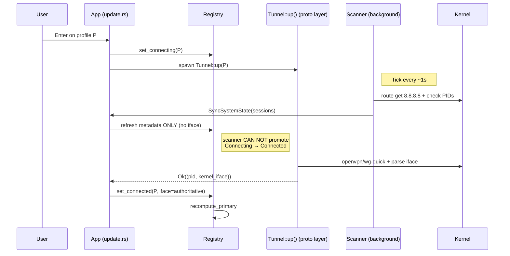

# fix: Multi-tunnel state authority

## Summary

Enforce single-authority for each Connected tunnel's kernel interface — the protocol layer's `Tunnel::up()` result is the sole writer; the scanner becomes metadata-only and can no longer promote `Connecting` → `Connected`. Land the WireGuard-on-macOS fix (return real `utunN` via the existing `Interface` port). Introduce a per-tunnel `interface_authoritative` flag so externally-adopted tunnels without reliable per-PID iface detection are excluded from primary election. All 12 multi-tunnel UX scenarios then derive from `registry.primary` alone, including the mixed-protocol (WG + OpenVPN) cases.

---

## Problem Frame

Today, two subsystems write to `details.interface` for the same tunnel. The protocol layer (`Tunnel::up()`) sets it once from authoritative sources — OpenVPN log scrape, wg-quick output. The scanner overwrites it every ~1s from per-PID heuristics that collide on macOS when multiple OpenVPN tunnels are up. The `recompute_primary` logic then matches arbitrary tunnels against the kernel's egress interface depending on `HashMap` iteration order, lying about which tunnel is primary (matrix scenarios #3 and #12). Even with a preservation guard in `refresh_registry_from_session`, the bug survives because `scanner_promote_to_connected` can transition a `Connecting` tunnel to `Connected` with stale scanner data **before** `Tunnel::up()`'s authoritative result arrives.

The bug is load-bearing for security correctness, not just UI accuracy: the killswitch reads `details.interface` to build per-tunnel PF/iptables ACCEPT rules (`vortix_platform_macos/firewall.rs:433`, `:472`, `:508`). A wrong interface = silent leak with `AlwaysOn` / `vpn-only` killswitch engaged.

The architecture's design intent (`docs/brainstorms/2026-05-28-multi-connection-requirements.md` D-4) was already "kernel-truth only, no Vortix-side override." This plan closes the gap between intent and implementation by collapsing the dual write path into a single seam.

---

## High-Level Technical Design

Directional guidance for review — implementing agents should mirror the shape (one write seam at `set_connected`, scanner refresh is metadata-only), not copy the diagram verbatim. The Mermaid sketch deliberately omits failure paths and the auto-promote banner; those are detailed under their respective units.

---

## Requirements Mapping

| R-ID | Requirement (from origin) | Implementation Unit(s) |
|---|---|---|
| R1 | Interface set once by `Tunnel::up()`; never overwritten | U1, U2, U4 |
| R2 | Scanner refreshes metadata, never interface | U4 |
| R3 | Scanner cannot promote Connecting→Connected | U4 |
| R4 | Adoption with unreliable iface refuses primary election | U3, U5 |
| R5 | WG on macOS returns real utun device | U2 |
| R6 | Connect-timeout transitions stuck-Connecting to Disconnected | Verification only (existing behavior; see Dependencies) |
| R7 | Primary derivation via kernel-routing probe + iface match | Existing (verified) |
| R8 | Auto-promote on primary disconnect | Existing (verified) |
| R9 | Per-surface display invariant | U6 |
| R10 | Role precedence (Primary > AddressableSuppressed > Addressable) | Existing (verified after U3) |

---

## Implementation Units

### U1. OpenVPN: surface log-parse failure as TunnelError (no synthetic fallback)

**Goal:** When the OpenVPN log scrape can't determine the kernel interface, `Tunnel::up()` returns a typed error rather than fabricating `openvpn-{safe_name}`. The synthetic name violates R1 by allowing a non-kernel-comparable iface to enter the registry.

**Requirements:** R1, R5 (mixed-protocol consistency — OpenVPN side)

**Dependencies:** none

**Files:**
- `crates/vortix/src/vortix_protocol_openvpn/tunnel.rs` (modify; current synthetic fallback at L536-543)
- `crates/vortix/src/vortix_protocol_openvpn/tunnel.rs#tests` (add test for failure path)

**Approach:** Replace the `kernel_iface.unwrap_or_else(...synthetic...)` branch in `OvpnTunnel::up`'s success path with an `Option<String>` propagation. If `parse_kernel_interface` returns `None` after the log shows `OVPN_LOG_SUCCESS`, return `TunnelError::DaemonExited("OpenVPN reported success but no kernel interface was found in the log; can't safely track this tunnel")`. The error surfaces to the FSM's `handle_connect_failure` path, which already leaves a `last_failure` record for retry.

**Patterns to follow:** the existing `TunnelError::DaemonExited` construction at `tunnel.rs:240-243` (PID file missing case) — same shape.

**Test scenarios:**
- Happy path: log contains `Opened utun device utun4` followed by `Initialization Sequence Completed` → `Tunnel::up` returns `Ok(TunnelHandle { interface_name: "utun4", .. })`. (Already covered by existing tests; verify no regression.)
- Failure path: log contains `Initialization Sequence Completed` but no `Opened utun device` / `TUN/TAP device` anchor line → `Tunnel::up` returns `Err(TunnelError::DaemonExited(..))` with a message naming "kernel interface" so the user can search for it.
- Edge: log scrape times out (existing behavior) → returns `TunnelError::Timeout`; no change.

**Verification:** OpenVPN connect path no longer leaves an `openvpn-<name>` synthetic string in the registry. Grep `target/debug` build for `openvpn-{` and `format!("openvpn-` — should return no matches in the protocol crate after the change.

---

### U2. WireGuard: return kernel utun on macOS via existing Interface port

**Goal:** `WgTunnel::up()` on macOS returns the actual `utunN` device created by `wg-quick`, not the config-file basename. On Linux, returns the config basename (which IS the kernel device name). Routes through the `Interface::resolve_wireguard_interface` port — no new platform-specific subprocess or file access in the protocol crate.

**Requirements:** R5

**Dependencies:** none (the platform port already exists and is used by the scanner today — `core/scanner.rs:153`)

**Files:**
- `crates/vortix/src/vortix_protocol_wireguard/tunnel.rs` (modify `interface_from_path` callers and `WgTunnel::up`'s `TunnelHandle` construction)
- `crates/vortix/src/vortix_protocol_wireguard/tunnel.rs#tests` (add macOS-resolution test using a mock platform port)
- verify: `crates/vortix/src/vortix_core/ports/interface.rs` exposes `resolve_wireguard_interface` (already does per research)

**Approach:** After `wg-quick up <config>` succeeds, look up the kernel device via `crate::platform::current_platform().interface.resolve_wireguard_interface(&basename)`. On macOS this reads `/var/run/wireguard/<basename>.name` and returns `Some("utun3")`; on Linux it returns `None` because the kernel device IS the basename. When the port returns `None`, fall back to the existing `interface_from_path(&effective_path)` (the basename) — that's the correct kernel name on Linux/BSD.

**Boundary discipline:** The WG protocol crate cannot import `vortix_platform_macos/*` directly (boundary lint). Route through the platform aggregate at `crate::platform::current_platform()`. The Interface port already abstracts this — same pattern the scanner uses.

**Patterns to follow:** scanner's call site at `core/scanner.rs:151-155` for the platform-port lookup shape. OpenVPN's `parse_kernel_interface` tests (`vortix_protocol_openvpn/tunnel.rs:714+`) for the platform-mocked test pattern.

**Test scenarios:**
- Happy path Linux: `resolve_wireguard_interface` returns `None` → `Tunnel::up` returns interface name == config basename (e.g., `wg-corp`).
- Happy path macOS: `resolve_wireguard_interface` returns `Some("utun9")` → `Tunnel::up` returns interface name == `"utun9"`, NOT the config basename.
- Edge: `resolve_wireguard_interface` returns `None` on macOS (the .name file isn't written yet because wg-quick hasn't finished bootstrapping) → fall back to basename, emit `tracing::warn` so manual diagnosis is possible. *Decision: this is acceptable because `WgTunnel::up` only returns after `wg-quick up` reports success synchronously — if the .name file is still missing at that point, the platform itself is in an unexpected state.*

**Verification:** On a macOS host with a WG profile up, `route -n get 8.8.8.8` interface output matches the `details.interface` in `registry.snapshot(profile_id)`. Confirm via the existing TUI's Connection Details row.

---

### U3. Add `interface_authoritative: bool` to `DetailedConnectionInfo`

**Goal:** Introduce a sibling flag on `DetailedConnectionInfo` that records whether the stored interface name was set by a reliable source (`Tunnel::up()` log scrape, wg-quick + platform port resolution) or by a best-effort fallback (scanner Method B heuristic on macOS multi-OpenVPN). The flag is consumed by `recompute_primary` to exclude unreliable entries from primary-election candidacy.

**Requirements:** R4, R10

**Dependencies:** none (introduces the foundation; later units consume it)

**Files:**
- `crates/vortix/src/vortix_core/engine/state.rs` (add field to `DetailedConnectionInfo`)
- `crates/vortix/src/vortix_core/engine/registry.rs` (update `recompute_primary` candidate filter; update `derive_role_from_allowed_ips` to treat non-authoritative entries as `Addressable` regardless of allowed_ips)
- `crates/vortix/src/vortix_core/engine/fsm.rs` (no changes expected — `seed_connected_state` already takes a full `DetailedConnectionInfo` by value)
- `crates/vortix/src/app/connection.rs` (`mirror_connect_into_registry` constructs with `interface_authoritative: true`; `refresh_registry_from_session` carries the existing entry's flag forward)
- `crates/vortix/src/vortix_core/engine/registry.rs#tests` (add coverage)

**Approach:**
- Add field with `#[serde(default = "default_true")]` (or equivalent) so historical JSON state files still deserialize. `Default for DetailedConnectionInfo` returns `true` for the field — most tunnels are authoritative.
- `recompute_primary`'s candidate loop: only consider Connected entries with `details.interface_authoritative == true` AND `details.interface == kernel_iface`. Unauthoritative entries are skipped silently.
- `derive_role_from_allowed_ips`: when `entry.engine.state()` is `Connected` AND `details.interface_authoritative == false`, return `Role::Addressable { allowed_ips }` regardless of whether allowed_ips claim the default route. This ensures the UI never claims a route status that vortix can't actually verify.

**Patterns to follow:** the existing `Default` impl for `DetailedConnectionInfo` — extend the same pattern. Serde-default attribute pattern: see other state structs that survived field additions across vortix versions.

**Test scenarios:**
- Default constructor sets `interface_authoritative = true`.
- Registry with two Connected tunnels, one authoritative (iface=utun8, matches kernel) and one not (iface=utun8, but flag=false) → `recompute_primary` elects the authoritative one. (Confirms R4's "refuse primary election" path.)
- Snapshot for a Connected-but-unauthoritative tunnel returns `Role::Addressable`, never `Role::Primary` or `Role::AddressableSuppressed`. (Confirms R10's role-precedence handling for the unauthoritative branch.)
- Backward-compat: deserialize a `DetailedConnectionInfo` JSON blob without the new field — defaults to `true`.

**Verification:** All existing registry tests (`vortix_core/engine/registry.rs#tests` — `connect_two_disjoint_allowed_ips_both_connected_primary_owns_zero_slash_zero`, `disconnect_primary_promotes_secondary_with_zero_slash_zero`, etc.) continue to pass without modification because they construct via `Default` (authoritative=true).

---

### U4. Scanner becomes metadata-only: refresh never writes iface; scanner_promote_to_connected removed

**Goal:** Close the dual-write path. `refresh_registry_from_session` updates transfer counters, MTU, internal IP, endpoint, latest-handshake — but never `details.interface`. `scanner_promote_to_connected` is deleted entirely; the only path from `Connecting` to `Connected` is the protocol layer's success result.

**Requirements:** R1, R2, R3

**Dependencies:** U3 (the `interface_authoritative` flag is preserved across refreshes; needs the field to exist)

**Files:**
- `crates/vortix/src/app/connection.rs` (modify `refresh_registry_from_session` at L498-556)
- `crates/vortix/src/app/update.rs` (delete `scanner_promote_to_connected` at L978-1017; modify `handle_sync_system_state`'s `(Connecting, Some(session))` arm at L885-887)
- `crates/vortix/src/app/tests.rs` (update existing scanner-promotion tests; expected to fail then be replaced)

**Approach:**
- `refresh_registry_from_session`: simplify the preserved-iface logic. The function now: (a) requires the registry entry to exist and be `Connected` (early-return otherwise — refuses to drive state transitions); (b) constructs a new `DetailedConnectionInfo` whose `interface` and `interface_authoritative` are read from the existing snapshot (NOT from `session`); (c) writes all other fields (counters, MTU, internal IP, endpoint, handshake) from `session`. The mid-state Connecting case no longer flows through this function.
- `handle_sync_system_state`: in the `(Connecting, Some(session))` arm, log "still connecting (kernel daemon visible, awaiting protocol-layer success)" at most once per N seconds; do NOT call `scanner_promote_to_connected`. Delete the function. The connect-timeout safety net (`handle_connection_timeout` at `update.rs:1316-1332`) remains the only exit from a stuck-Connecting state.

**Patterns to follow:** the existing `refresh_registry_from_session` preservation guard (already in tree from this session) — the change tightens it from "preserve when present" to "never write the field at all from session data."

**Test scenarios:**
- *Covers AE3.* Connect F1 (Tunnel::up → utun8). Connect S in parallel; scanner reports S with `session.interface = "utun8"` (collision). After both connects complete: F1's registry entry has `details.interface = "utun8"`, S's has `details.interface = <S's real utun from Tunnel::up>`. Scanner refresh tick fires; both interfaces unchanged. `registry.primary == Some(F1)`.
- *Covers AE12.* Reverse order: S connects first (no overlay; doesn't claim default), then F1. Scanner ticks during F1's connect with `session.interface = "utun8"` (S's). F1's `Tunnel::up` returns its real utun. Final state: F1 primary, S Addressable, primary derived from kernel-truth match.
- Scanner promotion attempt while Tunnel::up is in flight: scanner reports an in-flight Connecting tunnel as `Active`. `handle_sync_system_state` does NOT call anything that transitions Connecting → Connected. The tunnel reaches Connected only when `mirror_connect_into_registry` fires from `Message::ConnectResult`.
- Negative: removing `scanner_promote_to_connected` does NOT break the connect-timeout safety net — verify `handle_connection_timeout` still fires for Connecting tunnels that don't complete within `config.connect_timeout`.

**Verification:** Grep `crates/vortix/src/` for `scanner_promote_to_connected` after this unit — zero matches. Grep for `session.interface.clone()` in `refresh_registry_from_session` — zero matches (the function no longer reads that field).

---

### U5. Scanner adoption sets `interface_authoritative` per platform reliability

**Goal:** When `scanner_adopt_session` registers an externally-started tunnel, set `interface_authoritative` based on whether the scanner's per-PID detection is reliable on this platform for this protocol. Currently: macOS multi-OpenVPN = unreliable (Method B heuristic collides); macOS WG = reliable (resolved via `/var/run/wireguard/<name>.name`); Linux both = reliable (`/proc/PID/fd/*` and `wg show`).

**Requirements:** R4, R5

**Dependencies:** U3 (the flag exists), U2 (WG on macOS already resolves the real utun via the same port)

**Files:**
- `crates/vortix/src/app/update.rs` (modify `scanner_adopt_session` at L1140-1178)
- `crates/vortix/src/app/connection.rs` (`refresh_registry_from_session` already preserves the flag from U4; verify it accepts an "initial flag value" argument for adoption-time)
- `crates/vortix/src/core/scanner.rs` (add an `interface_authoritative: bool` field to `ActiveSession`, populated by the protocol-specific check functions)
- `crates/vortix/src/core/scanner.rs#tests` (add coverage for the flag's value per protocol/platform)

**Approach:**
- `ActiveSession.interface_authoritative`: defaults to `true`. Set to `false` only in the macOS OpenVPN Method B fallback path (`check_openvpn_by_pid` at scanner.rs:293-341) when the scanner couldn't use lsof Method A and fell back to ifconfig scanning. The WG path (`check_wireguard_by_name`) always sets `true` because `resolve_wireguard_interface` returns either the real utun (macOS) or the kernel device name (Linux).
- `scanner_adopt_session`: thread `session.interface_authoritative` into the new registry entry's `DetailedConnectionInfo`.
- TUI implication (handled by U6): adopted tunnels with `interface_authoritative=false` get a visible "external — iface unmapped" badge and are ineligible for `*` (the asterisk + sidebar bold treatment).

**Patterns to follow:** the existing `ActiveSession` field-addition pattern for backward compat (see how `started_at: Option<SystemTime>` was added previously).

**Test scenarios:**
- macOS OpenVPN via Method A (lsof finds `/dev/utun`): `session.interface_authoritative == true`. (Edge case — modern OpenVPN doesn't open `/dev/utun*`, but if a future macOS variant does, Method A succeeds and the flag stays true.)
- macOS OpenVPN via Method B (ifconfig fallback): `session.interface_authoritative == false`.
- macOS WireGuard via `resolve_wireguard_interface`: `session.interface_authoritative == true`.
- Linux OpenVPN via `/proc/PID/fd`: `session.interface_authoritative == true` (Linux per-PID detection is reliable; no Method B fallback needed).
- Linux WireGuard: `session.interface_authoritative == true`.
- Adoption with unauthoritative iface: `scanner_adopt_session` registers entry, `registry.primary` after the next `recompute_primary` does NOT include this profile.

**Verification:** Manual scenario: start an OpenVPN tunnel outside vortix on macOS while another OpenVPN tunnel is up inside vortix. The externally-started one appears in the sidebar but does NOT get the asterisk, and Connection Details shows the "iface unmapped" label.

---

### U6. TUI: render the "iface unmapped" state

**Goal:** When a tunnel is `Connected` but `interface_authoritative == false`, the TUI surfaces the state clearly — without adding a new panel and without breaking density at 80×24.

**Requirements:** R4, R9

**Dependencies:** U3, U5 (the flag exists in snapshots; adoption sets it correctly)

**Files:**
- `crates/vortix/src/ui/dashboard/sidebar.rs` (modify `signal_for` at L141-162 + asterisk-suppression rule at L262-282)
- `crates/vortix/src/ui/dashboard/connection_details.rs` (modify the Interface row render around L135-138)
- `crates/vortix/src/ui/dashboard/header.rs` (verify the `CONNECTED (<name>/<proto>)` segment doesn't claim primary status for unauthoritative tunnels — it currently reads `primary_snap`, which `recompute_primary` already filters per U3)
- `crates/vortix/src/ui/dashboard/security.rs` (verify the IP row doesn't display VPN exit IP for an unauthoritative primary — already guaranteed because `primary` is `None` for these)
- existing test patterns at `crates/vortix/src/ui/dashboard/security.rs#tests` and the visual-snapshot tests in `sidebar.rs#tests`

**Approach:**
- **Sidebar:** add a new badge variant for `Connected + !interface_authoritative` — a `?` sigil in a muted color, no asterisk, no bold treatment. Append `(external)` after the name when terminal width permits. The dot-color treatment for "connected" stays — these tunnels ARE connected, just not vortix-tracked.
- **Connection Details:** when the focused tunnel is unauthoritative, the Interface row reads `external — iface unmapped` in muted text. The IP / endpoint / cipher rows continue to render whatever the scanner reports (these are fine to show; they don't claim a routing status).
- **Header:** no change. `recompute_primary` filtering in U3 already excludes unauthoritative tunnels, so `CONNECTED (<name>)` never shows their name.
- **Security Guard:** no change. The IP row reads from `primary_snap`, which is `None` when all connected tunnels are unauthoritative — already routes to the existing "split-route — no exit" path.

**Patterns to follow:** the existing badge-emission shape at `sidebar.rs:status_badge_for`. The "PARTIAL with primary" IP-row branch in `security.rs:build_partial_audit` (added earlier this session) for the muted-text-with-explanation rendering style.

**Test scenarios:**
- Sidebar render: snapshot with `interface_authoritative=false` produces a `?` sigil, no asterisk, name suffix `(external)` when width allows.
- Connection Details render: snapshot with `interface_authoritative=false` produces the `external — iface unmapped` Interface row.
- Header: snapshot with one unauthoritative + one authoritative connected tunnel + the kernel egress matches the authoritative one → header shows the authoritative profile name.
- *Covers AE2 / AE10.* Security Guard with only unauthoritative connected tunnels → SG IP row is "split-route — no exit" (because `primary == None`).

**Verification:** Manual scenario from U5's verification (start external OpenVPN on macOS multi-tunnel) — the TUI renders the unmapped badge correctly across sidebar, Connection Details, header, and SG.

---

### U7. Manual-testing backlog rows + multi-connection scenarios doc

**Goal:** Add manual test scenarios for the runtime behaviors that unit/integration tests can't exercise — real macOS WG utun mapping, real multi-OpenVPN iface authority, real external-adoption flow.

**Requirements:** R5 (verification), R4 (verification), the 12 AE scenarios from the brainstorm

**Dependencies:** U1–U6 complete (scenarios exercise the shipped behavior)

**Files:**
- `docs/manual-testing/multi-connection.md` (add the 12 AE scenarios as ordered rows or replace existing matrix; pass/fail signal columns)
- `docs/manual-testing/backlog.md` (add row: "WG on macOS Tunnel::up returns kernel utun" — verify Connection Details iface matches `route get 8.8.8.8`)
- `docs/manual-testing/backlog.md` (add row: "Multi-OpenVPN on macOS — primary election byte-comparable with kernel" — verify scenarios #3, #6, #11)
- `docs/manual-testing/backlog.md` (update existing row 65 — adoption auto-tracking — for the new `interface_authoritative=false` semantics on macOS multi-OpenVPN)

**Approach:** Each row names setup, the precise observation point (which TUI surface, which CLI command), and the pass/fail signal in one sentence per the existing convention.

**Test scenarios:** none (this is docs).

**Verification:** Each row reads as a self-contained reproducible scenario without needing the plan as context.

**Test expectation: none -- this unit is documentation, no behavioral code.**

---

## Scope Boundaries

**In scope (drawn from origin requirements):**
- The single-authority contract on `details.interface` (R1, R2, R3)
- WireGuard on macOS real-utun discovery via existing platform port (R5)
- External adoption refuses primary election when iface detection is unreliable (R4)
- TUI rendering for the new unauthoritative state (R9)
- Manual-testing coverage for the runtime behaviors

**Deferred to Follow-Up Work:**
- Switching `handle_connection_timeout` from `set_disconnected` (drops entry) to `set_failed` with `FailureReason::Timeout` so stuck-Connecting tunnels leave a ✗ badge for user retry. Orthogonal UX upgrade; R6 just requires the timeout to fire, which it does today.
- Unifying the two parallel enums `PrimaryTunnelChangeReason` (registry) and `PrimaryChangeReason` (event) — same semantic, two name variants per CLAUDE.md vocabulary rule. Cleanup, not correctness.
- Migrating the auto-promote banner from tick-polled `last_known_primary` heuristic (`update.rs:1412-1454`) to event-driven (subscribe to `EngineEvent::PrimaryTunnelChanged` with reason `PriorPrimaryDisconnected`). Current polling works; event-driven is cleaner.
- A dropped-protocol-result watchdog for the case where `Message::ConnectResult` is lost between the connect thread and the main loop. Existing connect-timeout safety net catches the genuine stuck case; channel-drop is exotic enough it doesn't earn engineered protection in v1.

**Deferred to original multi-connection requirements doc (not relitigated here):**
- IPv6 default-route detection (origin's H1)
- Killswitch ruleset rewrite ordering (origin's §7.6)
- Windows multi-tunnel support
- The `[B]` (Both) takeover overlay semantics

---

## Key Technical Decisions

- **D1. `interface_authoritative: bool` flag on `DetailedConnectionInfo`, not `interface: Option<String>`.** Adding a sibling flag is a smaller blast radius than changing the field type — every TUI renderer and the killswitch firewall builder currently checks `.is_empty()` on the string. The flag adds one new check at exactly two places (`recompute_primary`, `derive_role_from_allowed_ips`) and is consumed by U6's rendering. Choosing `Option` would force a wide refactor across 5+ surfaces with no proportional benefit.
- **D2. WG on macOS routes through the existing `Interface::resolve_wireguard_interface` port.** The platform-side mechanism already exists (`/var/run/wireguard/<name>.name` lookup, used by the scanner at `core/scanner.rs:153`). The protocol crate calls through the port aggregate, respecting the protocol-vs-platform boundary lint without introducing a new shell-out.
- **D3. OpenVPN log-parse failure surfaces as `TunnelError::DaemonExited`, not a new error variant.** The existing error type carries a message field; the failure shape ("daemon reported success but vortix couldn't track it") matches the variant's semantics. Avoids growing the error enum surface area.
- **D4. Removing `scanner_promote_to_connected` is hard, not soft.** No watchdog, no fallback path. The connect-timeout (existing) handles the only realistic stuck-Connecting case. Channel-drop between connect-thread and main loop is rare enough that engineering for it would add complexity without earning its keep.
- **D5. Scanner's `ActiveSession` carries the `interface_authoritative` decision, not the App layer.** The scanner is where the platform-specific detection method is known (Method A vs Method B on macOS, `/proc/PID/fd` on Linux). Putting the flag at session-construction time means downstream consumers (`scanner_adopt_session`, `refresh_registry_from_session`) just propagate it — no re-deriving from raw scanner output.

---

## System-Wide Impact

This change touches four interacting surfaces:

| Surface | Impact |
|---|---|
| **Registry (`vortix_core/engine/`)** | New field on `DetailedConnectionInfo`. `recompute_primary` candidate filter. `derive_role` precedence for unauthoritative entries. |
| **Scanner (`app/update.rs`, `core/scanner.rs`)** | `ActiveSession` carries authoritative flag. `scanner_promote_to_connected` removed. `refresh_registry_from_session` no longer writes iface. `scanner_adopt_session` threads the flag. |
| **Protocol crates (`vortix_protocol_openvpn/`, `vortix_protocol_wireguard/`)** | OpenVPN drops synthetic fallback. WireGuard routes through Interface port. |
| **TUI (`ui/dashboard/`)** | Sidebar `?` sigil for unauthoritative. Connection Details "iface unmapped" row. Header + SG continue to derive from filtered `registry.primary`. |
| **Killswitch (`vortix_platform_*/firewall.rs`)** | No code change required, but the contract makes per-tunnel ACCEPT rules byte-comparable with kernel state (R1 closes the silent-leak window). |

---

## Verification Strategy

**Automated tests** (per-unit; see test scenarios in each U):
- U1: OpenVPN log-parse failure produces typed error (no synthetic name in registry).
- U2: WG `Tunnel::up` returns real utun on macOS (mocked Interface port).
- U3: `recompute_primary` skips unauthoritative entries; `derive_role` returns `Addressable` for unauthoritative entries.
- U4: scanner refresh never writes iface; `scanner_promote_to_connected` removed; existing primary-election remains correct.
- U5: `ActiveSession.interface_authoritative` correctly set per platform/protocol.
- U6: TUI render snapshots produce the new badges and labels for unauthoritative tunnels.

**Manual verification** (per U7's backlog rows):
- Scenarios #3 and #12 from the brainstorm matrix — the originally-reported bugs — pass on a macOS host with two OpenVPN droplets.
- Scenario #6 (Shift+B takeover with two F-class profiles) — header, asterisk, Role all show the new primary; old shows AddressableSuppressed.
- Scenario #11 (third F-class profile takes over) — both prior F-class show AddressableSuppressed; new F1' is primary.
- Scenarios #7 and #8 (disconnect from #6 state) — auto-promote banner appears for #7, doesn't for #8.
- WG-on-macOS sanity: connect a `wg-full` profile; Connection Details iface row matches `route -n get 8.8.8.8` output byte-for-byte.

**Boundary lint passes**: `cargo xtask check-platform-leak`, `check-protocol-leak`, `check-subprocess`, `check-no-shell-regressions` all clean. The WG protocol crate's new call to `current_platform().interface.resolve_wireguard_interface` must NOT trip the platform-leak check (route through port is intentional).

**CI parity command sequence** (per `docs/ci-parity.md`): `cargo fmt --all -- --check`, `cargo clippy --workspace --all-targets -- -D warnings`, `cargo test --workspace`, `RUSTDOCFLAGS='-D warnings' cargo doc --workspace --no-deps`, the four xtask checks, `cargo-deny check`.

---

## Dependencies / Assumptions

- The OpenVPN connect-timeout safety net (`handle_connection_timeout` at `update.rs:1316-1332`) does transition stuck-Connecting tunnels out of Connecting today — verified during research (it calls `registry.set_disconnected` after the timeout, which drops the entry). R6 is satisfied; whether to upgrade to `set_failed` is a follow-up.
- `EngineEvent::PrimaryTunnelChanged` and the 10-second auto-promote banner (with `[u]` revert) are wired today via tick-polling on `last_known_primary`. R8 is satisfied; event-driven migration is a follow-up.
- The platform-port `Interface::resolve_wireguard_interface` works on macOS today (used by the scanner). U2 reuses without modification.
- The kernel route-probe target (`route -n get 8.8.8.8`, `ip route get 8.8.8.8`) returns the actual egress under `redirect-gateway def1` topologies — confirmed in the prior session's route-probe fix.
- `wg-quick(8)` writes `/var/run/wireguard/<name>.name` synchronously before returning success. If the file is missing at success-return time, U2 falls back to the config basename with a `warn!`.

---

## Outstanding Questions

### Deferred to Implementation

- [Affects U6][Technical] The exact glyph for the unauthoritative sidebar sigil — `?`, `⚠`, or a new color of the existing dot — settles during implementation against the existing badge palette in `theme.rs`. Pick what reads cleanest at 80×24 in the dim/bright theme variants.
- [Affects U5][Technical] If a future macOS variant has `Method A` (lsof `/dev/utun*`) start working for modern OpenVPN, the scanner should set authoritative=true on that path. The U5 design already accommodates this — no further plan changes needed.
- [Affects U4][Needs verification] The `(Connecting, Some(session))` arm in `handle_sync_system_state` — confirm during implementation that we don't need ANY metadata refresh on a Connecting entry (current code uses scanner data to populate `last_used` and to drift-correct `session_start`). If those side effects are load-bearing, fold them into the in-Connecting arm as metadata-only writes.
- [Affects U1][Technical] OpenVPN protocol-layer behavior when log parse fails — the daemon process is still running. U1 returns an error, which the FSM treats as `handle_connect_failure`. The orphan openvpn process needs to be killed; verify `cleanup_vpn_resources` already does this on a failed connect (it should — same path as a Tunnel::down).

### Resolve via Follow-Up Plan

- Upgrade `handle_connection_timeout` to leave a `last_failure` record (separate UX plan; deferred to follow-up per Scope Boundaries).
- Unify `PrimaryTunnelChangeReason` and `PrimaryChangeReason` enums (CLAUDE.md vocabulary cleanup; deferred).
- Migrate auto-promote banner to event-driven detection (cleanup, not correctness; deferred).
